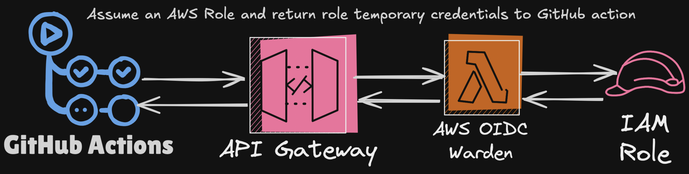

> [!WARNING]
> This project is still under active development and may not be production-ready. Features and functionality are subject to change. Use with caution and check back for updates.

[](https://github.com/boogy/aws-oidc-warden/actions/workflows/build.yml)

# AWS OIDC Warden



## Overview

The **AWS OIDC Warden** is a secure, lightweight Go service that validates OpenID Connect (OIDC) tokens issued by GitHub Actions and other OIDC providers. It acts as a trusted intermediary between GitHub workflows and AWS resources, providing fine-grained access control based on repository, branch, actor, and other configurable constraints.

This service solves a critical security challenge: securely connecting CI/CD workflows to AWS resources without storing long-lived credentials. By validating OIDC tokens and applying customizable security policies, it enables organizations to implement the principle of least privilege while maintaining operational efficiency at scale.

**Key Capabilities:**
- **Multi-OIDC Support**: Works with GitHub Actions and any OIDC provider with JWKS endpoints
- **Multiple Deployment Options**:
  - **API Gateway + Lambda**: Traditional REST API with API Gateway proxy integration
  - **Lambda URLs**: Direct Lambda HTTP endpoints with function URLs
  - **Application Load Balancer**: Integration with ALB target groups for high-traffic scenarios
  - **Local Development Server**: HTTP server for testing and integration
- **Advanced Caching**: Multi-tier caching with memory, DynamoDB, and S3 backends
- **Enterprise-Ready**: Comprehensive logging, monitoring, and security features
- **Cloud-Native Architecture**: Stateless design with external state management

---

> [!CAUTION]
> Not all OIDC claims can be trusted. See the great tool and table created [PaloAltoNetworks/GitHub OIDC Utils](https://github.com/PaloAltoNetworks/github-oidc-utils) for a comprehensive list of claims.
>
> This lambda allows you to include specific constraints for a repository before it can obtain credentials from a role. Choose wisely based on the table that Palo Alto Networks has provided in the repository linked above.

## Features

- **Universal OIDC Validation**: Validates tokens from GitHub Actions and any OIDC provider with JWKS endpoints
- **Multiple Deployment Options**:
  - **API Gateway**: Traditional REST API approach with API Gateway proxy integration
  - **Lambda URLs**: Direct Lambda HTTP endpoints with function URLs (recommended for simple setups)
  - **Application Load Balancer**: Integration with ALB target groups for high-traffic, multi-region scenarios
  - **Local Development Server**: HTTP server for testing
 - **AWS Fine-Grained Access Control**: Configure access based on repository, branch, event type, actor, workflow file, and more
- **Session Policy Support**: Apply custom AWS session policies via inline JSON or S3-stored policy files to reduce AWS Role permissions and reduce the number of required roles
- **Session Tagging**: Tag AWS sessions with GitHub-specific information for auditability and ABAC (Attribute Based Access Control)
- **Flexible Constraint System**: Apply regular expression-based matching for dynamic authorization
- **High-Performance Caching**:
  - **Memory Cache**: Fast in-memory caching with LRU eviction
  - **DynamoDB Cache**: Persistent caching across Lambda instances
  - **S3 Cache**: Large object caching with automatic cleanup
  - **Configurable TTL**: Custom time-to-live for cached JWKS
- **Comprehensive Logging**:
  - Structured JSON logging to CloudWatch
  - Optional S3 logging for long-term retention
  - Request tracking with correlation IDs
- **Multi-Architecture Support**: Native builds for ARM64 and AMD64 architectures with pre-build docker images

---

## Getting Started

### Installation

1. Clone the repository:
   ```bash
   git clone git@github.com:boogy/aws-oidc-warden.git
   cd aws-oidc-warden
   ```

2. Install dependencies:
   ```bash
   go mod tidy
   ```

3. Build the binary:
   ```bash
   make build
   ```

#### Alternative Installation Methods

- **Download pre-built binaries**: Check the [Releases](https://github.com/boogy/aws-oidc-warden/releases) page for pre-built Lambda deployment packages
- **Use container images**: Pull from GitHub: `ghcr.io/boogy/aws-oidc-warden:latest` (see [Pre-built Images](#using-pre-built-container-images))
- **Build with ko**: Use `make ko-build` for container-based deployment.

---

### Configuration

AWS OIDC Warden can be configured using environment variables, a YAML/JSON/TOML configuration file. For a complete reference of all configuration options, see the [Configuration Documentation](docs/CONFIGURATION.md).

#### Environment Variables

All configuration options can be set using environment variables with the `AOW_` prefix:

```bash
# Core configuration
export AOW_ISSUER=https://token.actions.githubusercontent.com
export AOW_AUDIENCE=sts.amazonaws.com
export AOW_ROLE_SESSION_NAME=aws-oidc-warden

# Cache configuration
export AOW_CACHE_TYPE=dynamodb
export AOW_CACHE_TTL=1h
export AOW_CACHE_MAX_LOCAL_SIZE=20
export AOW_CACHE_DYNAMODB_TABLE=aws-oidc-warden-cache

# Logging configuration
export AOW_LOG_TO_S3=true
export AOW_LOG_BUCKET=your-log-bucket
export AOW_LOG_PREFIX=logs/
export LOG_LEVEL=debug # Note: This one doesn't use the AOW_ prefix
```

#### Configuration File

Alternatively, you can use a YAML, JSON or TOML configuration file:

```yaml
issuer: https://token.actions.githubusercontent.com
audience: sts.amazonaws.com
role_session_name: aws-oidc-warden

cache:
  type: dynamodb
  ttl: 1h
  max_local_size: 20
  dynamodb_table: jwks-cache

log_to_s3: true
log_bucket: your-log-bucket
log_prefix: logs/
```

#### Repository-to-Role Mapping

The most powerful feature of this tool is the ability to map GitHub repositories to AWS IAM roles with specific constraints. Here's an example configuration:

```yaml
repo_role_mappings:
  # Simple mapping: Only allow access from the main branch
  - repo: "org/main-branch-repo"         # Repository pattern (supports regex)
    roles:
      - arn:aws:iam::123456789012:role/github-actions-role
    constraints:
      branch: "refs/heads/main"          # Only allow from main branch

  # Apply a session policy from S3
  - repo: "org/policy-from-s3"           # Exact repository name
    session_policy_file: "policies/restrict-to-dev.json"
    roles:
      - arn:aws:iam::123456789012:role/github-actions-role
    constraints:
      branch: "refs/heads/dev.*"         # Regex pattern for dev branches

  # Match multiple repositories with a pattern
  - repo: "org/project-.*"               # Match all repositories starting with project-
    session_policy: >
      {
        "Version": "2012-10-17",
        "Statement": [
          {
            "Effect": "Deny",
            "Action": ["iam:*"],
            "Resource": "*"
          }
        ]
      }
    roles:
      - arn:aws:iam::123456789012:role/github-actions-role
```

#### Advanced Constraint Configuration

You can apply multiple constraints to control when a role can be assumed. All constraints configured must be satisfied for access to be granted:

```yaml
repo_role_mappings:
  - repo: "org/multi-constraint-repo"    # Repository pattern (supports regex)
    roles:
      - arn:aws:iam::123456789012:role/github-actions-role
    constraints:
      # Git reference constraints
      branch: "refs/heads/main"          # Branch pattern (supports regex)
      ref: "refs/tags/v.*"               # Reference pattern (supports regex)
      ref_type: "tag"                    # Reference type (branch, tag)

      # GitHub workflow constraints
      event_name: "push"                 # GitHub event that triggered the workflow
      workflow_ref: "deploy\\.ya?ml$"    # Workflow file name pattern (supports regex)
      environment: "production"          # GitHub environment

      # Actor constraints
      actor_matches:                     # GitHub actors allowed to assume the role (supports regex)
        - "admin-user"
        - "authorized-.*"
```

### Usage

#### Request Format

To use the service, send a POST request with the GitHub OIDC token and the desired AWS role ARN:

```json
{
  "token": "eyJhbGciOiJSUzI1NiIsInR5cCI6IkpXVCJ9...",
  "role": "arn:aws:iam::123456789012:role/github-actions-role"
}
```

#### Running Locally
The application includes a local development server that simulates AWS Lambda environments:

```bash
# Start local development server (default port 8080)
make run

# Or with custom configuration
make run-local CONFIG_PATH=example-config.yaml

# Or run directly with Go
go run cmd/local/main.go

# With custom options
go run cmd/local/main.go -port 9090 -config example-config.yaml -log-level debug
```

The local server provides these endpoints:
- `POST /verify` - Token validation endpoint (matches Lambda behavior)
- `GET /health` - Health check endpoint

You can test the `/verify` endpoint:
```bash
curl -X POST http://localhost:8080/verify \
  -H "Content-Type: application/json" \
  -d '{"token": "your-github-oidc-token", "role": "your-aws-role-arn"}'
```

**Local Server Features:**
- Simulates AWS Lambda API Gateway proxy integration
- Configurable latency simulation for testing
- Graceful shutdown with SIGTERM/SIGINT
- Structured JSON logging
- Hot configuration reloading (restart required)

#### Using in GitHub Actions Workflows

Here's an example of how to use this service in a GitHub Actions workflow:

```yaml
name: AWS Deployment

jobs:
  deploy:
    runs-on: ubuntu-latest
    permissions:
      id-token: write  # Required for OIDC token
      contents: read   # Required to check out repository

    steps:
      - name: Checkout code
        uses: actions/checkout@v4

      - name: Get AWS credentials via custom OIDC validator
        id: aws-creds
        run: |
          # Get the OIDC token
          TOKEN=$(curl -H "Authorization: bearer $ACTIONS_ID_TOKEN" \
                 -H "Accept: application/json; api-version=2.0" \
                 -H "Content-Type: application/json" \
                 -H "User-Agent: actions/oidc-client" \
                 "$ACTIONS_ID_TOKEN_REQUEST_URL" | jq -r '.value')

          # Call the validator API to get AWS credentials
          RESPONSE=$(curl -s -X POST \
                   -H "Content-Type: application/json" \
                   -d "{\"token\": \"$TOKEN\", \"role\": \"arn:aws:iam::123456789012:role/github-actions-role\"}" \
                   "https://your-api-gateway-url.execute-api.region.amazonaws.com/prod/verify")

          # Parse and set AWS credentials
          echo "::add-mask::$(echo $RESPONSE | jq -r '.data.AccessKeyId')"
          echo "::add-mask::$(echo $RESPONSE | jq -r '.data.SecretAccessKey')"
          echo "::add-mask::$(echo $RESPONSE | jq -r '.data.SessionToken')"

          echo "AWS_ACCESS_KEY_ID=$(echo $RESPONSE | jq -r '.data.AccessKeyId')" >> $GITHUB_ENV
          echo "AWS_SECRET_ACCESS_KEY=$(echo $RESPONSE | jq -r '.data.SecretAccessKey')" >> $GITHUB_ENV
          echo "AWS_SESSION_TOKEN=$(echo $RESPONSE | jq -r '.data.SessionToken')" >> $GITHUB_ENV
        env:
          ACTIONS_ID_TOKEN_REQUEST_URL: ${{ vars.ACTIONS_ID_TOKEN_REQUEST_URL }}
          ACTIONS_ID_TOKEN: ${{ vars.ACTIONS_ID_TOKEN }}

      - name: Deploy with AWS credentials
        run: |
          # Now you can use AWS CLI with the obtained credentials
          aws s3 ls
```

#### Deploying to AWS Lambda

The project provides multiple deployment options depending on your AWS infrastructure:

**1. API Gateway + Lambda (Recommended for Production)**

API Gateway provides a public API endpoint that can be secured with API keys, restricting access to authorized repositories only. This approach minimizes endpoint exposure, enhancing security for safer usage.

```bash
# Build the API Gateway handler
GOOS=linux GOARCH=arm64 go build -o bootstrap cmd/apigateway/main.go
zip lambda-apigateway.zip bootstrap

# Create Lambda function
aws lambda create-function \
  --function-name aws-oidc-warden-apigateway \
  --runtime provided.al2023 \
  --role arn:aws:iam::ACCOUNT:role/lambda-execution-role \
  --handler bootstrap \
  --zip-file fileb://lambda-apigateway.zip
```

**2. Lambda URLs (Recommended for Simple Setups)**
```bash
# Build the Lambda URL handler
GOOS=linux GOARCH=arm64 go build -o bootstrap cmd/lambdaurl/main.go
zip lambda-url.zip bootstrap

# Create Lambda function with Function URL
aws lambda create-function \
  --function-name aws-oidc-warden-url \
  --runtime provided.al2023 \
  --role arn:aws:iam::ACCOUNT:role/lambda-execution-role \
  --handler bootstrap \
  --zip-file fileb://lambda-url.zip

# Create Function URL
aws lambda create-function-url-config \
  --function-name aws-oidc-warden-url \
  --auth-type NONE \
  --cors '{"AllowOrigins":["*"],"AllowMethods":["POST"]}'
```

**3. Application Load Balancer (High Traffic)**
```bash
# Build the ALB handler
GOOS=linux GOARCH=arm64 go build -o bootstrap cmd/alb/main.go
zip lambda-alb.zip bootstrap

# Create Lambda function for ALB target group
aws lambda create-function \
  --function-name aws-oidc-warden-alb \
  --runtime provided.al2023 \
  --role arn:aws:iam::ACCOUNT:role/lambda-execution-role \
  --handler bootstrap \
  --zip-file fileb://lambda-alb.zip
```

**4. Container-Based Deployment (Recommended Lambda Deployment)**
```bash
# Using pre-built container images
aws lambda create-function \
  --function-name aws-oidc-warden \
  --package-type Image \
  --code ImageUri=ghcr.io/boogy/aws-oidc-warden:latest \
  --role arn:aws:iam::ACCOUNT:role/lambda-execution-role
```

**Build Automation:**
```bash
# Build all Lambda variants locally
make build-all

# Build and publish container images
make ko-publish-all

# Create release packages with GoReleaser
make release
```

#### Using Pre-built Container Images

**Recommended for Production**: Instead of building your own images, you can use the pre-built container images from GitHub Container Registry (GHCR). These images are automatically built and published for each release.

**Container Registries**:
- `docker pull ghcr.io/boogy/aws-oidc-warden:latest`
- `docker pull boogy/aws-oidc-warden:latest`

**Available tags**:
- `latest` - Latest stable release
- `v1.x.x` - Specific version tags
- Multi-architecture support: `linux/amd64` and `linux/arm64`

##### Direct Lambda Deployment

```bash
# Create Lambda function with pre-built container image
aws lambda create-function \
  --function-name aws-oidc-warden \
  --package-type Image \
  --code ImageUri=ghcr.io/boogy/aws-oidc-warden:latest \
  --role arn:aws:iam::123456789012:role/lambda-execution-role

# Update existing Lambda function
aws lambda update-function-code \
  --function-name aws-oidc-warden \
  --image-uri ghcr.io/boogy/aws-oidc-warden:v1.0.0
```

##### Using ECR Pull-Through Cache (Recommended)

To avoid GitHub Container Registry rate limits and improve performance for production deployments, set up an AWS ECR pull-through cache:

1. **Create ECR pull-through cache rule**:
   ```bash
   aws ecr create-pull-through-cache-rule \
     --ecr-repository-prefix ghcr.io \
     --upstream-registry-url ghcr.io \
     --region us-east-1
   ```

2. **Use the pull-through cache URI in Lambda**:
   ```bash
   # Create Lambda function using ECR pull-through cache
   aws lambda create-function \
     --function-name aws-oidc-warden \
     --package-type Image \
     --code ImageUri=123456789012.dkr.ecr.us-east-1.amazonaws.com/ghcr.io/boogy/aws-oidc-warden:latest \
     --role arn:aws:iam::123456789012:role/lambda-execution-role

   # Update existing Lambda function
   aws lambda update-function-code \
     --function-name aws-oidc-warden \
     --image-uri 123456789012.dkr.ecr.us-east-1.amazonaws.com/ghcr.io/boogy/aws-oidc-warden:v1.0.0
   ```

3. **Configure permissions for pull-through cache**:

   Your Lambda execution role needs these additional permissions:
   ```json
   {
     "Version": "2012-10-17",
     "Statement": [
       {
         "Effect": "Allow",
         "Action": [
           "ecr:BatchGetImage",
           "ecr:GetDownloadUrlForLayer",
           "ecr:GetAuthorizationToken"
         ],
         "Resource": "*"
       }
     ]
   }
   ```

**Benefits of ECR Pull-Through Cache**:
- **No rate limits**: Avoid GitHub Container Registry throttling
- **Faster deployments**: Images are cached in your AWS Account and Region
- **Better reliability**: Reduced dependency on external registries
- **Cost optimization**: Lower data transfer costs for frequent deployments

**Container Image URI Format**:
- Direct: `ghcr.io/boogy/aws-oidc-warden:TAG`
- Via ECR pull-through cache: `ACCOUNT_ID.dkr.ecr.REGION.amazonaws.com/ghcr.io/boogy/aws-oidc-warden:TAG`

---

## API Responses

### Success Response

When a token is successfully validated and the AWS role is assumed, the service returns temporary AWS credentials:

```json
{
  "success": true,
  "statusCode": 200,
  "requestId": "12258876-a981-452b-a7ae-415f8fa737b6",
  "processingMs": 254,
  "message": "Token validation successful and role assumed",
  "data": {
    "AccessKeyId": "ASIA1234567890EXAMPLE",
    "SecretAccessKey": "wJalrXUtnFEMI/K7MDENG/bPxRfiCYEXAMPLEKEY",
    "SessionToken": "FwoGZXIvYXdzEPH//////////wEaDKLZ3MQOJZBKxR1JDiLBARJhUlx1g09xLW+oIYHDt15IZY4...",
    "Expiration": "2023-09-29T20:31:14Z"
  }
}
```

### Error Response

When validation fails or the role cannot be assumed, the service returns an error response:

```json
{
  "success": false,
  "statusCode": 403,
  "requestId": "12258876-a981-452b-a7ae-415f8fa737b6",
  "processingMs": 383,
  "message": "Permission denied for the requested operation",
  "errorCode": "permission_denied",
  "errorDetails": "role not allowed for repository or doesn't meet constraints"
}
```

---

## Caching System

The application includes a simple caching system for JWKS (JSON Web Key Sets) to improve performance and reduce load on GitHub's OIDC servers and mostly avoid hitting GitHub API rate limits:

### In-Memory Cache
- Default option, perfect for low to moderate traffic
- Fast lookups with configurable maximum size
- Cache is lost when the Lambda container is recycled
- Example configuration:
  ```yaml
  cache:
    type: "memory"
    ttl: "1h"
    max_local_size: 20
  ```

### DynamoDB Cache
- Persistent cache shared across all Lambda instances
- Ideal for high-traffic environments or when persistence is required
- Automatic TTL-based item expiration using DynamoDB's built-in TTL feature
- Example configuration:
  ```yaml
  cache:
    type: "dynamodb"
    ttl: "4h"
    dynamodb_table: "aws-oidc-warden-cache"
  ```

### S3 Cache
- Suitable for very large cache items or rarely-changing data
- Optional cleanup of expired objects
- Example configuration:
  ```yaml
  cache:
    type: "s3"
    ttl: "24h"
    s3_bucket: "aws-oidc-warden-cache"
    s3_prefix: "jwks-cache"
  ```

---

## Security Considerations

### Token Validation Process

1. **Token Parsing**: The JWT token is parsed to extract claims
2. **Signature Verification**: The token signature is verified using the GitHub JWKS endpoint
3. **Claims Validation**: Critical claims are validated (issuer, audience, expiration)
4. **Repository Mapping**: The repository is matched against configured patterns
5. **Constraint Validation**: Repository-specific constraints are applied (branch, actor, etc.)
6. **Role Assumption**: If all validations pass, the requested AWS role is assumed

### Secure Configuration

- Use specific repository patterns in the `repo` field rather than overly broad patterns like `.*`
- Apply multiple constraints for sensitive roles
- Use regex patterns carefully, ensuring they're not too permissive
- Consider using session policies to further restrict AWS permissions
- Regularly rotate and review logs for suspicious activity
- Follow the principle of least privilege when defining AWS IAM roles

### Session Tagging

The service automatically applies tags to the AWS sessions it creates. These tags include:

- `repo`: The repository name (without owner)
- `actor`: The GitHub user or system that triggered the workflow
- `ref`: The Git reference that triggered the workflow
- `event-name`: The event that triggered the workflow
- `repo-owner`: The owner of the repository
- `ref-type`: The type of Git reference (branch, tag)

These tags can be used for auditing, cost allocation, and for creating condition-based IAM policies.

📖 **For detailed examples and security patterns**, see [Session Tagging](docs/SESSION_TAGGING.md)

---

## How It Works

The service follows these steps to validate tokens and assume roles:

1. **Receive Request**: A GitHub Actions workflow sends an OIDC token and desired role ARN
2. **Fetch JWKS**: The service retrieves GitHub's JWKS (from cache if available) to validate the token
3. **Validate Token**: The token is validated for authenticity and claims
4. **Check Repository Mapping**: The repository claim is matched against configured patterns
5. **Apply Constraints**: Branch, actor, and other constraints are evaluated
6. **Apply Session Policy**: Optional custom session policy is applied
7. **Assume Role**: If all checks pass, the AWS role is assumed and session tags are set for the role ([AWS Role Session Tags](https://docs.aws.amazon.com/IAM/latest/UserGuide/id_session-tags.html))
8. **Return Credentials**: Temporary AWS credentials are returned to the requester

---

## Troubleshooting

### Common Issues

1. **Token Validation Failures**
   - Check that your GitHub Actions workflow has the necessary permissions (`id-token: write`)
   - Verify the token is being properly extracted and passed to the service
   - Ensure the repository name in the token matches patterns in your configuration

2. **Role Assumption Failures**
   - Verify that the Lambda execution role can assume the target role
   - Check for any conflicting constraint configurations
   - Review session policies for syntax errors or overly restrictive permissions

3. **Cache Issues**
   - For DynamoDB cache, ensure the table has a TTL field configured
   - For S3 cache, check bucket permissions and encryption settings
   - If using in-memory cache with high traffic, consider increasing `max_local_size`

4. **Performance Issues**
   - If experiencing slow response times, check CloudWatch metrics for Lambda timeouts or throttling
   - Consider increasing Lambda memory allocation, which also improves CPU performance
   - Review your caching strategy and TTL settings

5. **API Gateway Issues**
   - Verify the API Gateway is properly configured to pass all requests to the Lambda function
   - Check request transformer templates if using API Gateway mapping templates
   - Ensure the Lambda has the necessary permissions to be invoked by API Gateway

---

## Contributing

We welcome contributions from the community! Here's how you can help:

### Getting Started with Development

1. Fork the repository
2. Clone your fork: `git clone git@github.com:your-username/aws-oidc-warden.git`
3. Create a feature branch: `git checkout -b feature/your-feature-name`
4. Make your changes and write tests
5. Run tests: `make test`
6. Build and verify: `make build && make run`
7. Submit a pull request with a clear description of your changes

> [!TIP]
> If you find a bug please don't just create an issue. Create a pull request with your fix so that everyone can benefit from it.

---

## AWS Infrastructure Requirements

For full functionality, the service requires these AWS resources:

- **Lambda Function** - To run the validator service
- **IAM Role for Lambda** - With permissions to:
  - Assume the target roles
  - Access DynamoDB (if using DynamoDB cache)
  - Write to S3 (if using S3 logging or cache)
  - Write to CloudWatch Logs
- **DynamoDB Table** - For persistent caching (optional)
- **S3 Bucket** - For logs and session policies (optional)

> [!TIP]
> A generic role can be provided to the lambda with broader privileges and reduce permissions with the session policies for specific repositories. This can reduce the number of roles to be created.

### Required IAM Permissions

Here's a sample policy for the Lambda execution role:

```json
{
  "Version": "2012-10-17",
  "Statement": [
    {
      "Effect": "Allow",
      "Action": ["sts:AssumeRole", "sts:TagSession"],
      "Resource": ["arn:aws:iam::*:role/github-actions-*"]
    },
    {
      "Effect": "Allow",
      "Action": [
        "dynamodb:GetItem",
        "dynamodb:PutItem",
        "dynamodb:UpdateItem",
        "dynamodb:DeleteItem"
      ],
      "Resource": ["arn:aws:dynamodb:*:*:table/aws-oidc-warden-cache"]
    },
    {
      "Effect": "Allow",
      "Action": [
        "s3:GetObject",
        "s3:PutObject"
      ],
      "Resource": ["arn:aws:s3:::s3-aws-oidc-warden-session-policies/*"]
    },
    {
      "Effect": "Allow",
      "Action": [
        "logs:CreateLogGroup",
        "logs:CreateLogStream",
        "logs:PutLogEvents"
      ],
      "Resource": [
         "arn:${Partition}:logs:${Region}:${Account}:log-group:${LogGroupName}",
         "arn:${Partition}:logs:${Region}:${Account}:log-group:${LogGroupName}:log-stream:*",
      ]
    }
  ]
}
```

---

## License

This project is licensed under the Apache License 2.0.

---

## Acknowledgments

- This project started from the need for secure GitHub Actions integration with AWS at scale for thousands of repositories.
- Inspired by [AOEpeople/lambda_token_auth](https://github.com/AOEpeople/lambda_token_auth)
- Thanks to [PaloAltoNetworks/GitHub OIDC Utils](https://github.com/PaloAltoNetworks/github-oidc-utils) for their research on GitHub OIDC claims
- Thanks to Jonathan for the tool name inspiration
