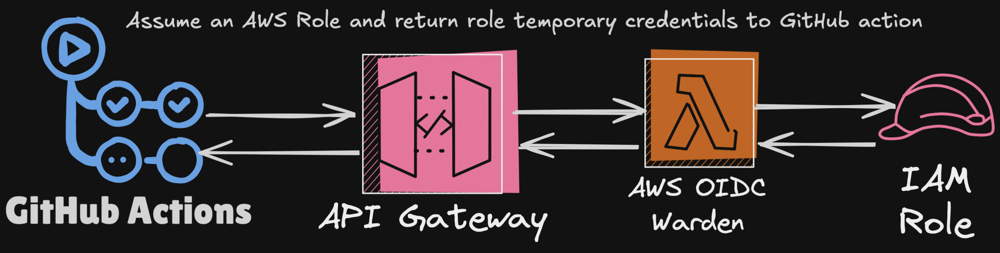
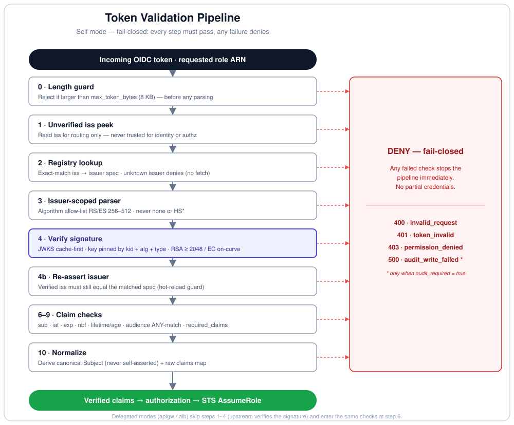

[](https://github.com/boogy/aws-oidc-warden/actions/workflows/release.yml) [](https://github.com/boogy/aws-oidc-warden/actions/workflows/codeql.yml) [](https://hub.docker.com/r/boogy/aws-oidc-warden) [](https://opensource.org/licenses/Apache-2.0) [](https://github.com/boogy/aws-oidc-warden/security/dependabot) [](https://github.com/boogy/aws-oidc-warden/blob/main/go.mod)

# AWS OIDC Warden



A Go service that validates OIDC tokens (GitHub Actions, GitLab, any OIDC IdP) and exchanges them for short-lived AWS credentials via STS AssumeRole. It sits between your CI/CD jobs and AWS, so no long-lived keys are stored anywhere.

Authorization is decided on the token's **verified** subject plus regex conditions on any claim the issuer publishes, composable with `all_of` / `any_of` / `none_of`.

<!-- prettier-ignore -->
> [!CAUTION]
> **Not all OIDC claims can be trusted.** Some GitHub claims are attacker-influenced. Before you gate access on a claim, check it against [PaloAltoNetworks/github-oidc-utils](https://github.com/PaloAltoNetworks/github-oidc-utils), which classifies every GitHub OIDC claim by how trustworthy it is. This service lets you require any claim; choosing the wrong one is the most likely way to build an insecure setup.

---

## Documentation

**New here?** Read in this order: **[CONFIGURATION.md](docs/CONFIGURATION.md)** to write your policy → **[ARCHITECTURE.md](docs/ARCHITECTURE.md#infrastructure-as-code)** to deploy it → **[GITHUB_ACTIONS.md](docs/GITHUB_ACTIONS.md)** to call it from CI → **[TOKEN_VALIDATION.md](docs/TOKEN_VALIDATION.md)** to understand what is actually guaranteed.

| Document                                                            | What's inside                                                                                                                             |
| ------------------------------------------------------------------- | ----------------------------------------------------------------------------------------------------------------------------------------- |
| [docs/ARCHITECTURE.md](docs/ARCHITECTURE.md#infrastructure-as-code) | **Deploy it** — the packaging, config-delivery, IAM and front-end contract your own IaC has to satisfy                                    |
| [docs/GITHUB_ACTIONS.md](docs/GITHUB_ACTIONS.md)                    | **Call it from CI** — the request/response contract, GitHub Actions examples, multi-region failover, and the composite action to roll out |
| [docs/CONFIGURATION.md](docs/CONFIGURATION.md)                      | Full config reference — every key, env vars, conditions, session policies, S3 hot-reload, fragments                                       |
| [docs/TOKEN_VALIDATION.md](docs/TOKEN_VALIDATION.md)                | **The security core** — validation modes, JWKS handling, crypto hardening, claim checks, SSRF protection                                  |
| [docs/MULTI_ISSUER.md](docs/MULTI_ISSUER.md)                        | Onboard any OIDC provider — discovery, `provider`, `claim_mappings`, per-issuer audiences                                                 |
| [docs/SESSION_TAGGING.md](docs/SESSION_TAGGING.md)                  | Session tags on every STS call, and the ABAC patterns they enable                                                                         |
| [docs/TAG_BASED_AUTHORIZATION.md](docs/TAG_BASED_AUTHORIZATION.md)  | Authorize via IAM role tags instead of config; hub/spoke cross-account model                                                              |
| [docs/LOGGING.md](docs/LOGGING.md)                                  | Structured logs, the durable audit trail, `audit_required`, SIEM signals, alerts                                                          |
| [docs/ARCHITECTURE.md](docs/ARCHITECTURE.md)                        | Component diagram, request pipeline, package layout, IAM permissions                                                                      |
| [docs/PERFORMANCE.md](docs/PERFORMANCE.md)                          | Measured behaviour at thousands of repositories — request cost, load time, memory sizing                                                  |
| [docs/MIGRATION_V3.md](docs/MIGRATION_V3.md)                        | v2 → v3: condition keys are claim names, and `environment` changed meaning                                                                |
| [docs/MIGRATION_V2.md](docs/MIGRATION_V2.md)                        | v1 → v2: the `issuers[]` model, with a breaking-change checklist                                                                          |

---

## Quick start

**1. Write a config** (`config.yaml`):

```yaml
issuers:
  - issuer: https://token.actions.githubusercontent.com
    provider: github
    audiences:
      - sts.amazonaws.com
    session_tags: # attached to every STS session, for ABAC and audit
      repo: repository
      ref: ref

role_mappings:
  - subject: "my-org/my-repo"
    roles:
      - arn:aws:iam::123456789012:role/github-actions-role
    conditions:
      ref: "refs/heads/main"
```

**2. Run it locally** to check the config loads and authorizes what you expect:

```bash
make run   # local server on :8080 with example-config.yaml
# or: go run cmd/local/main.go -port 9090 -config config.yaml -log-level debug
```

Endpoints: `POST /verify` (matches Lambda behaviour) and `GET /health`. The local server has no S3 hot-reload — that is a Lambda feature.

**3. Deploy** it with your own IaC — the contract to satisfy (packaging, config delivery, IAM, front-end) is in **[ARCHITECTURE.md](docs/ARCHITECTURE.md#infrastructure-as-code)**.

**4. Call it from a workflow** — see **[GITHUB_ACTIONS.md](docs/GITHUB_ACTIONS.md)**.

The target IAM role must trust the warden's execution role, with both `sts:AssumeRole` and `sts:TagSession`.

> **Upgrading?** In v3 every `conditions:` key is the claim it checks: `branch`/`actor_matches` became `ref`/`actor`, and `environment` now means the deployment environment, not the runner ([MIGRATION_V3](docs/MIGRATION_V3.md)). v2 replaced the top-level `issuer`/`audiences` and `repo_role_mappings`/`constraints` with `issuers[]`, `role_mappings` and `conditions` ([MIGRATION_V2](docs/MIGRATION_V2.md)).

---

## Calling it from CI

A caller requests an OIDC token, POSTs it with the role ARN it wants, and exports the credentials that come back. The job needs `id-token: write`:

```yaml
- uses: actions/github-script@v7
  with:
    script: |
      const core = require('@actions/core');
      const token = await core.getIDToken('sts.amazonaws.com');
      const res = await fetch(process.env.WARDEN_URL, {
        method: 'POST',
        headers: { 'Content-Type': 'application/json' },
        body: JSON.stringify({ token, role: process.env.ROLE_ARN }),
      });
      const { data } = await res.json();
      core.setSecret(data.SecretAccessKey);   // mask before exporting
      core.setSecret(data.SessionToken);
      // ...export as AWS_ACCESS_KEY_ID / AWS_SECRET_ACCESS_KEY / AWS_SESSION_TOKEN
```

**[GITHUB_ACTIONS.md](docs/GITHUB_ACTIONS.md)** has the rest: the full request/response contract for all three modes, which status codes are worth retrying, a `curl` variant, **multi-region failover** in both JavaScript and shell, and the composite action to put in front of a fleet of repositories. Non-GitHub issuers such as GitLab call the same endpoint the same way.

<!-- prettier-ignore -->
> [!IMPORTANT]
> **Mask the credentials before exporting them.** Without `core.setSecret` (or `::add-mask::` in shell) any later step can print live AWS credentials into the job log.

---

## How it works

1. **Receive** — a CI job sends an OIDC token and the role ARN it wants.
2. **Route by issuer** — the _unverified_ `iss` selects the issuer spec. Routing only; never trusted for identity.
3. **Verify signature** — JWKS fetched cache-first, signature checked against a `kid` + `alg` + key-type pinned key.
4. **Validate claims** — issuer re-asserted, audience (ANY-match), `exp`/`nbf`/`iat`, lifetime and age caps, `required_claims`. All fail-closed.
5. **Derive canonical subject** — from config (`claim_mappings.subject`, or GitHub's `repository`), never self-asserted.
6. **Authorize** — issuer-bound subject match against `role_mappings`, then auto-anchored regex `conditions`. IAM role tags can authorize as a fallback.
7. **Apply session policy** — optional inline or S3 policy narrows the credentials.
8. **Assume role** — with [STS session tags](https://docs.aws.amazon.com/IAM/latest/UserGuide/id_session-tags.html) built from verified claims.
9. **Audit and return** — the decision is recorded, then credentials are returned.

Token validation is the security core. The fail-closed pipeline in `self` mode:



Full detail — crypto hardening, JWKS handling, SSRF protection: **[docs/TOKEN_VALIDATION.md](docs/TOKEN_VALIDATION.md)**.

---

## Features

|                                |                                                                                                                                    |
| ------------------------------ | ---------------------------------------------------------------------------------------------------------------------------------- |
| **Multi-issuer, any provider** | Trust any number of issuers at once. GitHub is native; `provider: generic` onboards any OIDC IdP by mapping its claims             |
| **Hardened validation**        | RS/ES 256–512 only (never `none`/`HS*`), key pinning, RSA ≥ 2048 / EC on-curve checks, SSRF-safe JWKS, bounded time and size       |
| **Delegated modes**            | Let API Gateway or ALB verify the signature; claims are still re-validated here                                                    |
| **Four deployment shapes**     | API Gateway REST v1 + HTTP v2, Lambda URL, ALB, plus a local dev server                                                            |
| **Claim-based conditions**     | Auto-anchored regex on any verified claim, one pattern or a list, AND-ed by default, nestable with `all_of` / `any_of` / `none_of` |
| **Session policies**           | Inline JSON or S3-stored, scoping permissions per mapping                                                                          |
| **Session tags & ABAC**        | Verified claims become STS tags for audit, cost allocation, and `aws:PrincipalTag` policies                                        |
| **Tag-based authorization**    | Authorize from tags on the IAM role itself, no config enumeration; extends cross-account via a spoke role                          |
| **Structured audit trail**     | One JSON record per decision, secret-safe, with an optional fail-closed `audit_required`                                           |
| **Hot config reload**          | Change issuers, mappings and policies in S3 with no redeploy; fail-safe on a bad reload                                            |
| **Multi-tier JWKS cache**      | Memory LRU, DynamoDB (shared/persistent), or S3                                                                                    |
| **Multi-arch**                 | Native ARM64 and AMD64; pre-built images on GHCR                                                                                   |

---

## How it helps at scale

**Session tags turn verified claims into IAM policy inputs.** If you know **EKS Pod Identity**, this will feel familiar: the platform attests a workload, the workload assumes a role with no stored credential, and tags describing it become available to policy via `aws:PrincipalTag/...`. Here the OIDC token is the attestation and the repository plays the part a Kubernetes namespace does.

```json
{
  "Effect": "Allow",
  "Action": "s3:GetObject",
  "Resource": "arn:aws:s3:::my-bucket/*",
  "Condition": {
    "StringEquals": { "aws:PrincipalTag/repo": "my-org/my-repo" },
    "StringLike": { "aws:PrincipalTag/ref": "refs/heads/*" }
  }
}
```

So instead of one IAM role per repo (or per repo × environment), a few shared roles carry policies conditioned on the tags, and onboarding a repo becomes a config change. Unlike Pod Identity the tag vocabulary is **yours**, and only verified claims can become tags — [SESSION_TAGGING.md](docs/SESSION_TAGGING.md).

**Tag-based authorization removes the config entry entirely.** A repository can assume a role authorized by **tags on the role itself**, which suits roles managed across many accounts or teams. Explicit `role_mappings` are always evaluated first; tag-auth is an additive fallback — read its [security model](docs/TAG_BASED_AUTHORIZATION.md#security-model--foot-guns) before enabling it, because it can authorize a role _independently of_ the mapping conditions you wrote to constrain it.

Serving roles in **other AWS accounts** is a separate opt-in block. Two things are commonly misread: the target role is always assumed **directly, in one hop**, with the warden's own hub credentials; and the spoke role is assumed _only_ to call `iam:GetRole` and read a member-account role's tags, never as an assume target. Both features default to `false` — [TAG_BASED_AUTHORIZATION.md](docs/TAG_BASED_AUTHORIZATION.md), plus a worked example in [docs/examples/cross-account/](docs/examples/cross-account/).

---

## Deploying

**Infrastructure is not shipped here.** This repo is the service; deploying it is yours to own, with whichever tool your organization already uses. What a deployment must provide — packaging, config delivery, execution-role policy, front-end wiring — is specified in **[ARCHITECTURE.md § Infrastructure as code](docs/ARCHITECTURE.md#infrastructure-as-code)**.

Pick a Lambda variant by image tag; all four share the same core logic and differ only in the event they parse:

| Variant             | Image tag                                 | When to use                                                                                           |
| ------------------- | ----------------------------------------- | ----------------------------------------------------------------------------------------------------- |
| API Gateway HTTP v2 | `apigatewayv2-latest`                     | **Recommended** — `apigw` mode puts a JWT Authorizer in front, and the source IP is platform-attested |
| API Gateway REST v1 | `apigateway-latest` (also plain `latest`) | `self` mode; the only flavour AWS WAF can attach to                                                   |
| Lambda URL          | `lambdaurl-latest`                        | Simple setups, no gateway                                                                             |
| ALB                 | `alb-latest`                              | High traffic                                                                                          |

Each variant pairs with a `jwt_validation.mode`: `apigateway` and `lambdaurl` are `self` only, `apigatewayv2` is `apigw` only, and `alb` takes `alb` or `self`. The pairing is checked at boot and a mismatch panics rather than mis-parsing every request.

Images are published to `ghcr.io/boogy/aws-oidc-warden` and `docker.io/boogy/aws-oidc-warden`, multi-arch (arm64 + amd64), with build provenance attestations and version-pinnable tags (`apigatewayv2-v3.3.0`); a prerelease never moves a `*-latest` tag. Building from source: `make build`, `make build-lambda`, `make ko-build` (via [ko](https://ko.build) — there is no Dockerfile).

The Lambda needs an execution role with `sts:AssumeRole` + `sts:TagSession` on its target roles, `iam:GetRole` for tag-auth, and read/write on whichever S3 buckets and DynamoDB table you enable — complete policy in [ARCHITECTURE.md](docs/ARCHITECTURE.md#required-iam-permissions). **The target role must trust that execution role, with both `sts:AssumeRole` and `sts:TagSession`.**

<!-- prettier-ignore -->
> [!CAUTION]
> **In `apigw` mode, `lambda:InvokeFunction` is equivalent to minting credentials.** The signature is verified by the gateway, not by this service, so anything able to invoke the function directly can supply its own claims. Grant invoke to `apigateway.amazonaws.com` alone, narrowed by `source_arn` — [details](docs/TOKEN_VALIDATION.md#22-trust-boundary-lambdainvokefunction-is-identity-impersonation-in-apigw-mode).

<!-- prettier-ignore -->
> [!TIP]
> Give Lambda one broader role and scope it per-repo with session policies, rather than creating an IAM role per repository.

---

## What to watch out for

The failure modes that actually bite, in rough order of likelihood:

| Pitfall                                           | What happens                                                                                                              | Do this instead                                                                                                                                                                                 |
| ------------------------------------------------- | ------------------------------------------------------------------------------------------------------------------------- | ----------------------------------------------------------------------------------------------------------------------------------------------------------------------------------------------- |
| Gating on an untrusted claim                      | An attacker who can influence the claim can obtain credentials                                                            | Check the [claim trust table](https://github.com/PaloAltoNetworks/github-oidc-utils) first                                                                                                      |
| Broad `lambda:InvokeFunction` in `apigw` mode     | **Credential minting for any authorized subject.** The signature is not verified in that mode, so IAM is the only defence | Grant invoke to `apigateway.amazonaws.com` alone, narrowed by `source_arn` — [details](docs/TOKEN_VALIDATION.md#22-trust-boundary-lambdainvokefunction-is-identity-impersonation-in-apigw-mode) |
| A broad `subject` pattern                         | Every subject of that issuer gets the roles                                                                               | Keep patterns specific; a bare `.*`/`.+` is rejected at boot, but `(.*)` still compiles                                                                                                         |
| Target role doesn't trust the warden              | `403 assume_role_denied`                                                                                                  | Add the warden's execution role as a principal, with `sts:AssumeRole` **and** `sts:TagSession`                                                                                                  |
| ABAC breaks after a role chain                    | Session tags are dropped at the first hop                                                                                 | Set `session_tags_transitive: true` (recommended; off by default for upgrade safety)                                                                                                            |
| Audience mismatch in `apigw` mode                 | API Gateway rejects before this service runs                                                                              | `getIDToken(aud)` must match both the JWT Authorizer **and** the issuer's `audiences`                                                                                                           |
| `audit_required` (default **on**) with no S3 sink | Enforcement never engages — decisions only reach CloudWatch. It logs a warning at boot; nothing fails                     | Also set `log_to_s3: true` + `log_bucket` — see [LOGGING.md](docs/LOGGING.md)                                                                                                                   |
| Cross-account assume with the block off           | Fails closed with an error                                                                                                | Set `cross_account.enabled: true` and list the account in `allowed_accounts`                                                                                                                    |

---

## Troubleshooting

| Symptom                   | Likely cause                                                                                                                                           |
| ------------------------- | ------------------------------------------------------------------------------------------------------------------------------------------------------ |
| `401 token_invalid`       | Workflow missing `id-token: write`; issuer or audience mismatch; clock skew beyond `jwt_leeway`                                                        |
| `403 permission_denied`   | Subject doesn't match any mapping, or a condition failed. The audit record's `stage` and `reason` say which                                            |
| `403 assume_role_denied`  | STS refused: the target role's trust policy, or the execution role missing `sts:AssumeRole`/`sts:TagSession`. The log line carries `stsErrorCode`      |
| `500 assume_role_failed`  | Not a permission problem — throttling, expired broker credentials, or a malformed session policy                                                       |
| Cache misses / throttling | DynamoDB needs a TTL attribute configured; S3 needs read/write; raise `max_local_size` for high traffic                                                |
| Cross-account failures    | `cross_account.enabled: true`, spoke role exists in the member account and trusts the hub, `iam:GetRole` granted, account listed in `allowed_accounts` |

Every denial writes one audit record naming the `stage` that refused — start there. See [LOGGING.md](docs/LOGGING.md).

---

## Contributing

Fork, branch (`feature/…`), make the change with tests, run `make check`, open a PR with a clear description.

<!-- prettier-ignore -->
> [!TIP]
> Found a bug? Please open a pull request with the fix rather than only an issue, so everyone benefits.

---

## License

Apache License 2.0.

## Acknowledgments

- Built out of the need to connect thousands of GitHub Actions repositories to AWS securely.
- Inspired by [AOEpeople/lambda_token_auth](https://github.com/AOEpeople/lambda_token_auth).
- Thanks to [PaloAltoNetworks/github-oidc-utils](https://github.com/PaloAltoNetworks/github-oidc-utils) for their research on GitHub OIDC claim trustworthiness.
- Thanks to Jonathan for the name.
