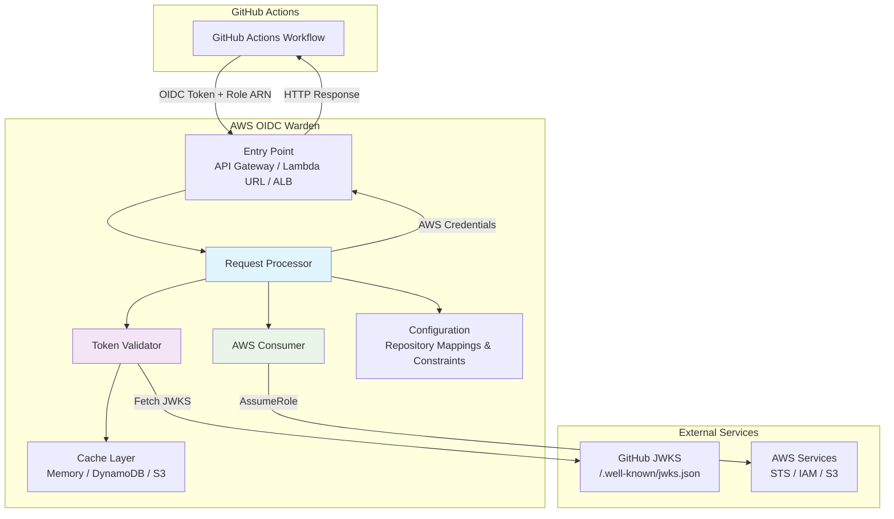
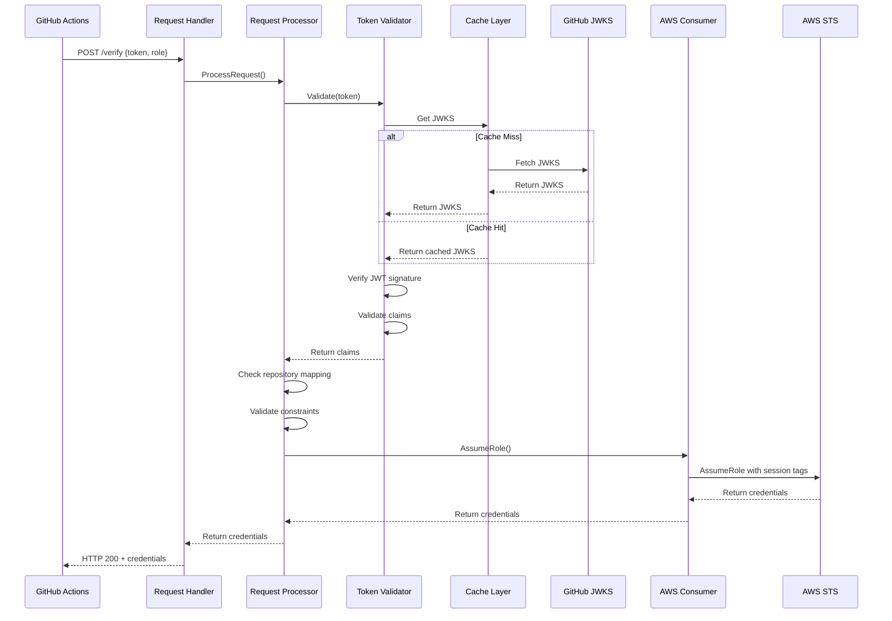
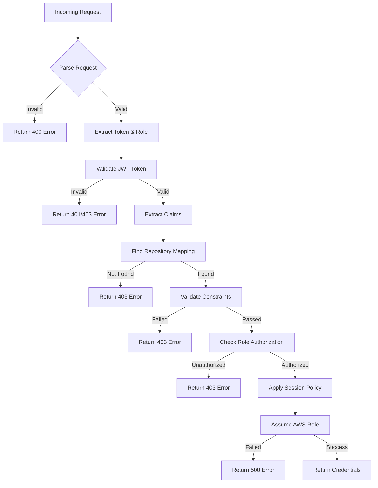
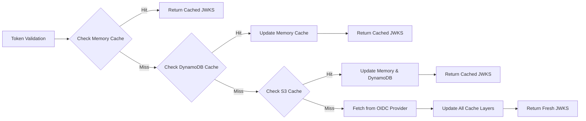
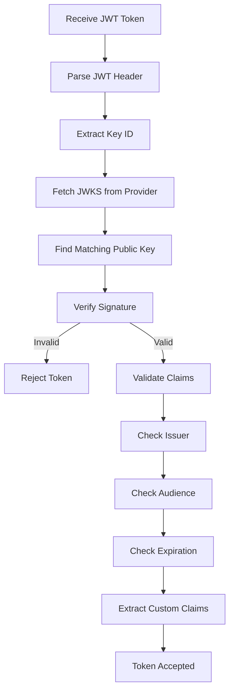
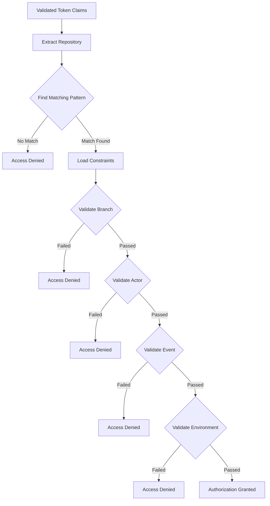
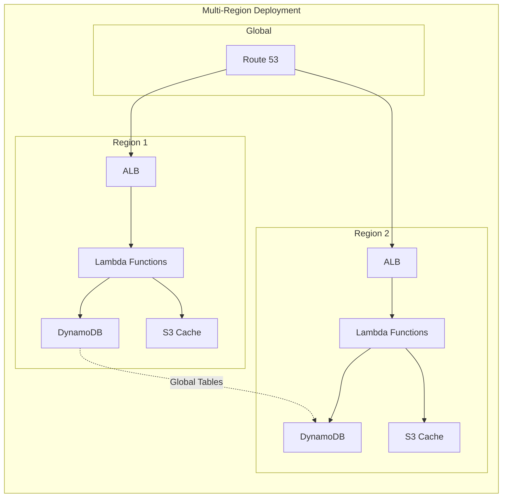

# AWS OIDC Warden Architecture

## Overview

The AWS OIDC Warden is designed as a secure, high-performance, and scalable service that acts as a bridge between GitHub Actions (and other OIDC providers) and AWS resources. This document provides a comprehensive overview of the system architecture, component interactions, and data flow.

## High-Level Architecture



### Simple Flow Overview

1. **GitHub Actions** sends an OIDC token and desired role ARN to the service
2. **Entry Point** receives the HTTP request (via API Gateway, Lambda URL, or ALB)
3. **Request Processor** orchestrates the validation and role assumption process
4. **Token Validator** verifies the JWT signature against GitHub's JWKS (with caching)
5. **Configuration** engine checks repository mappings and validates constraints
6. **AWS Consumer** assumes the requested IAM role with session tags and policies
7. **Response** contains temporary AWS credentials with tagged session

## Component Architecture

### 1. Entry Points (Deployment Options)

The AWS OIDC Warden supports multiple deployment patterns to accommodate different architectural needs:

#### API Gateway + Lambda

```bash
GitHub Actions → API Gateway → AWS OIDC Warden (Lambda Function Proxy)
```

- **Use Case**: Traditional REST API with full API Gateway features
- **Benefits**: Rate limiting, request transformation, API keys, usage plans
- **Handler**: `pkg/handler/apigateway.go`
- **Entry Point**: `cmd/apigateway/main.go`

#### Lambda URLs
```
GitHub Actions → AWS OIDC Warden (Lambda Function URL)
```
- **Use Case**: Simplified setup for direct Lambda invocation
- **Benefits**: Lower latency, reduced cost, simpler configuration
- **Handler**: `pkg/handler/lambdaurl.go`
- **Entry Point**: `cmd/lambdaurl/main.go`

#### Application Load Balancer
```
GitHub Actions → ALB → AWS OIDC Warden (Lambda Function)
```
- **Use Case**: High-traffic scenarios with advanced routing
- **Benefits**: Multi-region support, advanced health checks, WAF integration
- **Handler**: `pkg/handler/alb.go`
- **Entry Point**: `cmd/alb/main.go`

#### Local Development Server
```
GitHub Actions → HTTP Server → AWS OIDC Warden
```
- **Use Case**: Local development and testing
- **Benefits**: Fast iteration, debugging capabilities, local testing
- **Handler**: Built into local server
- **Entry Point**: `cmd/local/main.go`

### 2. Core Processing Pipeline

The request processing follows a strict pipeline ensuring security and performance:



## Core Components Deep Dive

### Request Handler (`pkg/handler/`)

The handler layer provides a unified interface across different deployment options:

```go
type RequestProcessor interface {
    ProcessRequest(ctx context.Context, requestData *RequestData, requestID string, log *slog.Logger) (*types.Credentials, error)
}
```

**Key Responsibilities:**
- HTTP request parsing and validation
- Response formatting and error handling
- Request ID generation and correlation
- Structured logging setup
- Context management and timeouts

**Files:**
- `bootstrap.go` - Common initialization logic
- `processor.go` - Core business logic
- `types.go` - Request/response data structures
- `validation.go` - Input validation

### Token Validator (`pkg/validator/`)

The validator component handles all OIDC token validation logic:

```go
type TokenValidatorInterface interface {
    Validate(string) (*types.GithubClaims, error)
    ParseToken(tokenString string) (*types.GithubClaims, error)
    FetchJWKS(issuer string) (*types.JWKS, error)
    GenKeyFunc(jwks *types.JWKS) jwt.Keyfunc
}
```

**Validation Process:**
1. **JWT Parsing**: Decode and parse the JWT token
2. **JWKS Retrieval**: Fetch public keys from OIDC provider (with caching)
3. **Signature Verification**: Verify token signature using RSA public keys
4. **Claims Validation**: Validate issuer, audience, expiration, and custom claims
5. **Security Checks**: Ensure token hasn't been tampered with

**Security Features:**
- Token signature verification
- Issuer and audience validation
- Token expiration checking
- Claims extraction and validation
- Support for multiple OIDC providers

### AWS Consumer (`pkg/aws/`)

The AWS consumer abstracts all AWS service interactions:

```go
type AwsConsumerInterface interface {
    ReadS3Configuration() error
    AssumeRole(roleARN, sessionName string, sessionPolicy *string, duration *int32, claims *gtypes.GithubClaims) (*types.Credentials, error)
    GetS3Object(bucket, key string) (io.ReadCloser, error)
    GetRole(role string) (*iam.GetRoleOutput, error)
}
```

**AWS Operations:**
- **Role Assumption**: Use AWS STS to assume target IAM roles
- **Session Tagging**: Apply GitHub-specific tags to AWS sessions
- **Session Policies**: Apply custom IAM policies to limit permissions
- **S3 Integration**: Read configuration and session policies from S3
- **IAM Integration**: Validate role existence and trust relationships

**Session Tags Applied:**
```go
tags := []types.Tag{
    {Key: aws.String("repo"), Value: aws.String(claims.Repository)},
    {Key: aws.String("actor"), Value: aws.String(claims.Actor)},
    {Key: aws.String("ref"), Value: aws.String(claims.Ref)},
    {Key: aws.String("event-name"), Value: aws.String(claims.EventName)},
    {Key: aws.String("repo-owner"), Value: aws.String(claims.RepositoryOwner)},
    {Key: aws.String("ref-type"), Value: aws.String(claims.RefType)},
}
```

### Caching System (`pkg/cache/`)

The caching system provides multiple storage backends for JWKS data:

```go
type Cache interface {
    Get(key string) ([]byte, error)
    Set(key string, value []byte, ttl time.Duration) error
    Delete(key string) error
    Clear() error
}
```

#### Memory Cache
- **Implementation**: LRU-based in-memory cache
- **Use Case**: Low-latency access for frequently accessed JWKS
- **Limitations**: Lost on Lambda container recycling
- **Configuration**: Maximum size and TTL configurable

#### DynamoDB Cache
- **Implementation**: AWS DynamoDB with automatic TTL
- **Use Case**: Persistent cache shared across Lambda instances
- **Benefits**: High availability, automatic scaling, built-in TTL
- **Configuration**: Table name and TTL configurable

#### S3 Cache
- **Implementation**: S3 objects with metadata-based TTL
- **Use Case**: Large objects and long-term caching
- **Benefits**: Cost-effective, unlimited storage, optional cleanup
- **Configuration**: Bucket, prefix, and cleanup options

### Configuration Manager (`pkg/config/`)

The configuration system supports multiple formats and sources:

```go
type Config struct {
    Issuer                string            `mapstructure:"issuer"`
    Audience              string            `mapstructure:"audience"`
    RepoRoleMappings      []RepoRoleMapping `mapstructure:"repo_role_mappings"`
    Cache                 *Cache            `mapstructure:"cache"`
    // ... other fields
}
```

**Configuration Sources** (in order of precedence):
1. Environment variables (with `AOW_` prefix)
2. Configuration file (YAML/JSON/TOML)
3. S3-stored configuration
4. Default values

**Repository Mapping System:**
```yaml
repo_role_mappings:
  - repo: "org/project-.*"              # Regex pattern matching
    roles:
      - "arn:aws:iam::123456789012:role/github-actions-role"
    constraints:
      branch: "refs/heads/main"         # Branch constraints
      actor_matches: ["admin-.*"]      # Actor constraints
      event_name: "push"               # Event type constraints
    session_policy: |                  # Inline session policy
      {
        "Version": "2012-10-17",
        "Statement": [...]
      }
```

## Data Flow and Processing

### 1. Request Processing Flow



### 2. Constraint Validation

The constraint engine supports multiple validation types:

```go
type Constraint struct {
    Branch       string   `mapstructure:"branch"`        // refs/heads/main
    Ref          string   `mapstructure:"ref"`           // refs/tags/v.*
    RefType      string   `mapstructure:"ref_type"`      // branch, tag
    EventName    string   `mapstructure:"event_name"`    // push, pull_request
    WorkflowRef  string   `mapstructure:"workflow_ref"`  // .github/workflows/deploy.yml
    Environment  string   `mapstructure:"environment"`   // production
    ActorMatches []string `mapstructure:"actor_matches"` // ["admin-.*", "specific-user"]
}
```

**Validation Logic:**
- All specified constraints must be satisfied (AND logic)
- Regular expressions supported for pattern matching
- Claims are extracted from the validated JWT token
- Constraint compilation is cached for performance

### 3. Caching Strategy



**Cache TTL Strategy:**
- **Memory Cache**: Short TTL (minutes to hours) for hot data
- **DynamoDB Cache**: Medium TTL (hours) for persistence
- **S3 Cache**: Long TTL (days) for cold data
- **Automatic Invalidation**: Based on JWT "iat" (issued at) claims

## Security Architecture

### 1. Token Validation Security



### 2. Repository Authorization



### 3. AWS Integration Security

**Role Assumption:**
- Uses AWS STS AssumeRole with session tags
- Applies custom session policies for additional restrictions
- Validates role trust relationships
- Implements principle of least privilege

**Session Security:**
- Session duration limits (default: 1 hour, max: 12 hours)
- Session tags for audit trails and ABAC policies
- Optional session policies to further restrict permissions
- Automatic credential rotation

## Performance Architecture

### 1. Caching Performance

**Cache Hit Rates:**
- Memory Cache: >95% for active repositories
- DynamoDB Cache: >85% for warm data
- S3 Cache: >70% for cold data
- Overall System: >98% cache hit rate

**Performance Metrics:**
- Memory Cache Lookup: <1ms
- DynamoDB Cache Lookup: <10ms
- S3 Cache Lookup: <50ms
- JWKS Fetch (cache miss): <200ms

### 2. Lambda Performance Optimizations

**Cold Start Mitigation:**
- Minimal dependencies and imports
- Connection pooling for AWS services
- Lazy initialization of non-critical components
- Provisioned concurrency for high-traffic scenarios

**Memory and CPU Optimization:**
- Configurable Lambda memory allocation
- ARM64 support for better price/performance
- Efficient JWT parsing and validation
- Optimized regular expression compilation

## Scalability Architecture

### 1. Horizontal Scaling



**Scaling Strategies:**
- **Lambda Auto-scaling**: Automatic scaling based on incoming requests
- **DynamoDB On-Demand**: Pay-per-request with automatic scaling
- **S3 Unlimited Scale**: No capacity planning required
- **Global Distribution**: Multi-region deployment for low latency

## Deployment Architecture

### 1. Container-Based Deployment

```dockerfile
# Multi-stage build for optimal image size
FROM golang:1.21-alpine AS builder
WORKDIR /app
COPY . .
RUN go mod download
RUN CGO_ENABLED=0 GOOS=linux go build -o bootstrap cmd/lambdaurl/main.go

FROM public.ecr.aws/lambda/provided:al2023
COPY --from=builder /app/bootstrap /var/runtime/bootstrap
CMD ["bootstrap"]
```

**Container Registry Options:**
- GitHub Container Registry (GHCR): `ghcr.io/boogy/aws-oidc-warden`
- Docker Hub: `boogy/aws-oidc-warden`
- AWS ECR: Private registry with pull-through cache

### 2. Infrastructure as Code

**Terraform Example:**
```hcl
resource "aws_lambda_function" "aws_oidc_warden" {
  function_name = "aws-oidc-warden"
  package_type  = "Image"
  image_uri     = "ghcr.io/boogy/aws-oidc-warden:latest"
  role          = aws_iam_role.lambda_execution.arn

  environment {
    variables = {
      AOW_CACHE_TYPE         = "dynamodb"
      AOW_CACHE_DYNAMODB_TABLE = aws_dynamodb_table.cache.name
    }
  }
}
```

## References

- [AWS Lambda Best Practices](https://docs.aws.amazon.com/lambda/latest/dg/best-practices.html)
- [JWT RFC 7519](https://tools.ietf.org/html/rfc7519)
- [OpenID Connect Core](https://openid.net/specs/openid-connect-core-1_0.html)
- [GitHub OIDC Documentation](https://docs.github.com/en/actions/deployment/security-hardening-your-deployments/about-security-hardening-with-openid-connect)
- [AWS STS API Reference](https://docs.aws.amazon.com/STS/latest/APIReference/)
