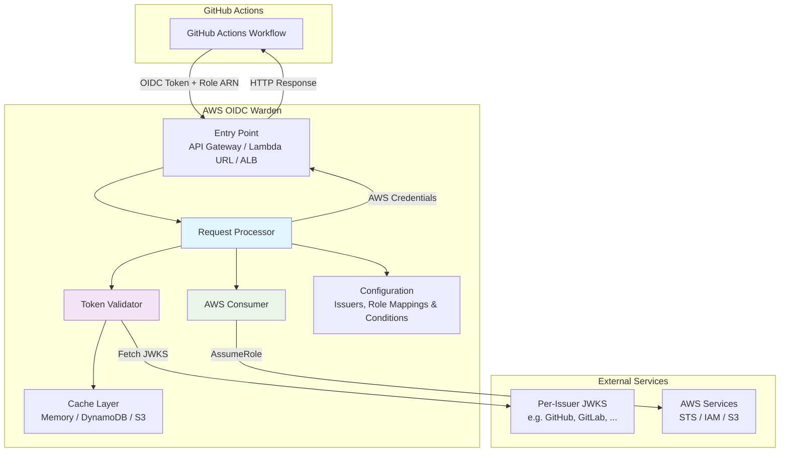
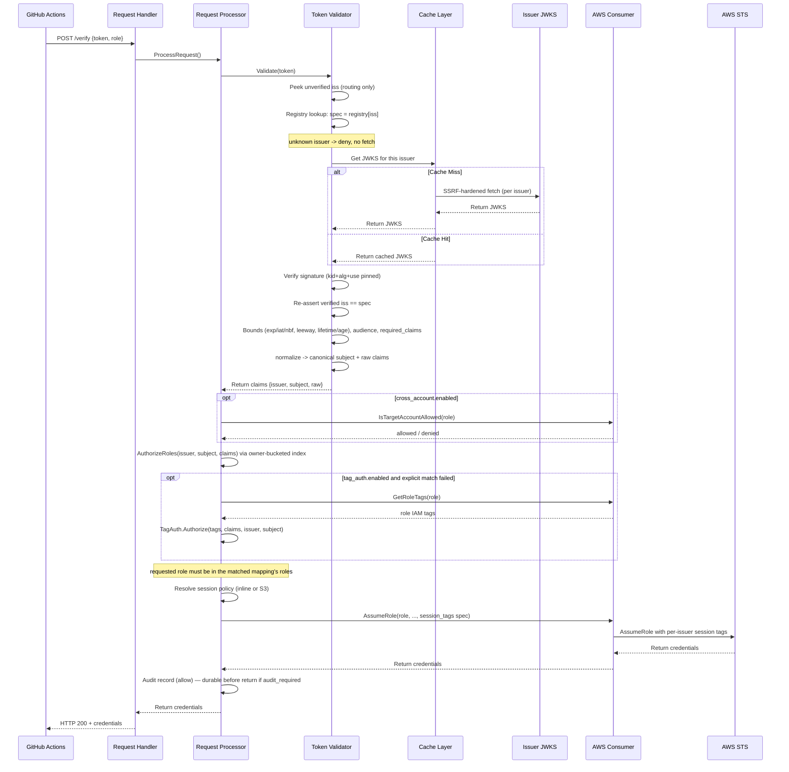
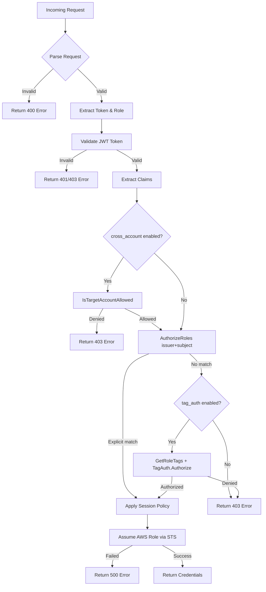
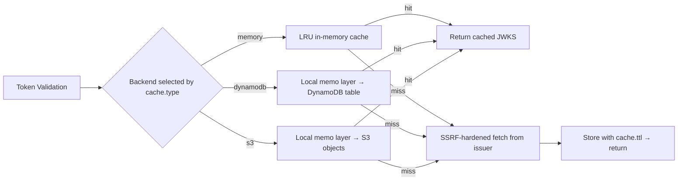
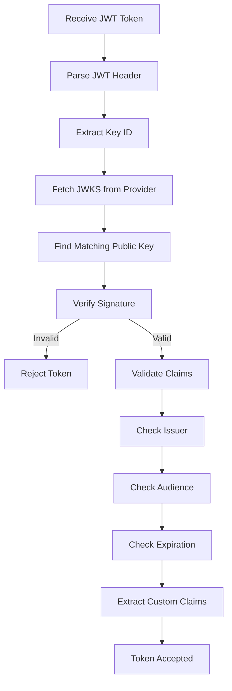
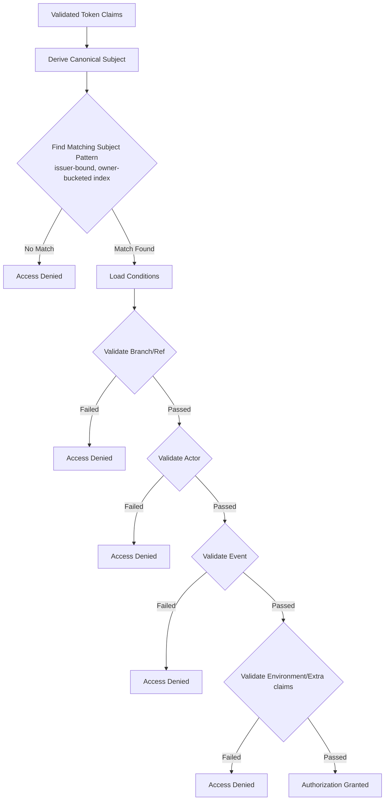
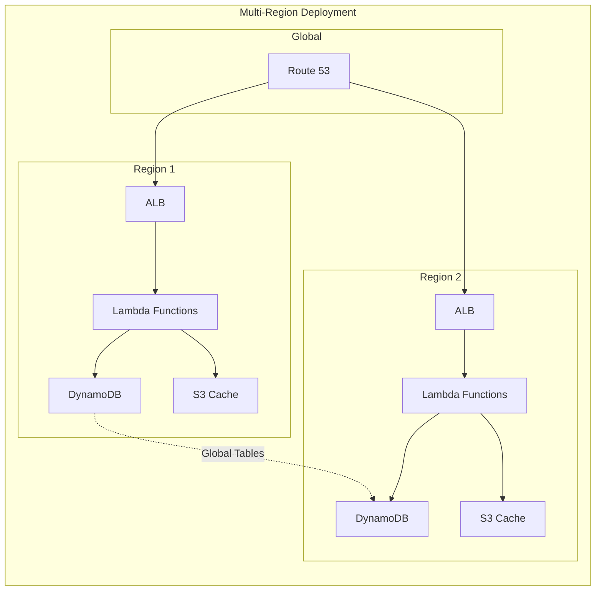

# AWS OIDC Warden Architecture

## Overview

The AWS OIDC Warden is designed as a secure, high-performance, and scalable service that acts as a bridge between GitHub Actions (and other OIDC providers) and AWS resources. This document provides a comprehensive overview of the system architecture, component interactions, and data flow.

## High-Level Architecture


```mermaid
graph TB
    subgraph "GitHub Actions"
        GA[GitHub Actions Workflow]
    end

    subgraph "AWS OIDC Warden"
        ENTRY[Entry Point<br/>API Gateway / Lambda URL / ALB]
        PROCESSOR[Request Processor]
        VALIDATOR[Token Validator]
        CACHE[Cache Layer<br/>Memory / DynamoDB / S3]
        CONSUMER[AWS Consumer]
        CONFIG[Configuration<br/>Issuers, Role Mappings & Conditions]
    end

    subgraph "External Services"
        JWKS[Per-Issuer JWKS<br/>e.g. GitHub, GitLab, ...]
        AWS[AWS Services<br/>STS / IAM / S3]
    end

    GA -->|OIDC Token + Role ARN| ENTRY
    ENTRY --> PROCESSOR
    PROCESSOR --> VALIDATOR
    PROCESSOR --> CONSUMER
    PROCESSOR --> CONFIG

    VALIDATOR -->|Fetch JWKS| JWKS
    VALIDATOR --> CACHE

    CONSUMER -->|AssumeRole| AWS

    PROCESSOR -->|AWS Credentials| ENTRY
    ENTRY -->|HTTP Response| GA

    style PROCESSOR fill:#e1f5fe
    style VALIDATOR fill:#f3e5f5
    style CONSUMER fill:#e8f5e8
```

### Simple Flow Overview

1. **GitHub Actions** sends an OIDC token and desired role ARN to the service
2. **Entry Point** receives the HTTP request (via API Gateway, Lambda URL, or ALB)
3. **Request Processor** orchestrates the validation and role assumption process
4. **Token Validator** verifies the JWT signature against GitHub's JWKS (with caching)
5. **Configuration** engine checks repository mappings and validates constraints
6. **AWS Consumer** assumes the requested IAM role with session tags and policies
7. **Response** contains temporary AWS credentials with tagged session

## Component Architecture

### 1. Entry Points (Deployment Options)

The AWS OIDC Warden supports multiple deployment patterns to accommodate different architectural needs:

#### API Gateway + Lambda

```bash
GitHub Actions → API Gateway → AWS OIDC Warden (Lambda Function Proxy)
```

- **Use Case**: Traditional REST API with full API Gateway features
- **Benefits**: Rate limiting, request transformation, API keys, usage plans
- **Handler**: `internal/handler/apigateway.go`
- **Entry Point**: `cmd/apigateway/main.go`

#### Lambda URLs

```
GitHub Actions → AWS OIDC Warden (Lambda Function URL)
```

- **Use Case**: Simplified setup for direct Lambda invocation
- **Benefits**: Lower latency, reduced cost, simpler configuration
- **Handler**: `internal/handler/lambdaurl.go`
- **Entry Point**: `cmd/lambdaurl/main.go`

#### Application Load Balancer

```
GitHub Actions → ALB → AWS OIDC Warden (Lambda Function)
```

- **Use Case**: High-traffic scenarios with advanced routing
- **Benefits**: Multi-region support, advanced health checks, WAF integration
- **Handler**: `internal/handler/alb.go`
- **Entry Point**: `cmd/alb/main.go`

#### Local Development Server

```
GitHub Actions → HTTP Server → AWS OIDC Warden
```

- **Use Case**: Local development and testing
- **Benefits**: Fast iteration, debugging capabilities, local testing
- **Handler**: Built into local server
- **Entry Point**: `cmd/local/main.go`

### 2. Core Processing Pipeline

The request processing follows a strict pipeline ensuring security and performance:


```mermaid
sequenceDiagram
    participant Client as GitHub Actions
    participant Handler as Request Handler
    participant Processor as Request Processor
    participant Validator as Token Validator
    participant Cache as Cache Layer
    participant JWKS as Issuer JWKS
    participant Consumer as AWS Consumer
    participant STS as AWS STS

    Client->>Handler: POST /verify {token, role}
    Handler->>Processor: ProcessRequest()

    Processor->>Validator: Validate(token)
    Validator->>Validator: Peek unverified iss (routing only)
    Validator->>Validator: Registry lookup: spec = registry[iss]
    Note over Validator: unknown issuer -> deny, no fetch
    Validator->>Cache: Get JWKS for this issuer

    alt Cache Miss
        Cache->>JWKS: SSRF-hardened fetch (per issuer)
        JWKS-->>Cache: Return JWKS
        Cache-->>Validator: Return JWKS
    else Cache Hit
        Cache-->>Validator: Return cached JWKS
    end

    Validator->>Validator: Verify signature (kid+alg+use pinned)
    Validator->>Validator: Re-assert verified iss == spec
    Validator->>Validator: Bounds (exp/iat/nbf, leeway, lifetime/age), audience, required_claims
    Validator->>Validator: normalize -> canonical subject + raw claims
    Validator-->>Processor: Return claims {issuer, subject, raw}

    opt cross_account.enabled
        Processor->>Consumer: IsTargetAccountAllowed(role)
        Consumer-->>Processor: allowed / denied
    end

    Processor->>Processor: AuthorizeRoles(issuer, subject, claims) via owner-bucketed index

    opt tag_auth.enabled and explicit match failed
        Processor->>Consumer: GetRoleTags(role)
        Consumer-->>Processor: role IAM tags
        Processor->>Processor: TagAuth.Authorize(tags, claims, issuer, subject)
    end

    Note over Processor: requested role must be in the matched mapping's roles
    Processor->>Processor: Resolve session policy (inline or S3)
    Processor->>Consumer: AssumeRole(role, ..., session_tags spec)

    Consumer->>STS: AssumeRole with per-issuer session tags
    STS-->>Consumer: Return credentials
    Consumer-->>Processor: Return credentials
    Processor->>Processor: Audit record (allow) — durable before return if audit_required
    Processor-->>Handler: Return credentials
    Handler-->>Client: HTTP 200 + credentials
```

## JWT Validation Modes

Three modes controlled by `jwt_validation.mode`:

| Mode    | Verifier              | Claims source                                | Binary         |
| ------- | --------------------- | -------------------------------------------- | -------------- |
| `self`  | This service (JWKS)   | JWT body after full verification             | any            |
| `apigw` | API Gateway (managed) | `event.requestContext.authorizer.jwt.claims` | `apigatewayv2` |
| `alb`   | This service (ES256)  | `x-amzn-oidc-data` after ALB key verify      | `alb`          |

**Security invariant:** In delegated modes, if no upstream-injected claims arrive (direct Lambda invocation bypass), `Extract()` returns an error wrapping `ErrTokenValidationFailed` → HTTP 401.

**API Gateway mode** requires an `aws_apigatewayv2_authorizer` JWT resource pointing at `https://token.actions.githubusercontent.com`. Restrict Lambda invocations to the API Gateway execution role via Lambda resource-based policies.

**ALB mode** verifies the ALB-signed ES256 JWT but does not re-verify the original OIDC signature. `alb_expected_signer` (the trusted ALB's ARN) is **required** in this mode — config validation fails without it — to prevent cross-ALB token injection.

**Hot-reload note:** The extractor implementation is fixed at Lambda cold start. Changing `jwt_validation.mode` requires a redeployment.

## Core Components Deep Dive

### Request Handler (`internal/handler/`)

The handler layer provides a unified interface across different deployment options:

```go
type RequestProcessor interface {
    ProcessRequest(ctx context.Context, requestData *RequestData, input validator.ExtractionInput, requestID string, log *slog.Logger) (*types.Credentials, error)
}
```

**Key Responsibilities:**

- HTTP request parsing and validation
- Response formatting and error handling
- Request ID generation and correlation
- Structured logging setup
- Context management and timeouts

**Files:**

- `bootstrap.go` - Common initialization logic
- `processor.go` - Core business logic
- `types.go` - Request/response data structures
- `validation.go` - Input validation

### Token Validator (`internal/validator/`)

The validator component handles all OIDC token validation logic:

```go
type TokenValidatorInterface interface {
    Validate(string) (*types.Claims, error)
    FetchJWKS(issuer string) (*types.JWKS, error)
    GenKeyFunc(jwks *types.JWKS) jwt.Keyfunc
}
```

**Validation Process (multi-issuer, `self` mode):**

1. **Length guard**: reject tokens over `max_token_bytes` before any parse.
2. **Route**: read the unverified `iss` (routing only) and look it up in the immutable issuer registry (exact match); an unknown issuer denies **before** any JWKS fetch.
3. **Per-issuer parse**: algorithm allowlist (RS/ES 256–512), `exp` + `iat` required, `WithLeeway`.
4. **Signature**: verify against that issuer's cached JWKS (SSRF-hardened fetch; forced refresh on key-miss, rate-limited per `(issuer, kid)`); key pinned by `kid` + `alg` + `use=sig` + key-type↔alg-family. Then **re-assert** the verified `iss` equals the matched spec.
5. **Bounds & claims**: `sub` non-empty, `nbf` (if present), optional lifetime/age caps, audience ANY-match against this issuer's audiences only, `required_claims` present.
6. **Normalize**: derive the canonical `subject` from the issuer's `claim_mappings` (GitHub default `repository`), populate `claims.Raw` with every verified claim. A token never self-asserts an unmapped subject.

The registry is rebuilt lock-free on config hot-reload (atomic snapshot swap keyed on a `builtFrom` identity check). Delegated `apigw`/`alb` modes run the **same** bounds + normalization via a shared `checkAndNormalizeClaims` path — they are not a weaker path.

**Security Features:**

- Allowed algorithms enforced: ES256/384/512, RS256/384/512 — `none` and all other algorithms rejected
- Issuer and multi-audience validation (any expected audience match accepted)
- Token expiration and `iat` required
- JWKS URI and issuer URL must use HTTPS (loopback hosts excepted for local dev/tests)
- Claims extraction and validation; each issuer's own `required_claims` list is enforced (GitHub defaults to requiring `repository`)

### AWS Consumer (`internal/aws/`)

The AWS consumer abstracts all AWS service interactions:

```go
type AwsConsumerInterface interface {
    ReadS3Configuration() error
    AssumeRole(roleARN, sessionName string, sessionPolicy *string, duration *int32, claims *gtypes.Claims, sessionTags map[string]string) (*types.Credentials, error)
    GetS3Object(bucket, key string) (io.ReadCloser, error)
    GetRole(role string) (*iam.GetRoleOutput, error)
    GetRoleTags(roleARN string) (map[string]string, error)
    IsTargetAccountAllowed(roleArn string) (bool, error)
}
```

**AWS Operations:**

- **Role Assumption**: Use AWS STS to assume target IAM roles
- **Session Tagging**: Apply the requesting issuer's `session_tags` spec to AWS sessions
- **Session Policies**: Apply custom IAM policies to limit permissions
- **S3 Integration**: Read configuration and session policies from S3
- **IAM Integration**: Validate role existence and trust relationships

**Session Tags Applied:**

Tags are not hardcoded — each issuer declares its own `session_tags` map (STS
tag key ← raw claim name), and `BuildSessionTags(rawClaims, tagSpec)` resolves
that spec against the verified claims of the token that authorized this
request:

```go
func BuildSessionTags(rawClaims map[string]any, tagSpec map[string]string) []types.Tag
```

A typical GitHub `session_tags` spec (`repo: repository`, `actor: actor`,
`ref: ref`, ...) produces the same shape of tags v1 hardcoded, but any issuer
can define its own key set from its own raw claims (see
[SESSION_TAGGING.md](SESSION_TAGGING.md)). Invalid keys/values are skipped and
logged, never sanitized — a tag an ABAC policy sees always carries the exact
verified claim value. The list is deterministic (sorted by key) and capped at
50 tags.

### Caching System (`internal/cache/`)

The caching system provides multiple storage backends for JWKS data:

```go
type Cache interface {
    Get(key string) (*types.JWKS, bool)
    Set(key string, value *types.JWKS, ttl time.Duration)
}
```

`NewCache(cfg)` selects **one** backend from `cache.type` (`memory`, `dynamodb`,
or `s3`) — the backends are alternatives, not chained tiers. The DynamoDB and
S3 backends each keep a small local in-memory layer in front of their remote
store to cut per-request latency.

#### Memory Cache

- **Implementation**: LRU-based in-memory cache
- **Use Case**: Low-latency access for frequently accessed JWKS
- **Limitations**: Lost on Lambda container recycling
- **Configuration**: Maximum size and TTL configurable

#### DynamoDB Cache

- **Implementation**: AWS DynamoDB with automatic TTL
- **Use Case**: Persistent cache shared across Lambda instances
- **Benefits**: High availability, automatic scaling, built-in TTL
- **Configuration**: Table name and TTL configurable

#### S3 Cache

- **Implementation**: S3 objects with metadata-based TTL
- **Use Case**: Large objects and long-term caching
- **Benefits**: Cost-effective, unlimited storage, optional cleanup
- **Configuration**: Bucket, prefix, and cleanup options

### Configuration Manager (`internal/config/`)

The configuration system supports multiple formats and sources:

```go
type Config struct {
    Issuers               []IssuerConfig    `mapstructure:"issuers"`        // trusted OIDC issuers (v2)
    DefaultIssuer         string            `mapstructure:"default_issuer"`
    RoleMappings          []RoleMapping     `mapstructure:"role_mappings"`
    RoleGroups            []RoleGroup       `mapstructure:"role_groups"`
    RoleSets              map[string][]string `mapstructure:"role_sets"`
    ConfigFragments       []string          `mapstructure:"config_fragments"`
    Cache                 *Cache            `mapstructure:"cache"`
    TagAuth               *TagAuth          `mapstructure:"tag_auth"`
    CrossAccount          *CrossAccount     `mapstructure:"cross_account"`
    ConfigReloadInterval  time.Duration     `mapstructure:"config_reload_interval"`
    // hardening + logging knobs: jwt_leeway, max_token_lifetime/age/bytes,
    // jwks_refetch_cooldown, allow_insecure_issuers, log_level,
    // log_claim_values, audit_required, ... (see docs/CONFIGURATION.md)
}
```

Each `IssuerConfig` carries `issuer`, `provider` (`github`/`generic`),
`audiences`, optional `jwks_uri`, `claim_mappings`, `required_claims`, and
`session_tags`. At `Validate()`, `role_mappings`/`role_groups` are resolved to
their issuer (explicit, `default_issuer`, or the sole issuer), `@role_set`
aliases are expanded, patterns are anchored + compiled once, and an
owner-bucketed authorization index is built (byte-identical to a linear scan).

**Configuration Sources** (in order of precedence):

1. Environment variables (with `AOW_` prefix) — re-applied after every remote merge
2. S3-stored configuration (overlaid on the local config when `s3_config_bucket`/`s3_config_path` are set)
3. Configuration file (YAML/JSON/TOML)
4. Default values

**Provider (hot-reload):**

`Provider` wraps `Config` behind an `atomic.Pointer` and supports lazy per-request hot-reload from a remote S3 source without redeploying:

- `NewProvider(base, interval, format, fetch)` — reloadable provider; initial config is `base` until the first successful `Refresh`.
- `NewStaticProvider(cfg)` — no-op provider for local/test use (no S3 source configured).
- `MaybeRefresh(ctx)` — called at the start of every request; no-op unless `config_reload_interval` has elapsed. Uses double-checked locking so at most one S3 fetch runs per interval under concurrent load. Each refresh clones the pristine base config (env/file/defaults), overlays the fetched bytes via `MergeBytes`, re-validates (recompiling all regex patterns), then atomically swaps the result in. Errors are logged and the previous config is retained.
- `Get()` — atomic load of the current active config; zero-copy, safe for concurrent reads.

The token validator is constructed via `NewTokenValidator(provider, cache)`; it reads the live config from `provider.Get()` and rebuilds its issuer registry on hot-reload (identity-checked snapshot swap) so issuer/audience/mapping changes take effect immediately without a Lambda restart. Beyond the primary S3 overlay, `config_fragments` are merged on refresh with fail-safe reload (a bad fragment retains the last-good config); fragments may only contribute `role_mappings`/`role_groups`/`role_sets`/`default_issuer`. Local filesystem-path fragments are content-hashed (sha256) for change detection and work today; a remote fetcher for `"scheme://"` sources (e.g. `s3://`, keyed on the source's own ETag) is a pluggable seam (`config.WithFragmentFetcher`) that the shipped binaries do not yet install.

**Authorization Mapping System:**

```yaml
role_mappings:
  - subject: "org/project-.*" # Regex pattern matching (canonical subject)
    # issuer: inherited from default_issuer unless set here
    roles:
      - "arn:aws:iam::123456789012:role/github-actions-role"
    conditions:
      branch: "refs/heads/main" # regex against the raw 'ref' claim
      actor_matches: ["admin-.*"] # Actor constraints
      event_name: "push" # Event type constraints
    session_policy: | # Inline session policy
      {
        "Version": "2012-10-17",
        "Statement": [...]
      }
```

## Data Flow and Processing

### 1. Request Processing Flow


```mermaid
flowchart TD
    A[Incoming Request] --> B{Parse Request}
    B -->|Invalid| C[Return 400 Error]
    B -->|Valid| D[Extract Token & Role]

    D --> E[Validate JWT Token]
    E -->|Invalid| F[Return 401/403 Error]
    E -->|Valid| G[Extract Claims]

    G --> GA{cross_account enabled?}
    GA -->|Yes| GB[IsTargetAccountAllowed]
    GB -->|Denied| GC[Return 403 Error]
    GB -->|Allowed| H[AuthorizeRoles issuer+subject]
    GA -->|No| H

    H -->|Explicit match| N[Apply Session Policy]
    H -->|No match| HA{tag_auth enabled?}
    HA -->|No| I[Return 403 Error]
    HA -->|Yes| HB[GetRoleTags + TagAuth.Authorize]
    HB -->|Denied| I[Return 403 Error]
    HB -->|Authorized| N

    N --> O[Assume AWS Role via STS]
    O -->|Failed| P[Return 500 Error]
    O -->|Success| Q[Return Credentials]
```

### 2. Condition Validation

Every named field and every `Extra` (arbitrary-claim) entry compiles through the
same anchored-regex mechanism, so a plain string is a widened `==`, not a
special case:

```go
type Condition struct {
    Branch       string            `mapstructure:"branch"`        // checks the raw 'ref' claim
    Ref          string            `mapstructure:"ref"`           // also checks 'ref' (alias of Branch)
    RefType      string            `mapstructure:"ref_type"`      // branch, tag
    EventName    string            `mapstructure:"event_name"`    // push, pull_request
    WorkflowRef  string            `mapstructure:"workflow_ref"`  // .github/workflows/deploy.yml
    Environment  string            `mapstructure:"environment"`   // checks the raw 'runner_environment' claim
    ActorMatches []string          `mapstructure:"actor_matches"` // ["admin-.*", "specific-user"]
    Extra        map[string]string `mapstructure:",remain"`       // any other raw claim, by name
}
```

**Validation Logic:**

- All specified conditions must be satisfied (AND logic) — this includes a
  named field and an `Extra` entry that happen to target the same underlying
  claim; both apply and both must match.
- Every pattern is auto-anchored (`^(?:pattern)$`) and regex-capable.
- Claims are extracted from the validated JWT token; `Extra` claim values must
  be string-typed (a numeric claim like `run_id` never satisfies a condition).
- Condition compilation happens once, in `Validate()`, never per request.

### 3. Caching Strategy

One backend is selected at startup by `cache.type`; the remote backends keep a
small local in-memory layer in front of their store:


```mermaid
flowchart LR
    A[Token Validation] --> B{Backend selected by cache.type}
    B -->|memory| C[LRU in-memory cache]
    B -->|dynamodb| D[Local memo layer → DynamoDB table]
    B -->|s3| E[Local memo layer → S3 objects]
    C & D & E -->|hit| F[Return cached JWKS]
    C & D & E -->|miss| G[SSRF-hardened fetch from issuer]
    G --> H[Store with cache.ttl → return]
```

**Cache TTL Strategy:**

- One `cache.ttl` applies to the selected backend (default `1h`).
- Entries expire by TTL (DynamoDB native TTL; S3 metadata + optional `s3_cleanup`).
- A signing-key rotation is recovered by a forced, rate-limited JWKS refetch on
  `kid` miss (`jwks_refetch_cooldown`) — there is no claim-based invalidation.

## Security Architecture

### 1. Token Validation Security


```mermaid
flowchart TD
    A[Receive JWT Token] --> B[Parse JWT Header]
    B --> C[Extract Key ID]
    C --> D[Fetch JWKS from Provider]
    D --> E[Find Matching Public Key]
    E --> F[Verify Signature]
    F -->|Invalid| G[Reject Token]
    F -->|Valid| H[Validate Claims]
    H --> I[Check Issuer]
    I --> J[Check Audience]
    J --> K[Check Expiration]
    K --> L[Extract Custom Claims]
    L --> M[Token Accepted]
```

### 2. Subject-Based Authorization


```mermaid
flowchart TD
    A[Validated Token Claims] --> B[Derive Canonical Subject]
    B --> C{Find Matching Subject Pattern<br/>issuer-bound, owner-bucketed index}
    C -->|No Match| D[Access Denied]
    C -->|Match Found| E[Load Conditions]
    E --> F{Validate Branch/Ref}
    F -->|Failed| G[Access Denied]
    F -->|Passed| H{Validate Actor}
    H -->|Failed| I[Access Denied]
    H -->|Passed| J{Validate Event}
    J -->|Failed| K[Access Denied]
    J -->|Passed| L{Validate Environment/Extra claims}
    L -->|Failed| M[Access Denied]
    L -->|Passed| N[Authorization Granted]
```

### 3. AWS Integration Security

**Role Assumption:**

- Uses AWS STS AssumeRole with session tags
- Applies custom session policies for additional restrictions
- Validates role trust relationships
- Implements principle of least privilege

**Session Security:**

- Session duration limits (default: 1 hour, max: 12 hours; whenever the
  warden's own credentials are a role session — always true on Lambda,
  same-account assumes included — chaining clamps the issued session to 1
  hour regardless of target. Only `local` server mode with IAM user
  credentials can exceed 1 hour, up to the target role's own max, cross-account
  targets included)
- Session tags for audit trails and ABAC policies
- Optional session policies to further restrict permissions
- Credentials are short-lived and expire on their own — no long-lived secrets
  are ever issued or stored

### 4. Tag-Based Authorization & Cross-Account

Tag-based authorization is opt-in (`tag_auth.enabled`, default `false`) and is a fallback after explicit `role_mappings` matching fails. Cross-account is a separate opt-in policy gate (`cross_account.enabled`, default `false`): `false` (or the block omitted) hard-blocks **every** cross-account operation — both role assumption and tag reads fail closed with an error, for explicit mappings and tag-auth alike. See [TAG_BASED_AUTHORIZATION.md](TAG_BASED_AUTHORIZATION.md) for the full tag reference and IAM setup, and [examples/cross-account/](examples/cross-account/) for a worked example.

**Flow:**

1. The hub (warden's own AWS account) is the central trust anchor; every role assumption — same-account or cross-account — goes **directly** from the hub's own credentials to the target role, one hop.
2. For each requested role ARN the account ID is parsed from the ARN. If it differs from the hub and `cross_account.enabled` is not true, the request fails closed.
3. _(tag-auth only, and only when no explicit mapping already authorized the role)_ If the target account differs from the hub, the warden assumes a convention-named spoke role (`arn:aws:iam::<account>:role/<SpokeRoleName>`, default `aow-spoke`) using `sts:AssumeRole` with an optional `ExternalID`, solely to call `iam:GetRole` on the target role and read its IAM tags. The spoke session is short-lived (`SpokeSessionDuration`, default 15 min) and the credentials are cached in-process per account. The spoke is never used to assume the target role itself.
4. `TagAuth.Authorize` evaluates the tags: the role must carry at least one identity tag — the canonical `aow/subject`, or the legacy `aow/repo`/`aow/repo-owner` aliases — that matches the verified subject/claims; with more than one configured issuer it must also carry a matching `aow/issuer` tag; every other present dimension tag must also match (AND logic; space-separated values in a tag = OR).
5. If authorized, `AssumeRole` is called directly on the target role using the hub's own credentials (never spoke credentials). When `TransitiveSessionTags` is true, every attached session tag (the issuer's `session_tags` spec) is marked transitive so it propagates immutably through subsequent role chaining. Because the hub's credentials are always a role session on Lambda, this assume — same-account included — is clamped to 1 hour; only `local` mode with IAM user credentials avoids the clamp.

**Account Allow-List (`IsTargetAccountAllowed`):**
Before reading role tags or assuming any role, `IsTargetAccountAllowed` checks the target ARN's account ID against `cross_account.allowed_accounts`. With `cross_account` disabled, only the hub account is allowed. With it enabled, the hub account is always implicitly allowed, and an empty list permits any account (a warning is logged). Non-12-digit account IDs are rejected at config load by `Validate()`.

**`DefaultOrg` shorthand:**
When `tag_auth.default_org` is set, bare repo names in `aow/repo` tag values (no `/`) are automatically expanded to `<default_org>/<name>` before comparison, enabling short tag values like `my-service` instead of `org/my-service`.

**Diagrams:**

| Diagram                        | File                                                                 |
| ------------------------------ | -------------------------------------------------------------------- |
| Authorization decision flow    | [images/tag-auth-decision.svg](images/tag-auth-decision.svg)         |
| Cross-account hub/spoke flow   | [images/tag-auth-crossaccount.svg](images/tag-auth-crossaccount.svg) |
| ABAC session tag flow          | [images/tag-auth-abac.svg](images/tag-auth-abac.svg)                 |
| Transitive session tags        | [images/tag-auth-transitive.svg](images/tag-auth-transitive.svg)     |
| Account allow-list enforcement | [images/tag-auth-accounts.svg](images/tag-auth-accounts.svg)         |
| Tag matching logic             | [images/tag-auth-matching.svg](images/tag-auth-matching.svg)         |
| Authorization precedence       | [images/tag-auth-precedence.svg](images/tag-auth-precedence.svg)     |

### 5. Residual Risk: Stateless Replay

The validator is fully stateless — there is no `jti`/nonce replay cache. A
token that is captured before it expires (e.g. exfiltrated from CI logs or a
compromised runner) remains usable by an attacker for the rest of its
validity window, and a duplicate `AssumeRole` call with the same token is not
itself detected as a replay. The hardening knobs bound, but do not eliminate,
this exposure:

- `max_token_lifetime` / `max_token_age` shrink the window a stolen token
  stays valid, independent of what the issuer itself set for `exp`.
- `jwks_refetch_cooldown` and per-`(issuer, kid)` rate limiting stop a replay
  attempt from being amplified into a JWKS-fetch storm.
- Structured audit records (`docs/LOGGING.md`) let you detect anomalous
  reuse after the fact (e.g. the same `jwtSub`/`subject` assuming roles from
  unexpected source IPs or in an unexpected cadence), even though the service
  itself does not block it in real time.

If your threat model requires hard replay prevention, put a short-lived,
single-use token issuance step in front of this service, or rely on the
short (minutes-scale) validity window GitHub Actions/GitLab CI already give
OIDC tokens.

## Performance Architecture

### 1. Caching Performance

JWKS documents change rarely (issuer key rotations), so with any backend and a
sane `cache.ttl` nearly every request is served from cache; only cold starts
and key rotations pay the upstream fetch. Relative cost per lookup:

- Memory: in-process map access (fastest; lost on container recycle)
- DynamoDB: one-digit-millisecond network hop, shared across containers
- S3: tens of milliseconds, cheapest at rest for large/cold objects
- Cache miss: one SSRF-hardened HTTPS fetch to the issuer (singleflight —
  concurrent misses for one issuer collapse into a single upstream call)

### 2. Lambda Performance Optimizations

**Cold Start Mitigation:**

- Minimal dependencies and imports
- Connection pooling for AWS services
- Lazy initialization of non-critical components
- Provisioned concurrency for high-traffic scenarios

**Memory and CPU Optimization:**

- Configurable Lambda memory allocation
- ARM64 support for better price/performance
- Efficient JWT parsing and validation
- Optimized regular expression compilation

## Scalability Architecture

### 1. Horizontal Scaling


```mermaid
graph LR
    subgraph "Multi-Region Deployment"
        subgraph "Region 1"
            ALB1[ALB] --> LAMBDA1[Lambda Functions]
            LAMBDA1 --> DDB1[DynamoDB]
            LAMBDA1 --> S3_1[S3 Cache]
        end

        subgraph "Region 2"
            ALB2[ALB] --> LAMBDA2[Lambda Functions]
            LAMBDA2 --> DDB2[DynamoDB]
            LAMBDA2 --> S3_2[S3 Cache]
        end

        subgraph "Global"
            ROUTE53[Route 53] --> ALB1
            ROUTE53 --> ALB2
            DDB1 -.->|Global Tables| DDB2
        end
    end
```

**Scaling Strategies:**

- **Lambda Auto-scaling**: Automatic scaling based on incoming requests
- **DynamoDB On-Demand**: Pay-per-request with automatic scaling
- **S3 Unlimited Scale**: No capacity planning required
- **Global Distribution**: Multi-region deployment for low latency

## Deployment Architecture

### 1. Container-Based Deployment

```dockerfile
# Multi-stage build for optimal image size
FROM golang:1.26-alpine AS builder
WORKDIR /app
COPY . .
RUN go mod download
RUN CGO_ENABLED=0 GOOS=linux go build -o bootstrap cmd/lambdaurl/main.go

FROM public.ecr.aws/lambda/provided:al2023
COPY --from=builder /app/bootstrap /var/runtime/bootstrap
CMD ["bootstrap"]
```

**Container Registry Options:**

- GitHub Container Registry (GHCR): `ghcr.io/boogy/aws-oidc-warden`
- Docker Hub: `boogy/aws-oidc-warden`
- AWS ECR: Private registry with pull-through cache

### 2. Infrastructure as Code

**Terraform Example:**

```hcl
resource "aws_lambda_function" "aws_oidc_warden" {
  function_name = "aws-oidc-warden"
  package_type  = "Image"
  image_uri     = "ghcr.io/boogy/aws-oidc-warden:latest"
  role          = aws_iam_role.lambda_execution.arn

  environment {
    variables = {
      AOW_CACHE_TYPE         = "dynamodb"
      AOW_CACHE_DYNAMODB_TABLE = aws_dynamodb_table.cache.name
    }
  }
}
```

### Required IAM Permissions

The Lambda execution role requires the following IAM permissions:

```json
{
  "Version": "2012-10-17",
  "Statement": [
    {
      "Effect": "Allow",
      "Action": ["sts:AssumeRole", "sts:TagSession"],
      "Resource": ["arn:aws:iam::*:role/github-actions-*"]
    },
    {
      "Effect": "Allow",
      "Action": ["iam:GetRole"],
      "Resource": ["arn:aws:iam::*:role/*"]
    },
    {
      "Effect": "Allow",
      "Action": [
        "dynamodb:GetItem",
        "dynamodb:PutItem",
        "dynamodb:UpdateItem",
        "dynamodb:DeleteItem"
      ],
      "Resource": ["arn:aws:dynamodb:*:*:table/aws-oidc-warden-cache"]
    },
    {
      "Effect": "Allow",
      "Action": ["s3:GetObject", "s3:PutObject"],
      "Resource": ["arn:aws:s3:::s3-aws-oidc-warden-session-policies/*"]
    },
    {
      "Effect": "Allow",
      "Action": [
        "logs:CreateLogGroup",
        "logs:CreateLogStream",
        "logs:PutLogEvents"
      ],
      "Resource": [
        "arn:aws:logs:*:*:log-group:*",
        "arn:aws:logs:*:*:log-group:*:log-stream:*"
      ]
    }
  ]
}
```

> `iam:GetRole` is only needed when `tag_auth` is enabled (role-tag reads via `GetRoleTags`; performed with spoke credentials only when the role is cross-account — the target `AssumeRole` itself is always direct with the hub's own credentials).

## References

- [AWS Lambda Best Practices](https://docs.aws.amazon.com/lambda/latest/dg/best-practices.html)
- [JWT RFC 7519](https://tools.ietf.org/html/rfc7519)
- [OpenID Connect Core](https://openid.net/specs/openid-connect-core-1_0.html)
- [GitHub OIDC Documentation](https://docs.github.com/en/actions/deployment/security-hardening-your-deployments/about-security-hardening-with-openid-connect)
- [AWS STS API Reference](https://docs.aws.amazon.com/STS/latest/APIReference/)
