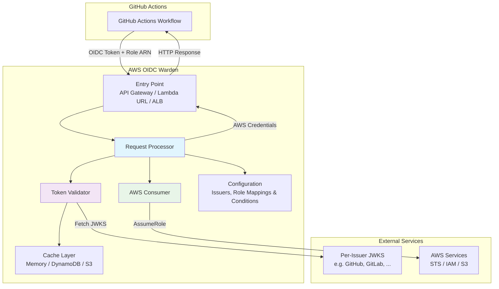
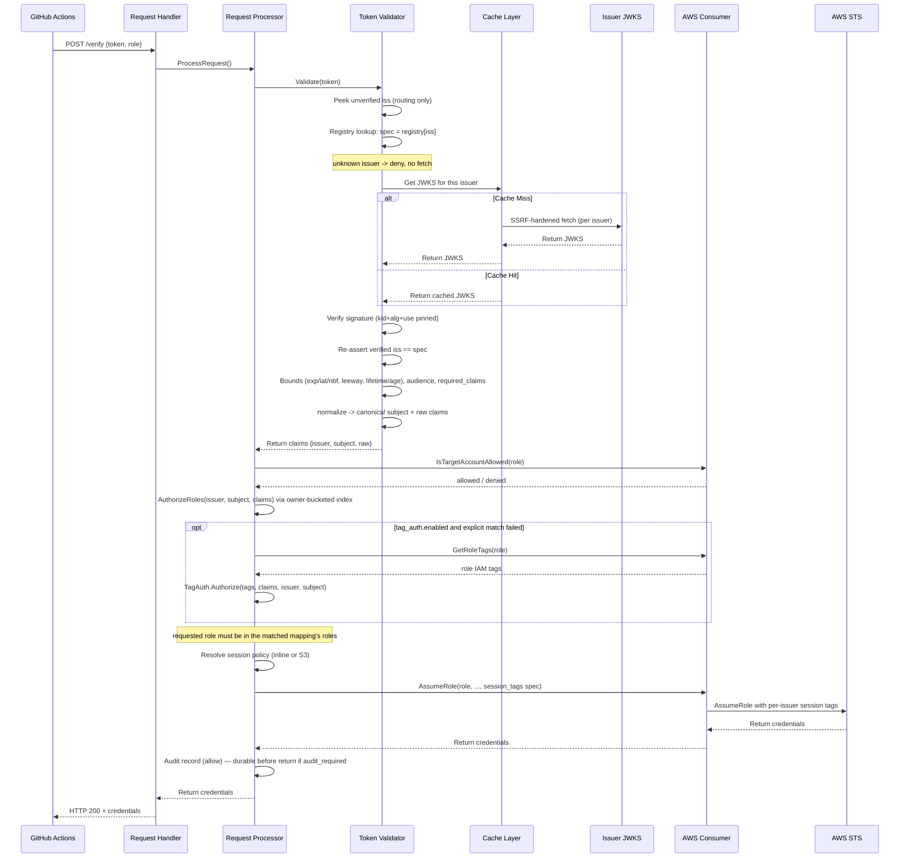
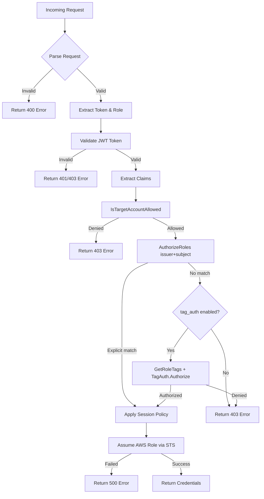
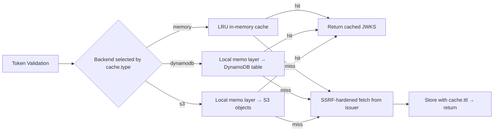
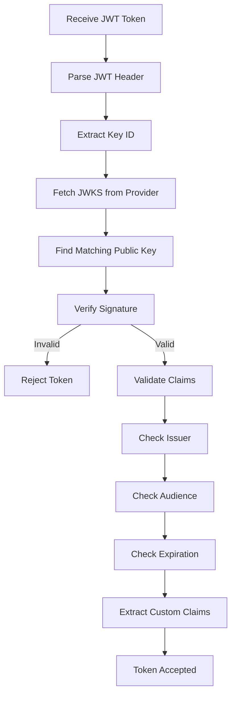
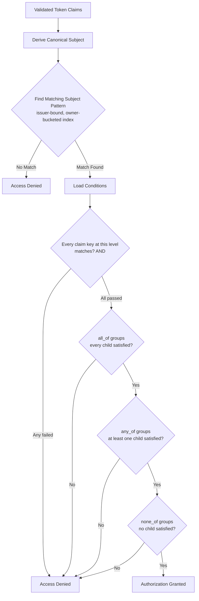

# AWS OIDC Warden Architecture

## Overview

The AWS OIDC Warden is designed as a secure, high-performance, and scalable service that acts as a bridge between GitHub Actions (and other OIDC providers) and AWS resources. This document provides a comprehensive overview of the system architecture, component interactions, and data flow.

## High-Level Architecture


```mermaid
graph TB
    subgraph "GitHub Actions"
        GA[GitHub Actions Workflow]
    end

    subgraph "AWS OIDC Warden"
        ENTRY[Entry Point<br/>API Gateway / Lambda URL / ALB]
        PROCESSOR[Request Processor]
        VALIDATOR[Token Validator]
        CACHE[Cache Layer<br/>Memory / DynamoDB / S3]
        CONSUMER[AWS Consumer]
        CONFIG[Configuration<br/>Issuers, Role Mappings & Conditions]
    end

    subgraph "External Services"
        JWKS[Per-Issuer JWKS<br/>e.g. GitHub, GitLab, ...]
        AWS[AWS Services<br/>STS / IAM / S3]
    end

    GA -->|OIDC Token + Role ARN| ENTRY
    ENTRY --> PROCESSOR
    PROCESSOR --> VALIDATOR
    PROCESSOR --> CONSUMER
    PROCESSOR --> CONFIG

    VALIDATOR -->|Fetch JWKS| JWKS
    VALIDATOR --> CACHE

    CONSUMER -->|AssumeRole| AWS

    PROCESSOR -->|AWS Credentials| ENTRY
    ENTRY -->|HTTP Response| GA

    style PROCESSOR fill:#e1f5fe
    style VALIDATOR fill:#f3e5f5
    style CONSUMER fill:#e8f5e8
```

### Simple Flow Overview

1. **An OIDC client** (GitHub Actions, GitLab CI, or any configured issuer) sends an OIDC token and desired role ARN to the service
2. **Entry Point** receives the HTTP request (via API Gateway, Lambda URL, or ALB)
3. **Request Processor** orchestrates the validation and role assumption process
4. **Token Validator** routes the token to its issuer and verifies the JWT signature against that issuer's JWKS (with caching)
5. **Configuration** engine matches the canonical subject against the issuer's role mappings and checks their conditions
6. **AWS Consumer** assumes the requested IAM role with session tags and policies
7. **Response** contains temporary AWS credentials with tagged session

## Component Architecture

### 1. Entry Points (Deployment Options)

The AWS OIDC Warden supports multiple deployment patterns to accommodate different architectural needs:

#### API Gateway + Lambda

```bash
OIDC Client → API Gateway → AWS OIDC Warden (Lambda Function Proxy)
```

- **Use Case**: Traditional REST API with full API Gateway features
- **Benefits**: Rate limiting, request transformation, API keys, usage plans
- **Handler**: `internal/handler/apigateway.go`
- **Entry Point**: `cmd/apigateway/main.go`
- **Note**: REST API v1 never receives JWT-authorizer claims, so this handler is always self-validating.

#### API Gateway HTTP API (v2) + Lambda

```bash
OIDC Client → API Gateway (HTTP API) → AWS OIDC Warden (Lambda)
```

- **Use Case**: HTTP APIs, and the only front-end that can delegate token validation to an API Gateway JWT Authorizer
- **Benefits**: Lower cost than REST APIs; with `jwt_validation.mode: "apigw"` the gateway verifies the signature and this service reads the authorizer claims
- **Handler**: `internal/handler/apigatewayv2.go`
- **Entry Point**: `cmd/apigatewayv2/main.go`

#### Lambda URLs

```
OIDC Client → AWS OIDC Warden (Lambda Function URL)
```

- **Use Case**: Simplified setup for direct Lambda invocation
- **Benefits**: Lower latency, reduced cost, simpler configuration
- **Handler**: `internal/handler/lambdaurl.go`
- **Entry Point**: `cmd/lambdaurl/main.go`

#### Application Load Balancer

```
OIDC Client → ALB → AWS OIDC Warden (Lambda Function)
```

- **Use Case**: High-traffic scenarios with advanced routing
- **Benefits**: Multi-region support, advanced health checks, WAF integration
- **Handler**: `internal/handler/alb.go`
- **Entry Point**: `cmd/alb/main.go`

#### Local Development Server

```
OIDC Client → HTTP Server → AWS OIDC Warden
```

- **Use Case**: Local development and testing
- **Benefits**: Fast iteration, debugging capabilities, local testing
- **Handler**: Built into local server
- **Entry Point**: `cmd/local/main.go`

### 2. Core Processing Pipeline

The request processing follows a strict pipeline ensuring security and performance:


```mermaid
sequenceDiagram
    participant Client as GitHub Actions
    participant Handler as Request Handler
    participant Processor as Request Processor
    participant Validator as Token Validator
    participant Cache as Cache Layer
    participant JWKS as Issuer JWKS
    participant Consumer as AWS Consumer
    participant STS as AWS STS

    Client->>Handler: POST /verify {token, role}
    Handler->>Processor: ProcessRequest()

    Processor->>Validator: Validate(token)
    Validator->>Validator: Peek unverified iss (routing only)
    Validator->>Validator: Registry lookup: spec = registry[iss]
    Note over Validator: unknown issuer -> deny, no fetch
    Validator->>Cache: Get JWKS for this issuer

    alt Cache Miss
        Cache->>JWKS: SSRF-hardened fetch (per issuer)
        JWKS-->>Cache: Return JWKS
        Cache-->>Validator: Return JWKS
    else Cache Hit
        Cache-->>Validator: Return cached JWKS
    end

    Validator->>Validator: Verify signature (kid+alg+use pinned)
    Validator->>Validator: Re-assert verified iss == spec
    Validator->>Validator: Bounds (exp/iat/nbf, leeway, lifetime/age), audience, required_claims
    Validator->>Validator: normalize -> canonical subject + raw claims
    Validator-->>Processor: Return claims {issuer, subject, raw}

    Processor->>Consumer: IsTargetAccountAllowed(role)
    Consumer-->>Processor: allowed / denied

    Processor->>Processor: AuthorizeRoles(issuer, subject, claims) via owner-bucketed index

    opt tag_auth.enabled and explicit match failed
        Processor->>Consumer: GetRoleTags(role)
        Consumer-->>Processor: role IAM tags
        Processor->>Processor: TagAuth.Authorize(tags, claims, issuer, subject)
    end

    Note over Processor: requested role must be in the matched mapping's roles
    Processor->>Processor: Resolve session policy (inline or S3)
    Processor->>Consumer: AssumeRole(role, ..., session_tags spec)

    Consumer->>STS: AssumeRole with per-issuer session tags
    STS-->>Consumer: Return credentials
    Consumer-->>Processor: Return credentials
    Processor->>Processor: Audit record (allow) — durable before return if audit_required
    Processor-->>Handler: Return credentials
    Handler-->>Client: HTTP 200 + credentials
```

## JWT Validation Modes

Three modes controlled by `jwt_validation.mode`:

| Mode    | Verifier              | Claims source                                | Binary         |
| ------- | --------------------- | -------------------------------------------- | -------------- |
| `self`  | This service (JWKS)   | JWT body after full verification             | any            |
| `apigw` | API Gateway (managed) | `event.requestContext.authorizer.jwt.claims` | `apigatewayv2` |
| `alb`   | This service (ES256)  | `x-amzn-oidc-data` after ALB key verify      | `alb`          |

**Security invariant:** In delegated modes, if no upstream-injected claims arrive (direct Lambda invocation bypass), `Extract()` returns an error wrapping `ErrTokenValidationFailed` → HTTP 401.

<!-- prettier-ignore -->
> [!WARNING]
> **`apigw` mode has no cryptographic backstop.**
>
> The Lambda never verifies the original token's signature — it trusts `event.requestContext.authorizer.jwt.claims` as handed to it. The invariant above rejects an **empty** claims map, but it cannot detect a direct invoke supplying **forged, non-empty** claims (arbitrary `iss`/`aud`/`sub`/`exp`): there is no signature left to check them against.
>
> - **`lambda:InvokeFunction` on this function is equivalent to full identity impersonation** in `apigw` mode. Anyone who can invoke it directly can obtain credentials for any subject your `role_mappings` / `role_groups` / `tag_auth` would authorize.
> - **Mitigation:** the function's resource-based (invoke) policy must restrict `lambda:InvokeFunction` to the fronting API Gateway's execution/service principal only — never a broader principal.
> - **`alb` mode does not share this gap.** The Lambda verifies the ALB's ES256 signature over `x-amzn-oidc-data` itself, so a forged direct invoke fails that check.
>
> Full write-up: [TOKEN_VALIDATION.md §2.2](TOKEN_VALIDATION.md#22-trust-boundary-lambdainvokefunction-is-identity-impersonation-in-apigw-mode).

**API Gateway mode** requires an `aws_apigatewayv2_authorizer` JWT resource per configured issuer, each pointing at that issuer's own URL (`https://token.actions.githubusercontent.com` for GitHub Actions, `https://gitlab.com` for GitLab, and so on) — the authorizer's verified `iss` must appear in `issuers[]` or the request is denied with `ErrUnknownIssuer`. Restrict Lambda invocations to the API Gateway execution role via Lambda resource-based policies.

**ALB mode** verifies the ALB-signed ES256 JWT but does not re-verify the original OIDC signature. `alb_expected_signer` (the trusted ALB's ARN) is **required** in this mode — config validation fails without it — to prevent cross-ALB token injection.

**Hot-reload note:** The extractor implementation is fixed at Lambda cold start. Changing `jwt_validation.mode` requires a redeployment.

## Core Components Deep Dive

### Request Handler (`internal/handler/`)

The handler layer provides a unified interface across different deployment options:

```go
type RequestProcessor struct {
    provider  *config.Provider
    consumer  aws.AwsConsumerInterface
    extractor validator.ClaimsExtractorInterface
    audit     AuditSink // nil is a safe no-op
    frontend  string    // apigateway/apigatewayv2/alb/lambdaurl
}

func NewRequestProcessor(provider *config.Provider, consumer aws.AwsConsumerInterface, extractor validator.ClaimsExtractorInterface, audit AuditSink, frontend string) *RequestProcessor

func (r *RequestProcessor) ProcessRequest(ctx context.Context, requestData *RequestData, input validator.ExtractionInput, requestID string, log *slog.Logger) (*types.Credentials, error)
```

**Key Responsibilities:**

- HTTP request parsing and validation
- Response formatting and error handling
- Request ID generation and correlation
- Structured logging setup
- Context management and timeouts

**Files:**

- `bootstrap.go` - Common initialization logic
- `processor.go` - Core business logic
- `types.go` - Request/response data structures
- `validation.go` - Input validation

### Token Validator (`internal/validator/`)

The validator component handles all OIDC token validation logic:

```go
type TokenValidatorInterface interface {
    Validate(string) (*types.Claims, error)
}
```

The interface is deliberately scoped to `Validate` alone. `FetchJWKS` and `GenKeyFunc` remain exported methods on the concrete `*TokenValidator` (used by tests and the cold-start JWKS warm prefetch), but they are an unscoped, audience-less path and neither is a standalone token-validation entry point. `Validate` is the only supported way to authenticate a token.

**Validation Process (multi-issuer, `self` mode):**

1. **Length guard**: reject tokens over `max_token_bytes` before any parse.
2. **Route**: read the unverified `iss` (routing only) and look it up in the immutable issuer registry (exact match); an unknown issuer denies **before** any JWKS fetch.
3. **Per-issuer parse**: algorithm allowlist (RS/ES 256–512), `exp` + `iat` required, `WithLeeway`.
4. **Signature**: verify against that issuer's cached JWKS (SSRF-hardened fetch; forced refresh on key-miss, rate-limited per `(issuer, kid)`); key pinned by `kid` + `alg` + `use=sig` + key-type↔alg-family. Then **re-assert** the verified `iss` equals the matched spec.
5. **Bounds & claims**: `sub` non-empty, `nbf` (if present), optional lifetime/age caps, audience ANY-match against this issuer's audiences only, `required_claims` present.
6. **Normalize**: derive the canonical `subject` from the issuer's `claim_mappings` (GitHub default `repository`), populate `claims.Raw` with every verified claim. A token never self-asserts an unmapped subject.

The registry is rebuilt lock-free on config hot-reload (atomic snapshot swap keyed on a `builtFrom` identity check). Delegated `apigw`/`alb` modes run the **same** bounds + normalization via a shared `checkAndNormalizeClaims` path — they are not a weaker path.

**Security Features:**

- Allowed algorithms enforced: ES256/384/512, RS256/384/512 — `none` and all other algorithms rejected
- Issuer and multi-audience validation (any expected audience match accepted)
- Token expiration and `iat` required
- JWKS URI and issuer URL must use HTTPS (loopback hosts excepted for local dev/tests)
- Claims extraction and validation; each issuer's own `required_claims` list is enforced (GitHub defaults to requiring `repository`)

### AWS Consumer (`internal/aws/`)

The AWS consumer abstracts all AWS service interactions:

```go
type AwsConsumerInterface interface {
    ReadS3Configuration() error
    AssumeRole(roleARN, sessionName string, sessionPolicy *string, duration *int32, claims *gtypes.Claims, sessionTags map[string]string) (*types.Credentials, error)
    GetS3Object(bucket, key string) (io.ReadCloser, error)
    GetRole(role string) (*iam.GetRoleOutput, error)
    GetRoleTags(roleARN string) (map[string]string, error)
    IsTargetAccountAllowed(roleArn string) (bool, error)
}
```

**AWS Operations:**

- **Role Assumption**: Use AWS STS to assume target IAM roles
- **Session Tagging**: Apply the requesting issuer's `session_tags` spec to AWS sessions
- **Session Policies**: Apply custom IAM policies to limit permissions
- **S3 Integration**: Read configuration and session policies from S3
- **IAM Integration**: Validate role existence and trust relationships

**Session Tags Applied:**

Tags are not hardcoded — each issuer declares its own `session_tags` map (STS tag key ← raw claim name), and `BuildSessionTags(rawClaims, tagSpec)` resolves that spec against the verified claims of the token that authorized this request:

```go
func BuildSessionTags(rawClaims map[string]any, tagSpec map[string]string) []types.Tag
```

A typical GitHub `session_tags` spec (`repo: repository`, `actor: actor`, `ref: ref`, ...) produces the same shape of tags v1 hardcoded, but any issuer can define its own key set from its own raw claims (see [SESSION_TAGGING.md](SESSION_TAGGING.md)). Invalid keys/values are skipped and logged, never sanitized — a tag an ABAC policy sees always carries the exact verified claim value. The list is deterministic (sorted by key) and capped at 50 tags.

### Caching System (`internal/cache/`)

The caching system provides multiple storage backends for JWKS data:

```go
type Cache interface {
    Get(key string) (*types.JWKS, bool)
    Set(key string, value *types.JWKS, ttl time.Duration)
}
```

`NewCache(cfg)` selects **one** backend from `cache.type` (`memory`, `dynamodb`, or `s3`) — the backends are alternatives, not chained tiers. The DynamoDB and S3 backends each keep a small local in-memory layer in front of their remote store to cut per-request latency.

#### Memory Cache

- **Implementation**: LRU-based in-memory cache
- **Use Case**: Low-latency access for frequently accessed JWKS
- **Limitations**: Lost on Lambda container recycling
- **Configuration**: Maximum size and TTL configurable

#### DynamoDB Cache

- **Implementation**: AWS DynamoDB with automatic TTL
- **Use Case**: Persistent cache shared across Lambda instances
- **Benefits**: High availability, automatic scaling, built-in TTL
- **Configuration**: Table name and TTL configurable

#### S3 Cache

- **Implementation**: S3 objects with metadata-based TTL
- **Use Case**: Large objects and long-term caching
- **Benefits**: Cost-effective, unlimited storage, optional cleanup
- **Configuration**: Bucket, prefix, and cleanup options

### Configuration Manager (`internal/config/`)

The configuration system supports multiple formats and sources:

```go
type Config struct {
    Issuers               []IssuerConfig    `mapstructure:"issuers"`        // trusted OIDC issuers
    DefaultIssuer         string            `mapstructure:"default_issuer"`
    RoleMappings          []RoleMapping     `mapstructure:"role_mappings"`
    RoleGroups            []RoleGroup       `mapstructure:"role_groups"`
    RoleSets              map[string][]string `mapstructure:"role_sets"`
    ConfigFragments       []string          `mapstructure:"config_fragments"`
    Cache                 *Cache            `mapstructure:"cache"`
    TagAuth               *TagAuth          `mapstructure:"tag_auth"`
    CrossAccount          *CrossAccount     `mapstructure:"cross_account"`
    ConfigReloadInterval  time.Duration     `mapstructure:"config_reload_interval"`
    // hardening + logging knobs: jwt_leeway, max_token_lifetime/age/bytes,
    // jwks_refetch_cooldown, allow_insecure_issuers, log_level,
    // log_claim_values, audit_required, ... (see docs/CONFIGURATION.md)
}
```

Each `IssuerConfig` carries `issuer`, `provider` (`github`/`generic`), `audiences`, optional `jwks_uri`, `claim_mappings`, `required_claims`, and `session_tags`. At `Validate()`, `role_mappings`/`role_groups` are resolved to their issuer (explicit, `default_issuer`, or the sole issuer), `@role_set` aliases are expanded, patterns are anchored + compiled once, and an owner-bucketed authorization index is built (byte-identical to a linear scan).

**Configuration Sources** (in order of precedence):

1. Environment variables (with `AOW_` prefix) — re-applied after every remote merge
2. S3-stored configuration (overlaid on the local config when `s3_config_bucket`/`s3_config_path` are set)
3. Configuration file (YAML/JSON/TOML)
4. Default values

**Provider (hot-reload):**

`Provider` wraps `Config` behind an `atomic.Pointer` and supports lazy per-request hot-reload from a remote S3 source without redeploying:

- `NewProvider(base, interval, format, fetch)` — reloadable provider; initial config is `base` until the first successful `Refresh`.
- `NewStaticProvider(cfg)` — no-op provider for local/test use (no S3 source configured).
- `MaybeRefresh(ctx)` — called at the start of every request; no-op unless `config_reload_interval` has elapsed. Uses double-checked locking so at most one S3 fetch runs per interval under concurrent load. Each refresh clones the pristine base config (env/file/defaults), overlays the fetched bytes via `MergeBytes`, re-validates (recompiling all regex patterns), then atomically swaps the result in. Errors are logged and the previous config is retained.
- `Get()` — atomic load of the current active config; zero-copy, safe for concurrent reads.

The token validator is constructed via `NewTokenValidator(provider, cache)`; it reads the live config from `provider.Get()` and rebuilds its issuer registry on hot-reload (identity-checked snapshot swap) so issuer/audience/mapping changes take effect immediately without a Lambda restart. Beyond the primary S3 overlay, `config_fragments` are merged on refresh with fail-safe reload (a bad fragment retains the last-good config); fragments may only contribute `role_mappings`/`role_groups`/`role_sets`/`default_issuer`. Local filesystem-path fragments are content-hashed (sha256) for change detection and work today; a remote fetcher for `"scheme://"` sources (e.g. `s3://`, keyed on the source's own ETag) is a pluggable seam (`config.WithFragmentFetcher`) that the shipped binaries do not yet install.

**Authorization Mapping System:**

```yaml
role_mappings:
  - subject: "org/project-.*" # Regex pattern matching (canonical subject)
    # issuer: inherited from default_issuer unless set here
    roles:
      - "arn:aws:iam::123456789012:role/github-actions-role"
    conditions:
      ref: "refs/heads/main" # regex against the raw 'ref' claim
      actor: ["admin-.*"] # Actor constraints
      event_name: "push" # Event type constraints
    session_policy: | # Inline session policy
      {
        "Version": "2012-10-17",
        "Statement": [...]
      }
```

## Data Flow and Processing

### 1. Request Processing Flow


```mermaid
flowchart TD
    A[Incoming Request] --> B{Parse Request}
    B -->|Invalid| C[Return 400 Error]
    B -->|Valid| D[Extract Token & Role]

    D --> E[Validate JWT Token]
    E -->|Invalid| F[Return 401/403 Error]
    E -->|Valid| G[Extract Claims]

    G --> GB[IsTargetAccountAllowed]
    GB -->|Denied| GC[Return 403 Error]
    GB -->|Allowed| H[AuthorizeRoles issuer+subject]

    H -->|Explicit match| N[Apply Session Policy]
    H -->|No match| HA{tag_auth enabled?}
    HA -->|No| I[Return 403 Error]
    HA -->|Yes| HB[GetRoleTags + TagAuth.Authorize]
    HB -->|Denied| I[Return 403 Error]
    HB -->|Authorized| N

    N --> O[Assume AWS Role via STS]
    O -->|Failed| P[Return 500 Error]
    O -->|Success| Q[Return Credentials]
```

### 2. Condition Validation

Every key under `conditions:` other than the three boolean groups names a raw verified claim, and every one of them compiles through the same anchored-regex mechanism, so a plain string is a widened `==`, not a special case. `Patterns` is a `[]string` that decodes from either a single scalar or a list, and the named fields are discoverability sugar over what the remain-map does generically:

```go
type Condition struct {
    Ref               Patterns `mapstructure:"ref"`                // "refs/heads/main" or a list of patterns
    RefType           Patterns `mapstructure:"ref_type"`           // branch, tag
    EventName         Patterns `mapstructure:"event_name"`         // push, pull_request
    WorkflowRef       Patterns `mapstructure:"workflow_ref"`       // .github/workflows/deploy.yml
    Actor             Patterns `mapstructure:"actor"`              // the triggering principal
    RunnerEnvironment Patterns `mapstructure:"runner_environment"` // github-hosted, self-hosted
    Environment       Patterns `mapstructure:"environment"`        // the deployment environment a job declares

    AllOf  []*Condition `mapstructure:"all_of"`  // every member must be satisfied
    AnyOf  []*Condition `mapstructure:"any_of"`  // at least one member must be satisfied
    NoneOf []*Condition `mapstructure:"none_of"` // no member may be satisfied

    ExplicitClaims map[string]Patterns `mapstructure:"claims"`   // escape hatch: keys are always claim names
    Claims         map[string]Patterns `mapstructure:",remain"`  // any other raw claim, by name
}
```

**Validation Logic:**

- Patterns listed for ONE claim are OR-ed; separate claims are AND-ed — including a named field and a `claims:` entry naming the same claim; both apply and both must match. `all_of` / `any_of` / `none_of` groups nest inside for richer logic, and on a single node the flat fields and all three groups are AND-ed together, so the top level of a `conditions:` block stays an implicit AND. Nesting is capped at 5 levels and one mapping's tree at 64 nodes, both rejected in `Validate()`.
- Every pattern is auto-anchored (`^(?:pattern)$`) and regex-capable.
- Claims are extracted from the validated JWT token and matched on their **value**, not their Go type. A scalar claim — string, bool, or number — is compared through its canonical text, the same rendering used for audit records and session tags, so `email_verified: "true"` matches whether the issuer mints `true` or `"true"` and `run_id: "42"` matches the JSON number `42`. A **list** claim matches when any element does, each element read the same way (GitLab/Okta/Entra group, scope, and role lists). Only a shape with no readable text denies outright: absent, `null`, and objects.
- Leaf matching is polarity-aware, but both polarities decide on the same reading of the value. In positive polarity a leaf matches when the claim's text satisfies a pattern. Under an odd number of `none_of` groups the veto fires when it matches — and _also_ when the claim has no readable text at all, since a non-answer would otherwise disarm the veto and authorize exactly the caller the operator wrote it to refuse. So `none_of: [{email_verified: "false"}]` vetoes the JSON bool `false` and does not veto `true`, while an object-valued claim vetoes because it cannot be judged. Absence keeps `none_of`'s exact-negation meaning and is not affected. Because the two polarities read the value identically, they are exact complements on any readable claim: `none_of` nested in a `none_of` is positive again, and means what the bare predicate means.
- Condition compilation happens once, in `Validate()`, never per request. `Validate()` additionally emits an advisory warning, on a `provider: github` issuer, for a claim name GitHub does not issue — a typo that would otherwise deny silently.
- An empty pattern or an empty pattern list is rejected: both read as a predicate but gate nothing.

### 3. Caching Strategy

One backend is selected at startup by `cache.type`; the remote backends keep a small local in-memory layer in front of their store:


```mermaid
flowchart LR
    A[Token Validation] --> B{Backend selected by cache.type}
    B -->|memory| C[LRU in-memory cache]
    B -->|dynamodb| D[Local memo layer → DynamoDB table]
    B -->|s3| E[Local memo layer → S3 objects]
    C & D & E -->|hit| F[Return cached JWKS]
    C & D & E -->|miss| G[SSRF-hardened fetch from issuer]
    G --> H[Store with cache.ttl → return]
```

**Cache TTL Strategy:**

- One `cache.ttl` applies to the selected backend (default `1h`).
- Entries expire by TTL (DynamoDB native TTL; S3 metadata + optional `s3_cleanup`).
- A signing-key rotation is recovered by a forced, rate-limited JWKS refetch on `kid` miss (`jwks_refetch_cooldown`) — there is no claim-based invalidation.

## Security Architecture

### 1. Token Validation Security


```mermaid
flowchart TD
    A[Receive JWT Token] --> B[Parse JWT Header]
    B --> C[Extract Key ID]
    C --> D[Fetch JWKS from Provider]
    D --> E[Find Matching Public Key]
    E --> F[Verify Signature]
    F -->|Invalid| G[Reject Token]
    F -->|Valid| H[Validate Claims]
    H --> I[Check Issuer]
    I --> J[Check Audience]
    J --> K[Check Expiration]
    K --> L[Extract Custom Claims]
    L --> M[Token Accepted]
```

### 2. Subject-Based Authorization


```mermaid
flowchart TD
    A[Validated Token Claims] --> B[Derive Canonical Subject]
    B --> C{Find Matching Subject Pattern<br/>issuer-bound, owner-bucketed index}
    C -->|No Match| D[Access Denied]
    C -->|Match Found| E[Load Conditions]
    E --> F{Every claim key at this level<br/>matches? AND}
    F -->|Any failed| G[Access Denied]
    F -->|All passed| H{all_of groups<br/>every child satisfied?}
    H -->|No| G
    H -->|Yes| I{any_of groups<br/>at least one child satisfied?}
    I -->|No| G
    I -->|Yes| J{none_of groups<br/>no child satisfied?}
    J -->|No| G
    J -->|Yes| K[Authorization Granted]
```

No claim is privileged or evaluated in a fixed order: every key under `conditions` is looked up by its own name and AND'd with the rest, and the group nodes recurse through the same walk (`satisfiesConditionsWith` in `internal/config/condition.go`). `ref`, `event_name`, `workflow_ref` and `ref_type` are named fields only for discoverability — they take the same generic path as `project_path` or any other issuer's claim.

### 3. AWS Integration Security

**Role Assumption:**

- Uses AWS STS AssumeRole with session tags
- Applies custom session policies for additional restrictions
- Validates role trust relationships
- Implements principle of least privilege

**Session Security:**

- Session duration limits (default: 1 hour, max: 12 hours; whenever the warden's own credentials are a role session — always true on Lambda, same-account assumes included — chaining clamps the issued session to 1 hour regardless of target. Only `local` server mode with IAM user credentials can exceed 1 hour, up to the target role's own max, cross-account targets included)
- Session tags for audit trails and ABAC policies
- Optional session policies to further restrict permissions
- Credentials are short-lived and expire on their own — no long-lived secrets are ever issued or stored

### 4. Tag-Based Authorization & Cross-Account

Both features are opt-in and default to `false`:

| Toggle | Off means | On means |
| --- | --- | --- |
| `tag_auth.enabled` | Only explicit `role_mappings` authorize | Role IAM tags authorize as a **fallback**, after mapping matching fails |
| `cross_account.enabled` | **Every** cross-account operation fails closed — assumption and tag reads, mappings and tag-auth alike | Accounts in `allowed_accounts` are reachable |

**The one-hop rule.** Every role assumption — same-account or cross-account — goes directly from the hub's own credentials to the target role. The spoke role exists only to read tags, and is never an assume target.

**Flow:**

1. Parse the account ID out of the requested role ARN. If it isn't the hub's and `cross_account.enabled` isn't true, fail closed.
2. `IsTargetAccountAllowed` checks that account against `cross_account.allowed_accounts` — before any tag read or assumption. With `cross_account` disabled only the hub is allowed; with it enabled the hub is always implicitly allowed, and an **empty list permits any account** (logged as a warning). Non-12-digit IDs are rejected at config load.
3. _(tag-auth only, cross-account only)_ Assume the convention-named spoke role (`aow-spoke` by default, optional `ExternalID`) just to call `iam:GetRole` and read the target role's tags. Short-lived (`SpokeSessionDuration`, default 15 min), cached in-process per account.
4. `TagAuth.Authorize` evaluates the tags — see the rules below.
5. Assume the target role directly with the hub's credentials. Because those are themselves a role session on Lambda, the assume is clamped to 1 hour; only `local` mode with IAM user credentials avoids the clamp.

**Tag matching rules:**

- The role must carry at least one identity tag matching the verified subject — canonical `aow/subject`, or the legacy `aow/repo` / `aow/repo-owner` aliases.
- With more than one configured issuer, a matching `aow/issuer` tag is also required.
- Every *other* dimension tag present must also match — AND across tags, OR within one tag's space-separated values. `aow/claim.<name>` matches the raw verified claim and can only ever narrow the decision.
- `tag_auth.default_org` expands a bare `aow/repo` value (no `/`) to `<default_org>/<name>`, so tags can read `my-service` instead of `org/my-service`.

**Session tags and chaining.** When `session_tags_transitive` is true (**recommended**; the deprecated `tag_auth.transitive_session_tags` still works as a fallback), every attached session tag is marked transitive and propagates immutably through later role chaining. Without it the tags are dropped at the first hop and any ABAC policy past it loses the caller's identity.

Full tag reference and IAM setup: [TAG_BASED_AUTHORIZATION.md](TAG_BASED_AUTHORIZATION.md). Worked example: [examples/cross-account/](examples/cross-account/).

**Diagrams:**

| Diagram | File |
| --- | --- |
| Authorization decision flow | [images/tag-auth-decision.svg](images/tag-auth-decision.svg) |
| Cross-account hub/spoke flow | [images/tag-auth-crossaccount.svg](images/tag-auth-crossaccount.svg) |
| ABAC session tag flow | [images/tag-auth-abac.svg](images/tag-auth-abac.svg) |
| Transitive session tags | [images/tag-auth-transitive.svg](images/tag-auth-transitive.svg) |
| Account allow-list enforcement | [images/tag-auth-accounts.svg](images/tag-auth-accounts.svg) |
| Tag matching logic | [images/tag-auth-matching.svg](images/tag-auth-matching.svg) |
| Authorization precedence | [images/tag-auth-precedence.svg](images/tag-auth-precedence.svg) |


### 5. Residual Risk: Stateless Replay

The validator is fully stateless — there is no `jti`/nonce replay cache. A token that is captured before it expires (e.g. exfiltrated from CI logs or a compromised runner) remains usable by an attacker for the rest of its validity window, and a duplicate `AssumeRole` call with the same token is not itself detected as a replay. The hardening knobs bound, but do not eliminate, this exposure:

- `max_token_lifetime` / `max_token_age` shrink the window a stolen token stays valid, independent of what the issuer itself set for `exp`.
- `jwks_refetch_cooldown` and per-`(issuer, kid)` rate limiting stop a replay attempt from being amplified into a JWKS-fetch storm.
- Structured audit records (`docs/LOGGING.md`) let you detect anomalous reuse after the fact (e.g. the same `jwtSub`/`subject` assuming roles from unexpected source IPs or in an unexpected cadence), even though the service itself does not block it in real time.

If your threat model requires hard replay prevention, put a short-lived, single-use token issuance step in front of this service, or rely on the short (minutes-scale) validity window GitHub Actions/GitLab CI already give OIDC tokens.

## Performance Architecture

### 1. Caching Performance

JWKS documents change rarely (issuer key rotations), so with any backend and a sane `cache.ttl` nearly every request is served from cache; only cold starts and key rotations pay the upstream fetch. In `self` mode even the cold start is usually covered: `NewBootstrap()` warm-prefetches every configured issuer's JWKS during Lambda INIT (best-effort, 3s-bounded), so the first request normally finds the key already cached. A slow or unreachable issuer is abandoned at the timeout and fetched inline on first use. Relative cost per lookup:

- Memory: in-process map access (fastest; lost on container recycle)
- DynamoDB: one-digit-millisecond network hop, shared across containers
- S3: tens of milliseconds, cheapest at rest for large/cold objects
- Cache miss: one SSRF-hardened HTTPS fetch to the issuer (singleflight — concurrent misses for one issuer collapse into a single upstream call)

### 2. Lambda Performance Optimizations

**Cold Start Mitigation:**

- Minimal dependencies and imports
- Connection pooling for AWS services
- Lazy initialization of non-critical components
- Provisioned concurrency for high-traffic scenarios

**Memory and CPU Optimization:**

- Configurable Lambda memory allocation
- ARM64 support for better price/performance
- Efficient JWT parsing and validation
- Optimized regular expression compilation

## Scaling

Nothing in the request path holds state, so scale is AWS's problem rather than the service's:

| Layer | How it scales | What to watch |
| --- | --- | --- |
| Lambda | Concurrency scales automatically per request | Reserved/provisioned concurrency if cold starts matter |
| JWKS cache (memory) | Per-execution-environment LRU; free | Lost on every cold start |
| JWKS cache (DynamoDB) | On-demand, shared across all environments and regions | Needs a TTL attribute configured, or entries never expire |
| JWKS cache (S3) | Effectively unlimited | Highest latency of the three |
| Config in S3 | One read per refresh interval per environment, not per request | A bad config object is rejected and the previous one is kept |

For multi-region, deploy the stack per region. Nothing coordinates between regions, so this needs no additional application config.

Keep the JWKS cache **per-region** — do not reach for Global Tables. The cache holds public signing keys and is rebuildable from a single JWKS fetch, so replication buys nothing and couples two deployments that are otherwise independent. The same reasoning applies with more force to the audit bucket, where sharing one bucket makes the secondary region fail closed during a primary-region S3 outage. See [deploy/README.md — Multi-region deployment](../deploy/README.md#multi-region-deployment-resilience).

Measured numbers — per-request cost, load time at thousands of mappings, memory sizing: [PERFORMANCE.md](PERFORMANCE.md).

## Deployment

Images are built with [ko](https://ko.build) from `.ko.yaml`, not a Dockerfile — there is no Dockerfile in this repo. The base image is `public.ecr.aws/lambda/provided:al2023` and the binary is named `bootstrap`, as Lambda container images require.

One image per frontend, published to GHCR and Docker Hub for arm64 and amd64:

| Frontend | `cmd/` | Image tag |
| --- | --- | --- |
| API Gateway REST v1 | `cmd/apigateway` | `apigateway-latest` (also plain `latest`) |
| API Gateway HTTP v2 | `cmd/apigatewayv2` | `apigatewayv2-latest` |
| ALB | `cmd/alb` | `alb-latest` |
| Lambda URL | `cmd/lambdaurl` | `lambdaurl-latest` |

Version-pinned tags (`apigatewayv2-v3.2.0`) are published alongside; a prerelease never moves a `*-latest` tag. Builds carry provenance attestations and are scanned in the release workflow.

### Infrastructure as code

Use the maintained stacks in [`deploy/`](../deploy/README.md) rather than hand-rolling one:

- **[`deploy/opentofu/`](../deploy/opentofu/)** — the full module: Lambda, IAM, the config S3 object rendered from `templates/config.yaml.tftpl`, DynamoDB cache, optional API Gateway hardening. Includes `hardening.tftest.hcl`.
- **[`deploy/cloudformation/quickstart.yaml`](../deploy/cloudformation/quickstart.yaml)** — a single-file quick-start for evaluation.

[`deploy/README.md`](../deploy/README.md) covers the toggle reference, how `config.yaml` is delivered, choosing a JWT validation mode, hardening a public endpoint, and smoke tests.


### Required IAM Permissions

The Lambda execution role requires the following IAM permissions:

```json
{
  "Version": "2012-10-17",
  "Statement": [
    {
      "Effect": "Allow",
      "Action": ["sts:AssumeRole", "sts:TagSession"],
      "Resource": ["arn:aws:iam::*:role/github-actions-*"]
    },
    {
      "Effect": "Allow",
      "Action": ["iam:GetRole"],
      "Resource": ["arn:aws:iam::*:role/*"]
    },
    {
      "Effect": "Allow",
      "Action": ["dynamodb:GetItem", "dynamodb:PutItem", "dynamodb:UpdateItem", "dynamodb:DeleteItem"],
      "Resource": ["arn:aws:dynamodb:*:*:table/aws-oidc-warden-cache"]
    },
    {
      "Effect": "Allow",
      "Action": ["s3:GetObject", "s3:PutObject"],
      "Resource": ["arn:aws:s3:::s3-aws-oidc-warden-session-policies/*"]
    },
    {
      "Effect": "Allow",
      "Action": ["logs:CreateLogGroup", "logs:CreateLogStream", "logs:PutLogEvents"],
      "Resource": ["arn:aws:logs:*:*:log-group:*", "arn:aws:logs:*:*:log-group:*:log-stream:*"]
    }
  ]
}
```

> `iam:GetRole` is only needed when `tag_auth` is enabled (role-tag reads via `GetRoleTags`; performed with spoke credentials only when the role is cross-account — the target `AssumeRole` itself is always direct with the hub's own credentials).

## References

- [AWS Lambda Best Practices](https://docs.aws.amazon.com/lambda/latest/dg/best-practices.html)
- [JWT RFC 7519](https://tools.ietf.org/html/rfc7519)
- [OpenID Connect Core](https://openid.net/specs/openid-connect-core-1_0.html)
- [GitHub OIDC Documentation](https://docs.github.com/en/actions/deployment/security-hardening-your-deployments/about-security-hardening-with-openid-connect)
- [AWS STS API Reference](https://docs.aws.amazon.com/STS/latest/APIReference/)
