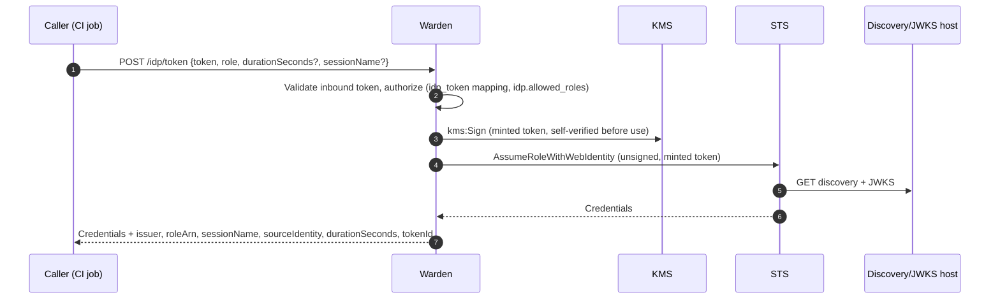

# Warden as an identity provider (IdP mode)

Optional. The warden validates the inbound OIDC token as usual, then mints its **own** short-lived OIDC token and exchanges it in-process with an unsigned `sts:AssumeRoleWithWebIdentity`. The caller gets ordinary STS credentials.

- [Why](#why)
- [Flow](#flow)
- [Hosting discovery and JWKS](#hosting-discovery-and-jwks)
- [KMS signing key](#kms-signing-key)
- [IAM OIDC provider](#iam-oidc-provider)
- [Trust policy](#trust-policy)
- [Configuration](#configuration)
- [Session duration](#session-duration)
- [Session name](#session-name)
- [Source identity](#source-identity)
- [Calling the endpoint](#calling-the-endpoint)
- [Key rotation](#key-rotation)
- [Hot reload and the kill switch](#hot-reload-and-the-kill-switch)
- [Security notes](#security-notes)
- [Incident response](#incident-response)
- [Error codes and audit fields](#error-codes-and-audit-fields)

## Why

`sts:AssumeRole` called with a role session (always the case on Lambda) is role chaining: STS caps the session at **1 hour**. `AssumeRoleWithWebIdentity` is not chained, so the session can last up to the target role's `MaxSessionDuration` (15 minutes to 12 hours). IdP mode exists for long jobs that outlive one hour.

The default `AssumeRole` path is unchanged and is still capped at 1h. IdP mode is opt-in per mapping (`idp_token: true`).

## Flow



The minted token never leaves the warden and is never logged or returned. Its claims come only from warden config and the verified inbound identity; inbound claims are never copied.

## Hosting discovery and JWKS

STS fetches `{issuer}/.well-known/openid-configuration` and the JWKS when it validates the minted token. Both must be reachable from the public internet at the issuer URL.

**Production default: static documents.** Generate them with `idp-export` and upload them to S3/CloudFront (or any static host) at the issuer origin:

```sh
idp-export -config config.yaml -out ./site
```

The documents are written under `-out` at `idp.paths.discovery` and `idp.paths.jwks`. `idp-export` reads only the local config file (no S3 overlay); run it against the config that carries the effective `idp` block. A warden-served JWKS couples STS availability to the Lambda: every exchange triggers a JWKS fetch, and the warden can DoS itself under load.

**Dev and low volume: warden-served.** The warden answers `GET`/`HEAD` on `idp.paths.discovery` and `idp.paths.jwks` with `Cache-Control: public, max-age=<jwks_cache_max_age>`. If you use this:

- Throttle the discovery/JWKS routes separately from `/idp/token`.
- The routes must carry **no authorizer** (required in `apigw` delegated mode; STS cannot present a token).
- `idp.paths.*` must match the path the front end actually delivers. An HTTP API v2 with a named stage includes it (`/prod/idp/token`) and returns 404 unless configured that way.
- Only the three `idp.paths.*` are exposed. Any other IdP-shaped near miss (other case, trailing slash, one extra leading segment) returns 404 `idp_path_not_found`. Wrong method returns 405 `method_not_allowed` with an `Allow` header.

One issuer URL and one KMS key per deployment; never shared between stages.

## KMS signing key

| Requirement | Value |
| --- | --- |
| Key spec | `ECC_NIST_P256` (`ES256`) or `RSA_2048`/`RSA_3072`/`RSA_4096` (`RS256`) |
| Key usage | `SIGN_VERIFY` |
| Multi-region | `false` |
| State | `Enabled` |

`NewKMSSigner` calls `DescribeKey` and `GetPublicKey` and refuses a key that is disabled, multi-region, not `SIGN_VERIFY`, of another spec, or whose `SigningAlgorithms` lacks the configured algorithm.

`idp.signing_keys[].kms_key_id` must be the **full key ARN**. Aliases and bare key IDs are rejected: anyone who can `UpdateAlias` could re-point an alias at another key. `GetPublicKey.KeyId` must equal the configured ARN.

Key policy: grant the warden role only `kms:Sign`, `kms:GetPublicKey`, `kms:DescribeKey`, and deny signing to everyone else and key tampering to everyone except a break-glass role:

```json
{
  "Version": "2012-10-17",
  "Statement": [
    {
      "Sid": "AdminNoSign",
      "Effect": "Allow",
      "Principal": { "AWS": "arn:aws:iam::123456789012:root" },
      "Action": ["kms:Describe*", "kms:List*", "kms:GetKeyPolicy", "kms:GetPublicKey", "kms:TagResource"],
      "Resource": "*"
    },
    {
      "Sid": "WardenSign",
      "Effect": "Allow",
      "Principal": { "AWS": "arn:aws:iam::123456789012:role/aws-oidc-warden" },
      "Action": ["kms:Sign", "kms:GetPublicKey", "kms:DescribeKey"],
      "Resource": "*"
    },
    {
      "Sid": "DenySignToOthers",
      "Effect": "Deny",
      "NotPrincipal": { "AWS": "arn:aws:iam::123456789012:role/aws-oidc-warden" },
      "Action": "kms:Sign",
      "Resource": "*"
    },
    {
      "Sid": "DenyTamper",
      "Effect": "Deny",
      "NotPrincipal": { "AWS": "arn:aws:iam::123456789012:role/break-glass" },
      "Action": [
        "kms:PutKeyPolicy",
        "kms:ScheduleKeyDeletion",
        "kms:DisableKey",
        "kms:CreateGrant",
        "kms:ReplicateKey",
        "kms:UpdateAlias",
        "kms:UpdatePrimaryRegion"
      ],
      "Resource": "*"
    }
  ]
}
```

Also:

- SCP: deny the tamper actions on the key for everyone but the break-glass role.
- Alarms (CloudTrail/EventBridge): any `kms:Sign` by another principal, and every action in the tamper list.
- Quota: KMS `Sign` request quotas are per account and shared with every other signer. Use a dedicated account or a sized quota. Throttling surfaces as 503 `idp_signing_unavailable`.

## IAM OIDC provider

Create one IAM OIDC provider per deployment:

- URL: `idp.issuer`
- Client ID: `idp.audience`

IAM ignores thumbprints for providers served by a CA-trusted certificate.

## Trust policy

Every target role trusts the IdP and needs these actions: `sts:AssumeRoleWithWebIdentity`, `sts:TagSession`, `sts:SetSourceIdentity`. Replace `<issuer-host-and-path>` with `idp.issuer` without `https://`.

`aud` is always pinned with `StringEquals`. The minted `sub` is `idp.subject_template` with its placeholders filled, and always ends with the role ARN:

| Placeholder | Value |
| --- | --- |
| `{role_arn}` | target role ARN (required, exactly once, at the end) |
| `{account_id}`, `{role_name}` | parts of the role ARN |
| `{source_issuer}`, `{source_subject}` | inbound issuer and canonical subject |

`{source_subject}` needs `{source_issuer}` before it, separated by `#`. The default template `{role_arn}` makes `sub` the role's own ARN. With `{source_issuer}#{source_subject}#{role_arn}` the `sub` also names the caller, which lets the trust policy pin the caller.

Worked example for `role/LongDeploy`, default template, tags pinned:

```json
{
  "Version": "2012-10-17",
  "Statement": [
    {
      "Effect": "Allow",
      "Principal": { "Federated": "arn:aws:iam::123456789012:oidc-provider/<issuer-host-and-path>" },
      "Action": ["sts:AssumeRoleWithWebIdentity", "sts:TagSession", "sts:SetSourceIdentity"],
      "Condition": {
        "StringEquals": {
          "<issuer-host-and-path>:aud": "idp-audience-example",
          "<issuer-host-and-path>:sub": "arn:aws:iam::123456789012:role/LongDeploy"
        }
      }
    }
  ]
}
```

With a caller-bearing template, pin the whole `sub` with `StringEquals`, or one source issuer with `StringLike`:

```json
"StringLike": {
  "<issuer-host-and-path>:sub": "https://token.actions.githubusercontent.com#*#arn:aws:iam::123456789012:role/LongDeploy"
}
```

Pitfalls:

- `StringLike` `*` is greedy across `#`. Keep the source issuer as a fixed prefix and the role ARN as a fixed suffix so the wildcard covers only the source subject. Never wildcard the role-ARN part, and never put a leading or trailing wildcard around the issuer.
- Matching is case-sensitive.
- Pin `sub` with `StringEquals` wherever the whole value is known; avoid `StringLike` with `*`.
- Without the fixed suffix, a subject containing `#` could forge another role's `sub`.

Optional hardening:

- Pin session tags, for example `"aws:RequestTag/repository": "octo-org/api"` under `StringEquals`; pair it with `Null` (`"aws:RequestTag/repository": "false"`) so the tag must be present.
- Pin the source-identity prefix with `StringLike` on `sts:SourceIdentity` (for example `token.actions.githubusercontent.com=*`); never pin the full value.
- Use `ForAllValues:StringEquals` on `aws:TagKeys` with a `Null` check to restrict which tag keys may be sent.

### `audience_mode: role_arn`

`aud` becomes the target role ARN instead of `idp.audience`. Register each role ARN as a client ID on the IAM OIDC provider (IAM limits client IDs per provider; check the current quota) and pin `<issuer-host-and-path>:aud` with `StringEquals` to the role's own ARN. A token minted for role A then fails `aud` on role B even if a `sub` pin is wrong. The default `static` keeps `idp.audience`.

## Configuration

```yaml
idp:
  enabled: true
  issuer: "https://idp.example.com"
  audience: "idp-audience-example"
  signing_keys:
    - kms_key_id: "arn:aws:kms:eu-west-1:123456789012:key/00000000-0000-0000-0000-000000000000"
      algorithm: ES256
      status: active
  max_session_duration: 1h
  allow_session_name: false
  allowed_roles:
    - "arn:aws:iam::123456789012:role/LongDeploy"

role_mappings:
  - issuer: "https://token.actions.githubusercontent.com"
    subject: "octo-org/long-job"
    roles: ["arn:aws:iam::123456789012:role/LongDeploy"]
    idp_token: true
    idp_max_session_duration: 4h
```

Full key reference: [CONFIGURATION.md](CONFIGURATION.md#idp-optional-identity-provider).

- `idp.max_session_duration`: base-only ceiling, default `1h`, range 15m to 12h. It caps every mapping's `idp_max_session_duration` and every request. Above `1h` the warden logs `config.idp_uncapped` at Warn.
- `idp.allow_session_name`: base-only, default `false`. Gates the per-mapping `allow_session_name`.
- Both are read per request (live) and rejected in config fragments, which cannot carry an `idp` block at all.
- Unset `idp_max_session_duration` on a mapping means the base ceiling (1h unless raised).

## Session duration

| Request `durationSeconds` | Result |
| --- | --- |
| omitted | `min(3600, ceiling)` |
| outside 900..43200 | 400 `invalid_duration` |
| above the ceiling | 400 `duration_exceeds_cap` (never clamped) |
| above the role's `MaxSessionDuration` | 400 `duration_exceeds_role_max` |

Ceiling = `min(mapping idp_max_session_duration, idp.max_session_duration)`. When `role_sets` expansion yields several mappings, the lowest-order mapping wins. Set the role's `MaxSessionDuration` at least as high as the longest session you intend to allow.

The `AssumeRole` path takes no `durationSeconds` (400 `field_not_supported`) and always issues 1h.

## Session name

Resolved in this order:

1. The mapping's `role_session_name`, if set. A request `sessionName` alongside it is refused with 403 `session_name_not_permitted`.
2. Request `sessionName`, only when both `idp.allow_session_name` and the mapping's `allow_session_name` are true; otherwise 403 `session_name_not_permitted`. It must match `^[\w+=,.@-]{2,64}$`, else 400 `invalid_session_name`.
3. The canonical subject, sanitized and fitted to 64 characters.
4. The global `role_session_name`.

## Source identity

`idp.source_identity` is a template rendered per request and set as the STS `SourceIdentity` (carried in the minted token, immutable for the session). Placeholders:

| Placeholder | Value |
| --- | --- |
| `{request_id}` | the warden request ID |
| `{subject}` | the canonical subject |
| `{issuer}` | the **host** of the inbound issuer, so two issuers sharing a subject cannot collide |
| `{claim:<name>}` | a verified inbound claim; a missing claim fails with 403 `idp_source_identity_invalid` |

The default is `{issuer}:{subject}`. STS allows only `[\w=,.@-]`, so every other character becomes `=`, including the literal `:`. A substituted value that needed sanitizing also gets `+` and 16 hex characters of its SHA-256, so distinct inputs stay distinct. Example: issuer `https://token.actions.githubusercontent.com`, subject `octo-org/api` renders `token.actions.githubusercontent.com=octo-org=api+<16 hex>`.

Over 64 characters, `idp.source_identity_overflow` decides: `truncate` (default; 47 characters, `+`, 16 hex of the SHA-256) or `reject` (403 `idp_source_identity_invalid`). The audit field `sourceIdentityTruncated` flags truncation. Truncation is attribution, not an access boundary.

`{issuer}` renders only the issuer URL host, so two inbound issuers on the same host render the same prefix. Pair `{issuer}` with `{subject}`, or use distinct hosts, when that matters.

`aws:SourceIdentity` is the key for downstream ABAC and CloudTrail attribution. `idp.include_source_identity: false` omits it from the minted token. The template is then not rendered, so a bad template cannot fail the mint.

## Calling the endpoint

`POST` the same body as `/verify`, plus the optional `durationSeconds` and `sessionName`, to `idp.paths.token` (default `<issuer path>/idp/token`). GitHub Actions example:

```yaml
name: long-job
on: push
permissions:
  id-token: write
jobs:
  deploy:
    runs-on: ubuntu-latest
    steps:
      - name: Get credentials
        run: |
          TOKEN=$(curl -sS -H "Authorization: bearer $ACTIONS_ID_TOKEN_REQUEST_TOKEN" \
            "$ACTIONS_ID_TOKEN_REQUEST_URL&audience=sts.amazonaws.com" | jq -r .value)
          RESP=$(curl -sSf -X POST "https://idp.example.com/idp/token" \
            -d "$(jq -n --arg t "$TOKEN" '{token:$t, role:"arn:aws:iam::123456789012:role/LongDeploy", durationSeconds:14400}')")
          echo "::add-mask::$(jq -r .data.SecretAccessKey <<<"$RESP")"
          echo "::add-mask::$(jq -r .data.SessionToken <<<"$RESP")"
          {
            echo "AWS_ACCESS_KEY_ID=$(jq -r .data.AccessKeyId <<<"$RESP")"
            echo "AWS_SECRET_ACCESS_KEY=$(jq -r .data.SecretAccessKey <<<"$RESP")"
            echo "AWS_SESSION_TOKEN=$(jq -r .data.SessionToken <<<"$RESP")"
          } >> "$GITHUB_ENV"
```

The success body carries `AccessKeyId`, `SecretAccessKey`, `SessionToken`, `Expiration`, `issuer`, `roleArn`, `sessionName`, `sourceIdentity`, `durationSeconds`, `tokenId` under `data`. It never contains a token.

## Key rotation

The loader is all-or-nothing: if any configured key fails to load, none are served. Rotate in this order:

1. Add the new key as `verify_only`; deploy, or re-run `idp-export` and upload.
2. Wait at least `jwks_cache_max_age` plus STS's own cache time.
3. Make the new key `active` and the old one `verify_only`.
4. **Remove the old key from config and deploy.**
5. Wait for the JWKS max-age to pass.
6. **Only then** disable or schedule deletion of the old KMS key.

Disabling a KMS key that is still configured makes the load fail and takes the IdP down. At most 5 keys, exactly one `active`.

## Hot reload and the kill switch

| Frozen at cold start (restart to change) | Live (read per request) |
| --- | --- |
| `issuer`, `audience`, `audience_mode`, `jwks_uri`, `paths`, `signing_keys`, `subject_template`, `source_identity*`, `include_source_identity`, `token_ttl`, `sign_timeout`, `jwks_cache_max_age` | `enabled`, `allowed_roles`, `max_session_duration`, `allow_session_name`, plus per-mapping `idp_token`, `idp_max_session_duration`, `allow_session_name` |

A reload that changes a frozen field logs `config.idp.reload_ignored` once and keeps the running values. A reload that makes an inbound issuer equal the frozen IdP issuer is rejected (`config.idp.issuer_collision`).

**Kill switch:** set `idp.enabled: false` in the layer that set it. Environment beats S3: `AOW_IDP_ENABLED` is re-applied after every S3 merge, so never set `AOW_IDP_ENABLED` on Lambda if the S3 overlay is your switch. Order of operations:

1. Disable.
2. Confirm `/idp/token` answers 503 `idp_signing_unavailable`.
3. Then revoke (remove the client ID from the IAM OIDC provider; add a Deny on `aws:TokenIssueTime`).

Discovery and JWKS keep serving while disabled.

## Security notes

- The token is self-verified before use, signed only by the configured KMS key, and never logged.
- Only `ES256` and `RS256`.
- Transitive session tags: with `session_tags_transitive`, the minted token carries the tag keys as transitive; STS packed-policy limits apply (500 `idp_token_too_large`).
- Token size: STS accepts at most 20,000 bytes; long claim values and many tags can exceed it.
- `idp.allowed_roles` is base-only (ARNs or `@role_set` names); empty means no extra cap.
- PEM key files are dev-only; they are refused on Lambda unless `allow_insecure_issuers` is set.

| Risk | Control |
| --- | --- |
| Key policy tampering, alias re-pointing, multi-region replica | Full-ARN pinning, single-region check, tamper Deny, SCP, alarms |
| A mapping writer widening sessions | `idp.max_session_duration` (base-only) caps every mapping and every request |
| Self-DoS through JWKS fetches | Static hosting from `idp-export` by default |
| Half-rotated keys | All-or-nothing loader; rotation order above |
| Cross-role token reuse | `sub` ends with the role ARN; optional `audience_mode: role_arn` |
| Session-name spoofing | Off by default; two-level opt-in |

## Incident response

In order:

1. Stop minting: `idp.enabled: false` (see the kill switch above).
2. Stop STS accepting: remove the client ID from the IAM OIDC provider, or disable the KMS key.
3. Revoke live sessions: add a Deny on `aws:TokenIssueTime` to the affected roles.
4. Scope the damage in CloudTrail by `accessKeyId` and `sourceIdentity` (both are in the audit record).
5. Rotate the signing key.
6. Restrict `iam:UpdateRole` and trust-policy edits to a break-glass role.

## Error codes and audit fields

Every response uses the standard error envelope. "Retry" means the same request may succeed later.

| Code | Status | Retry | Cause |
| --- | --- | --- | --- |
| `idp_not_permitted` | 403 | No | Mapping has no `idp_token`, role outside `idp.allowed_roles`, or invalid subject |
| `session_name_not_permitted` | 403 | No | `sessionName` not allowed here |
| `idp_source_identity_invalid` | 403 | No | Source identity could not be derived or overflowed with `reject` |
| `idp_exchange_denied` | 403 | No | STS refused: fix the trust policy or the IAM OIDC provider |
| `invalid_duration` | 400 | No | `durationSeconds` outside 900..43200 |
| `duration_exceeds_cap` | 400 | No | Above the mapping or `idp.max_session_duration` ceiling |
| `duration_exceeds_role_max` | 400 | No | Above the role's `MaxSessionDuration` |
| `invalid_session_name` | 400 | No | `sessionName` fails the pattern |
| `field_not_supported` | 400 | No | `durationSeconds` or `sessionName` on the `AssumeRole` path |
| `idp_path_not_found` | 404 | No | IdP-shaped path that is not configured |
| `method_not_allowed` | 405 | No | Wrong method on an IdP path |
| `idp_token_too_large` | 500 | No | Minted token or packed policy over the STS limit; reduce session tags |
| `idp_signing_unavailable` | 503 | Yes | KMS unavailable or throttled; also the kill-switch answer |
| `idp_exchange_unavailable` | 503 | Yes | STS could not reach discovery or JWKS |

The audit record gains, for `action: mint_token`: `tokenId`, `idpSessionCapSeconds`, `requestedDurationSeconds`, `durationSeconds`, `sourceIdentity`, `sourceIdentityTruncated`, `accessKeyId`, `sessionNameSource` (`mapping`, `request`, `subject` or `default`). Log events are catalogued in [LOGGING.md](LOGGING.md#event-catalog).
