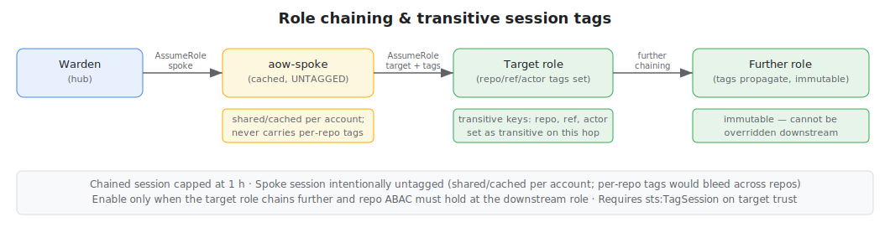
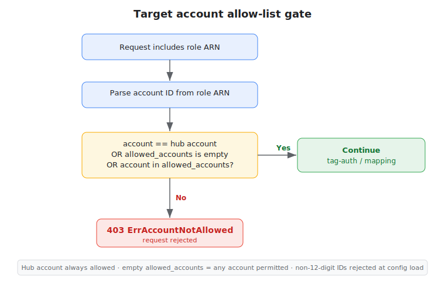

# Tag-Based Authorization & Cross-Account

Tag-based authorization lets a workload assume an IAM role whose **tags**
authorize the request, without listing the role in `role_mappings`. The
feature is opt-in (`tag_auth.enabled`, default `false`) and **additive**:
explicit `role_mappings` are evaluated first; tag-based authorization is a
fallback used only when no explicit mapping authorizes the requested role.

Serving roles from **other AWS accounts** is configured separately via the
top-level `cross_account` block. `cross_account.enabled` is a policy gate:
`false` (or the block omitted) hard-blocks every cross-account operation —
both role assumption and tag reads fail closed. The assume itself is always
**direct**, hub → target, one hop, using the warden's own credentials; a
convention-named per-account spoke role exists only to read a target role's
IAM tags cross-account (`iam:GetRole`), since IAM has no resource-based
policies. It works with plain `role_mappings`, with tag-auth, or both — see
[Cross-account](#cross-account) and the full worked example in
[examples/cross-account/](examples/cross-account/).

- [How it works](#how-it-works)
- [Conditions (multi-dimensional matching)](#conditions-multi-dimensional-matching)
- [Tag reference](#tag-reference)
- [Precedence: mappings + tags together](#precedence-mappings--tags-together)
- [Corner cases](#corner-cases)
- [Session tags & ABAC](#session-tags--abac)
- [Role chaining & transitive session tags](#role-chaining--transitive-session-tags)
- [Target account allow-list](#target-account-allow-list)
- [Cross-account](#cross-account)
- [IAM setup](#iam-setup)
- [Configuration](#configuration)

---

## How it works


1. The workflow requests a role ARN as usual.
2. The warden validates the OIDC token, derives the canonical **subject**
   (GitHub: the `repository` claim), and extracts the verified raw claims
   (`ref`, `actor`, …).
3. **Explicit mappings first.** `role_mappings` is evaluated. If a mapping
   matches the (issuer, subject), passes its conditions, and lists the
   requested role, the role is authorized and tag-auth is **skipped entirely**.
   The mapping's session policy (if any) is applied.
4. **Tag-auth fallback.** Only if step 3 did _not_ authorize the role, and
   `tag_auth.enabled` is `true`, the warden reads the requested role's IAM tags
   (`iam:GetRole`) and checks them against the verified issuer, subject, and
   claims (see [Conditions](#conditions-multi-dimensional-matching)). If they
   pass, the role is authorized. Tag-authorized assumptions use **no inline
   session policy**.
5. If neither path authorizes the role, the request is denied
   (`ErrRoleNotPermitted`).

The account ID is parsed from the requested role ARN. If the role lives in a
different account than the warden (the _hub_), `cross_account.enabled` must be
`true` (and the account allow-listed) or the request fails closed. When
tag-auth needs to read that role's tags, the warden assumes a convention-named
**spoke** role in that account for the `iam:GetRole` call only. The final
`sts:AssumeRole` on the target role is always **direct**, using the warden's
own (hub) credentials — the spoke is never part of the assume path.
Same-account requests need no spoke at all. See [Cross-account](#cross-account).

---

## Conditions (multi-dimensional matching)

Yes — tag-auth supports conditions equivalent to `role_mappings.conditions`.
A role can require, for example, **`subject == acme/api` AND `ref == refs/heads/main`**
by carrying both tags:

```
aow/subject: "acme/api"
aow/ref:     "refs/heads/main"
```

The combining rules:


- **AND across tags** — every `aow/*` tag present on the role must match its
  corresponding claim. Add more tags to narrow access.
- **OR within a tag** — a tag value is a single value or a **space-separated
  list**; the claim must equal one of them.
- **Identity gate** — the role must carry at least one identity tag — the
  canonical `aow/subject`, or the legacy `aow/repo` / `aow/repo-owner` aliases
  (GitHub-shaped subjects, retained through the v2 migration window) — and
  match it. A role with no identity tag is never assumable via tag-auth
  (prevents an untagged role from being broadly assumable).
- **Issuer gate (multi-issuer)** — once **more than one** issuer is configured,
  a role must also carry a matching `aow/issuer` tag or tag-auth fails closed
  for it: without the tag, tag-auth cannot tell which issuer's identity
  namespace the role trusts, and one issuer's subject could collide with
  another's. With a single issuer the tag is optional, but still checked if
  present.
- **Exact matching** — unlike `role_mappings` (which compile anchored
  regex), tag values are matched **exactly**. AWS tag values allow only letters,
  digits, spaces, and `_ . : / = + - @` — no regex metacharacters. Use a
  space-list for several specific values, or `aow/repo-owner` for a whole org.

### Equivalence with `role_mappings.conditions`

| `conditions` field           | Tag (default prefix) | Matching difference                                                 |
| ---------------------------- | -------------------- | ------------------------------------------------------------------- |
| `branch` (regex on `ref`)    | `aow/branch`         | exact; matches full `ref` **or** short branch name                  |
| `ref` (regex)                | `aow/ref`            | exact full ref                                                      |
| `ref_type`                   | `aow/ref-type`       | exact                                                               |
| `event_name`                 | `aow/event-name`     | exact                                                               |
| `workflow_ref` (regex)       | `aow/workflow-ref`   | exact                                                               |
| `environment`                | `aow/environment`    | exact (matches the `runner_environment` claim, same as constraints) |
| `actor_matches` (regex list) | `aow/actor`          | exact; space-list = OR                                              |

---

## Tag reference

Tag keys use a configurable prefix (`tag_auth.tag_prefix`, default `aow/`).

| Tag (default prefix) | Claim checked                    | Notes                                                              |
| -------------------- | -------------------------------- | ------------------------------------------------------------------ |
| `aow/subject`        | canonical subject (any issuer)   | **canonical identity tag**; exact or space-list                    |
| `aow/issuer`         | verified `iss`                   | **required with >1 configured issuer**; optional with a single one |
| `aow/repo`           | `repository` (e.g. `acme/api`)   | legacy identity alias (GitHub); exact or space-list                |
| `aow/repo-owner`     | `repository_owner` (e.g. `acme`) | legacy identity alias; whole org; OR with `aow/repo`/`aow/subject` |
| `aow/branch`         | `ref` **or** short branch name   | `main` or `refs/heads/main`                                        |
| `aow/ref`            | `ref`                            | exact full ref                                                     |
| `aow/ref-type`       | `ref_type` (`branch`/`tag`)      | exact or space-list                                                |
| `aow/event-name`     | `event_name` (`push`, …)         | exact or space-list                                                |
| `aow/workflow-ref`   | `workflow_ref`                   | exact full `owner/repo/.github/workflows/x.yml@ref`                |
| `aow/environment`    | `runner_environment`             | mirrors `constraints.environment`                                  |
| `aow/actor`          | `actor`                          | exact or space-list                                                |

### Example

A role tagged:

```
aow/subject:     "acme/api acme/web"
aow/ref:         "refs/heads/main"
aow/event-name:  "push"
```

is assumable by `acme/api` **or** `acme/web`, only on a `push` whose ref is
exactly `refs/heads/main`. (`aow/repo` works the same way as a legacy alias
for GitHub-shaped subjects.)

### Short-form repo tags (`default_org`)

By default, every token in `aow/repo` must be a full `owner/repo` path — a bare
name like `api` (no `/`) never matches the `repository` claim (which is always
`owner/repo`).

Set `tag_auth.default_org` to an org name to enable expansion: bare tokens are
prefixed with `<default_org>/` before matching. Full `owner/repo` tokens are
**not** expanded and continue to work as-is — they may name any org (multi-org
use case).

**Example** — with `tag_auth.default_org: acme`:

```
aow/repo: "api web"          # expands to acme/api and acme/web
aow/repo: "beta/service api" # beta/service stays as-is; api expands to acme/api
```

Rules:

- A token is "bare" if it contains no `/` character.
- Expansion applies **only** to `aow/repo`. `aow/workflow-ref` always requires
  the full `owner/repo/.github/workflows/x.yml@ref` form.
- Matching remains **case-sensitive**. `default_org` must match the `repository`
  claim's owner casing exactly (GitHub usernames and org names are
  case-preserving).
- Without `default_org` (empty string, the default), bare tokens never match —
  the behavior is unchanged from before this feature was introduced.
- Benefit: single-org fleets can use short names in role tags, staying well within
  the AWS 256-character tag-value limit.

**Token expansion examples** (`default_org: acme`):

| Tag token  | Comparison form | Matches claim `acme/api`? | Matches claim `beta/web`? |
| ---------- | --------------- | ------------------------- | ------------------------- |
| `api`      | `acme/api`      | yes                       | no                        |
| `acme/api` | `acme/api`      | yes                       | no                        |
| `beta/web` | `beta/web`      | no                        | yes                       |
| `acme/`    | `acme/`         | no (exact, not a repo)    | no                        |

---

## Precedence: mappings + tags together

When `tag_auth.enabled` is `true` **and** `role_mappings` is also configured,
both are consulted in this order for the requested role:


```
explicitlyAllowed = mapping matches subject AND passes conditions AND lists the requested role
allowed           = explicitlyAllowed
                    OR (tag_auth.enabled AND requested role's tags authorize the claims)
deny if not allowed
```

This is **allow-if-either**, with explicit mappings short-circuiting:

| Explicit mapping result                                       | `tag_auth.enabled` | Role tags authorize? | Outcome              | Session policy   |
| ------------------------------------------------------------- | ------------------ | -------------------- | -------------------- | ---------------- |
| Authorizes the role                                           | (any)              | (not checked)        | **Allow**            | from the mapping |
| No mapping for the subject                                    | `false`            | —                    | **Deny**             | —                |
| No mapping for the subject                                    | `true`             | yes                  | **Allow**            | none             |
| No mapping for the subject                                    | `true`             | no                   | **Deny**             | —                |
| Mapping matches subject but role not listed / conditions fail | `false`            | —                    | **Deny**             | —                |
| Mapping matches subject but role not listed / conditions fail | `true`             | yes                  | **Allow** (via tags) | none             |
| Mapping matches subject but role not listed / conditions fail | `true`             | no                   | **Deny**             | —                |

Key consequences:

- A mapping that **authorizes** the role always wins and supplies the session
  policy. Tag-auth never overrides or tightens a mapping.
- A mapping that **fails** (role not listed, or constraints not satisfied) does
  **not** hard-deny when tag-auth is enabled — the request falls through to the
  tag check. Tag-auth can therefore _broaden_ access beyond what mappings allow.
  If you rely on a mapping to _deny_, do not also publish matching `aow/*` tags
  on that role.

---

## Corner cases

- **No identity tag → deny.** A role with none of `aow/subject`, `aow/repo`,
  or `aow/repo-owner` is never tag-authorized, even if other `aow/*` tags
  match.
- **Multi-issuer without `aow/issuer` → deny.** Once a second issuer is
  configured, a role with no `aow/issuer` tag is unreachable via tag-auth
  (fails closed) — add the tag when you add the issuer.
- **Tag read fails → deny (logged, not fatal).** If `iam:GetRole` errors (role
  missing, no permission, spoke assume failed), tag-auth treats the role as not
  authorized and logs a warning; the explicit-mapping result still stands.
- **Empty claim never matches.** If a claim is absent/empty (e.g. no
  `environment`), a role requiring that tag is denied. Don't tag dimensions the
  workflow won't present.
- **Prefix collisions.** Only keys under `tag_prefix` are inspected; unrelated
  tags (cost-center, team, …) are ignored. Changing `tag_prefix` changes which
  keys are read — keep it consistent with how roles are tagged.
- **Tag charset.** `*`, `(`, `)`, `[`, `]`, `|`, `^`, `$`, `\`, `?`, `,` are
  rejected by AWS in tag values. Lists are **space**-separated, not comma.
- **`aow/branch` vs `aow/ref`.** `aow/branch` is forgiving (matches the full ref
  _or_ the short name); `aow/ref` is strict (full ref only). Prefer `aow/ref`
  when you need an exact ref including tags like `refs/tags/v1.2.3`.
- **Caching.** Spoke credentials are cached until ~5 min before expiry; role
  tags are cached ~60 s. A tag change can take up to ~60 s to take effect.
- **`cross_account.enabled` gates everything cross-account.** `false` (or the
  block omitted) hard-blocks a cross-account tag read with an error — it does
  not silently deny only that role, it fails the request. With it `true`, a
  cross-account tag read additionally fails closed if the `aow-spoke` role is
  missing or untrusted in the target account. The final `AssumeRole` on the
  target role never uses the spoke — see [Cross-account](#cross-account).

---

## Security model & foot-guns

Three behaviors are intentional but easy to misjudge. Review them before enabling
tag-auth in production:

1. **Tag-auth is an additive fallback, not a tightening.** Enabling it lets a
   role's `aow/*` tags authorize claims **independently of** `role_mappings`
   conditions. A role you constrain via a mapping (e.g. `branch: main`) can still
   be assumed from any branch if its tags match and it carries no matching
   `aow/branch` tag. **Do not rely on a mapping condition alone to _deny_ a role
   that also publishes matching `aow/*` tags.** See
   [Precedence](#precedence-mappings--tags-together).

2. **`cross_account.enabled: false` (or omitted) hard-blocks all cross-account
   use** — both assumes and tag reads fail closed with an error; it is not a
   silent no-op. Once enabled, an **empty `allowed_accounts` still fails
   open**: the warden may assume into **any** member account. Config load
   only logs a warning in that case. Always populate `allowed_accounts` in
   production. See [Target account allow-list](#target-account-allow-list).

3. **Tag-authorized roles receive no session policy.** Session policies come only
   from `role_mappings`; a role authorized via tags is scoped solely by its
   own IAM permissions. Keep tag-authorized roles least-privilege at the IAM level
   — there is no session-policy backstop.

---

## Session tags & ABAC

Authorization tags decide **whether** a role may be assumed; **session tags**
then travel with the issued credentials so downstream resources can restrict
access by the calling subject/ref (ABAC). The warden attaches session tags on
**every** `AssumeRole` — both the explicit-mapping path and the tag-auth path —
via `sts:TagSession`. The tag set is **per-issuer and spec-driven**: each
issuer's `session_tags` map (STS tag key ← raw claim name) decides what is
attached (see [SESSION_TAGGING.md](SESSION_TAGGING.md)).


The standard GitHub `session_tags` spec produces:

| Session tag  | Source claim                     | Example           |
| ------------ | -------------------------------- | ----------------- |
| `repo`       | `repository` (full `owner/repo`) | `acme/api`        |
| `repo-owner` | `repository_owner`               | `acme`            |
| `ref`        | `ref`                            | `refs/heads/main` |
| `ref-type`   | `ref_type`                       | `branch`          |
| `event-name` | `event_name`                     | `push`            |
| `actor`      | `actor`                          | `deploy-bot`      |

> **v2 note:** the `repo` session tag carries the **full `owner/repo`** value
> (the raw `repository` claim) — the same shape the `aow/repo` authorization
> tag matches. v1 stripped the owner to a bare name; update any ABAC condition
> still written against a bare repo name (see
> [SESSION_TAGGING.md](SESSION_TAGGING.md)).

Use these in downstream IAM policies, S3 bucket policies, KMS key policies, or
SCPs via `aws:PrincipalTag/<key>`:

```json
{
  "Effect": "Allow",
  "Action": "s3:GetObject",
  "Resource": "arn:aws:s3:::shared-artifacts/*",
  "Condition": {
    "StringEquals": {
      "aws:PrincipalTag/repo": "acme/api",
      "aws:PrincipalTag/repo-owner": "acme"
    }
  }
}
```

For the target role's **own** trust or boundary, you can also gate the assume
itself with `aws:RequestTag/...` (defense-in-depth alongside the warden's tag
checks):

```json
{
  "Effect": "Allow",
  "Principal": { "AWS": "arn:aws:iam::<HUB_ACCOUNT>:role/<warden-exec-role>" },
  "Action": "sts:AssumeRole",
  "Condition": { "StringEquals": { "aws:RequestTag/repo-owner": "acme" } }
}
```

> Requires `sts:TagSession` on the target role's trust policy for the hub
> execution role — the assuming principal, same account or cross-account
> alike (the spoke role is never the assuming principal for a target role).

---

## Role chaining & transitive session tags



When a workflow assumes a target role that **itself chains to further roles** (via
`sts:AssumeRole` in the target's permissions), the warden can mark the attached
session tags as **transitive**, making them immutable and propagated to every
downstream assumption in the chain.

Enable with `tag_auth.transitive_session_tags: true`.

### How the chain works

```
Warden (hub credentials, itself a role session)
    → Target role, DIRECT (issuer's session tags set here, transitive=true)
        → Further role (tags propagate, immutable)
```

(If `tag_auth` needed to read the target's tags cross-account, a separate,
untagged `aow-spoke` assumption happened first for that `iam:GetRole` call —
it is not part of this chain and carries no session tags of its own, cached
per account and reused across repos. All per-repo tagging happens at the
`AssumeRole` into the target role.)

When `transitive_session_tags` is enabled, the warden marks **every session tag
it attaches** (the issuer's whole `session_tags` spec — e.g. `repo`, `ref`,
`actor`, … for the standard GitHub spec) transitive via `TransitiveTagKeys` in
the `AssumeRole` call to the target. The key set follows the issuer's
configured `session_tags`; there is no separate transitive-key list.

The **chained session duration is capped at 1 hour** regardless of the target
role's configured maximum. This follows from the warden's own credentials
always being a role session (true on every Lambda deployment, same-account
assumes included) — AWS fails, rather than clamps, a chained `AssumeRole`'s
`DurationSeconds` over 3600. Only `local` server mode running with IAM user
credentials avoids this clamp.

### When to use

- The target role chains further and repo ABAC (`aws:PrincipalTag/repo`) must
  hold at the deepest role.
- You want the calling identity cryptographically bound and tamper-proof across
  the entire chain.

### When NOT to use

- The target role does **not** chain further — there is no benefit and transitive
  tags add rigidity.
- The target role (or something downstream) legitimately re-tags any of the
  attached session-tag keys (`repo`, `ref`, `actor`, …) when assuming other
  roles. Transitive tags cannot be overridden; the downstream `AssumeRole`
  call will fail with `AccessDenied`.

### Example: shared target role with ABAC

One target role, many repos — each repo can only access its own resources:

```json
{
  "Version": "2012-10-17",
  "Statement": [
    {
      "Effect": "Allow",
      "Action": "s3:GetObject",
      "Resource": "arn:aws:s3:::shared-artifacts/${aws:PrincipalTag/repo}/*",
      "Condition": {
        "StringEquals": {
          "aws:PrincipalTag/repo-owner": "acme"
        }
      }
    }
  ]
}
```

With `transitive_session_tags: true`, even if the target role chains to another
role, the `repo` tag remains bound to the original GitHub repository.

> **IAM note:** to use transitive tags, the target role's trust policy must grant
> `sts:TagSession` to the hub execution role — the sole assuming principal for
> any target role, same-account or cross-account.

---

## Target account allow-list



With `cross_account.enabled: true` and no `allowed_accounts` set, the warden
may assume roles in **any** AWS account. In production, restrict this to a
known set of member accounts with `cross_account.allowed_accounts`.

```yaml
cross_account:
  allowed_accounts:
    - "111111111111"
    - "222222222222"
```

Or as a comma-separated environment variable:
`AOW_CROSS_ACCOUNT_ALLOWED_ACCOUNTS=111111111111,222222222222`

### Semantics

- **Hub account** is always implicitly allowed, regardless of the list.
- **Empty list** (default) permits any account — equivalent to no restriction.
- **Non-empty list** — only the listed account IDs plus the hub are allowed;
  attempts to assume into any other account return `403 ErrAccountNotAllowed`.
- **Account ID** is parsed from the requested role ARN (`arn:aws:iam::<ACCOUNT>:role/…`);
  there is no separate field in the token request.
- **Malformed IDs** (not 12 digits) are rejected at config load time.

> **Production recommendation:** always populate `allowed_accounts` to prevent
> the warden from being used as a pivot into unintended accounts in the event of
> a misconfigured target-role (or spoke) trust policy.

---

## Cross-account


Gated by the top-level `cross_account` block. `cross_account.enabled: true`
is **required** for any cross-account operation — `false` or the block
omitted hard-blocks both role assumption and tag reads with an error. Once
enabled, it applies independent of `tag_auth`; explicit `role_mappings`
targeting member-account ARNs are gated the same way. A full worked example
(config + IAM roles + StackSets template) lives in
[examples/cross-account/](examples/cross-account/).

- **Hub** = the account running the warden (Lambda/local). The warden's own
  credentials are always used for the target assume.
- **Spoke** = a small role (`cross_account.spoke_role_name`, default
  `aow-spoke`) deployed once per member account, used **only** for
  cross-account `iam:GetRole` tag reads (tag-auth). Not needed if you
  authorize exclusively through `role_mappings`.
- **Target** = the role the workflow actually assumes.

For a target role in account `222…`:

1. Warden parses `222…` from the requested ARN.
2. **Policy gate:** if `cross_account` is disabled or absent, the request is
   rejected immediately with an error — there is no fallback path.
3. **Allow-list gate:** if `allowed_accounts` is non-empty and `222…` is neither
   the hub account nor in the list, the request is rejected with
   `403 ErrAccountNotAllowed`.
4. _(tag-auth only, and only if step 3's explicit mapping didn't already
   authorize the role)_ Warden (hub identity) assumes
   `arn:aws:iam::222…:role/aow-spoke` (with the optional external ID) and, with
   those credentials, calls `iam:GetRole` to read the target's tags and checks
   them against the claims.
5. Warden (its own hub identity — **not** spoke credentials) calls
   `sts:AssumeRole` directly on the target role, one hop, attaching the
   session tags (and transitive keys if enabled). Because the warden's own
   credentials are a role session (always true on Lambda), the resulting
   session is clamped to 1 hour regardless of the target role's configured
   maximum — this is a property of chained credentials, not of being
   cross-account. Only `local` server mode with IAM user credentials can get a
   longer session, up to the target role's own max.
6. The target's temporary credentials are returned to the workflow.

Same-account requests (`target account == hub account`) skip the policy gate,
allow-list check, and spoke entirely.

---

## IAM setup

### Hub (the account running the warden)

The warden's execution role needs:

- `sts:GetCallerIdentity` (to learn its own account and whether its own
  credentials are a role session, which drives the 1h chaining clamp).
- `iam:GetRole`, `sts:AssumeRole`, `sts:TagSession` on same-account target
  roles.
- `sts:AssumeRole` + `sts:TagSession` directly on member-account **target**
  roles (prefer per-account patterns like `arn:aws:iam::<member>:role/<prefix>*`
  over `arn:aws:iam::*:role/*`).
- Only if `tag_auth` reads roles cross-account: `sts:AssumeRole` on
  `arn:aws:iam::*:role/<spoke_role_name>` (default `aow-spoke`).

### Spoke role (one per member account, tag-auth only)

Needed only when `tag_auth` reads role tags cross-account; skip entirely for
`role_mappings`-only setups. Create a role named `<spoke_role_name>` (default
`aow-spoke`) in each member account.

- **Trust policy:** trusts the hub execution role. Optionally require
  `sts:ExternalId` matching `cross_account.external_id` — this ID applies only
  to this hub→spoke hop, never to the hub→target assume.
- **Permissions:** `iam:GetRole` only (read target tags). It has no
  `sts:AssumeRole` permissions — it is never used to assume anything.

Example spoke trust policy (external ID optional):

```json
{
  "Version": "2012-10-17",
  "Statement": [
    {
      "Effect": "Allow",
      "Principal": {
        "AWS": "arn:aws:iam::<HUB_ACCOUNT>:role/<warden-exec-role>"
      },
      "Action": "sts:AssumeRole",
      "Condition": { "StringEquals": { "sts:ExternalId": "<external_id>" } }
    }
  ]
}
```

### Target role (the role workflows assume)

- **Trust policy:** trust the hub execution role **directly** — same account
  or cross-account, there is only one trust edge. No `sts:ExternalId`
  condition: the warden sends none on this direct assume. Optionally add
  `aws:RequestTag/...` conditions as defense-in-depth alongside the warden's
  tag checks.
- **Tags:** the `aow/*` tags from the [reference](#tag-reference).

---

## Configuration

```yaml
tag_auth:
  enabled: true
  tag_prefix: "aow/"
  default_org: "" # if set, bare aow/repo tags (e.g. "api") expand to "<default_org>/api"
  transitive_session_tags: false # set true to mark all attached session tags immutable through role chaining

# Cross-account policy gate. Required (enabled: true) for ANY cross-account
# operation — assumes (which are always direct hub->target) and tag reads
# alike; false/omitted hard-blocks both. spoke_role_name/external_id apply
# only to the separate hub->spoke hop used for cross-account tag reads.
cross_account:
  enabled: true
  spoke_role_name: "aow-spoke" # only used for cross-account tag reads (tag_auth)
  external_id: "" # optional; hub->spoke trust only, never sent on the target assume
  spoke_session_duration: "15m"
  allowed_accounts: [] # restrict target accounts; hub always allowed; empty = any (once enabled)
```

Or via environment variables: `AOW_TAG_AUTH_ENABLED`, `AOW_TAG_AUTH_TAG_PREFIX`,
`AOW_TAG_AUTH_DEFAULT_ORG`, `AOW_TAG_AUTH_TRANSITIVE_SESSION_TAGS`,
`AOW_CROSS_ACCOUNT_ENABLED`, `AOW_CROSS_ACCOUNT_SPOKE_ROLE_NAME`,
`AOW_CROSS_ACCOUNT_EXTERNAL_ID`, `AOW_CROSS_ACCOUNT_SPOKE_SESSION_DURATION`,
`AOW_CROSS_ACCOUNT_ALLOWED_ACCOUNTS` (comma-separated account IDs).
