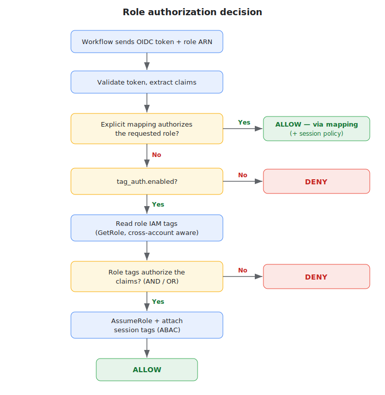
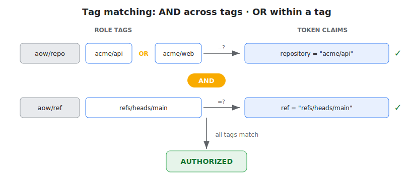
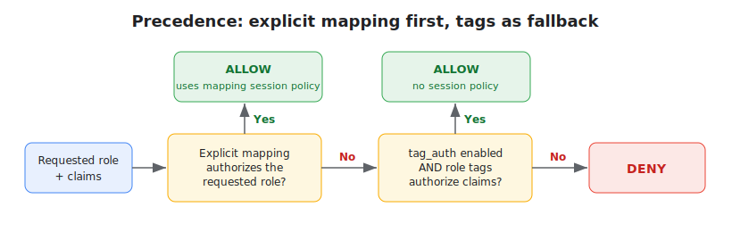
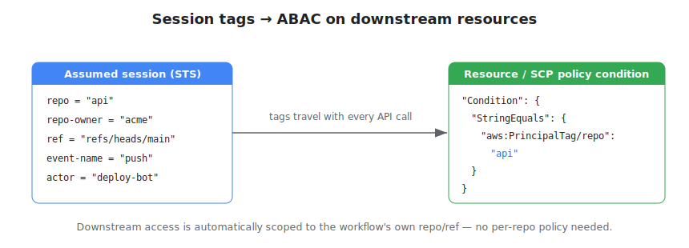
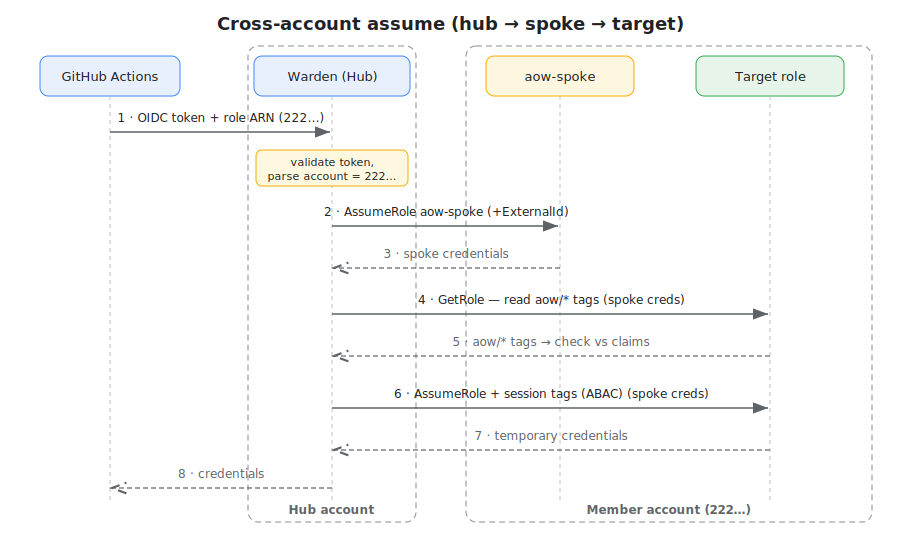

# Tag-Based Authorization & Cross-Account

Tag-based authorization lets a repository assume an IAM role whose **tags**
authorize the request, without listing the role in `repo_role_mappings`. It also
enables serving roles from **other AWS accounts** through a per-account spoke
role. The feature is opt-in (`tag_auth.enabled`, default `false`) and **additive**:
explicit `repo_role_mappings` are evaluated first; tag-based authorization is a
fallback used only when no explicit mapping authorizes the requested role.

- [How it works](#how-it-works)
- [Conditions (multi-dimensional matching)](#conditions-multi-dimensional-matching)
- [Tag reference](#tag-reference)
- [Precedence: mappings + tags together](#precedence-mappings--tags-together)
- [Corner cases](#corner-cases)
- [Session tags & ABAC](#session-tags--abac)
- [Cross-account](#cross-account)
- [IAM setup](#iam-setup)
- [Configuration](#configuration)

---

## How it works



1. The workflow requests a role ARN as usual.
2. The warden validates the OIDC token and extracts the claims (`repository`,
   `ref`, `actor`, …).
3. **Explicit mappings first.** `repo_role_mappings` is evaluated. If a mapping
   matches the repo, passes its constraints, and lists the requested role, the
   role is authorized and tag-auth is **skipped entirely**. The mapping's
   session policy (if any) is applied.
4. **Tag-auth fallback.** Only if step 3 did _not_ authorize the role, and
   `tag_auth.enabled` is `true`, the warden reads the requested role's IAM tags
   (`iam:GetRole`) and checks them against the claims (see
   [Conditions](#conditions-multi-dimensional-matching)). If they pass, the role
   is authorized. Tag-authorized assumptions use **no inline session policy**.
5. If neither path authorizes the role, the request is denied
   (`ErrRoleNotPermitted`).

The account ID is parsed from the requested role ARN. If the role lives in a
different account than the warden (the _hub_), the warden first assumes a
convention-named **spoke** role in that account and uses those credentials for
both the tag read and the final `sts:AssumeRole`. Same-account requests skip
this hop. See [Cross-account](#cross-account).

---

## Conditions (multi-dimensional matching)

Yes — tag-auth supports conditions equivalent to `repo_role_mappings.constraints`.
A role can require, for example, **`repo == acme/api` AND `ref == refs/heads/main`**
by carrying both tags:

```
aow/repo: "acme/api"
aow/ref:  "refs/heads/main"
```

The combining rules:



- **AND across tags** — every `aow/*` tag present on the role must match its
  corresponding claim. Add more tags to narrow access.
- **OR within a tag** — a tag value is a single value or a **space-separated
  list**; the claim must equal one of them.
- **Identity gate** — the role must carry at least `aow/repo` **or**
  `aow/repo-owner` and match it. A role with neither tag is never assumable via
  tag-auth (prevents an untagged role from being broadly assumable).
- **Exact matching** — unlike `repo_role_mappings` (which compile anchored
  regex), tag values are matched **exactly**. AWS tag values allow only letters,
  digits, spaces, and `_ . : / = + - @` — no regex metacharacters. Use a
  space-list for several specific values, or `aow/repo-owner` for a whole org.

### Equivalence with `repo_role_mappings.constraints`

| `constraints` field          | Tag (default prefix) | Matching difference                                                 |
| ---------------------------- | -------------------- | ------------------------------------------------------------------- |
| `branch` (regex on `ref`)    | `aow/branch`         | exact; matches full `ref` **or** short branch name                  |
| `ref` (regex)                | `aow/ref`            | exact full ref                                                      |
| `ref_type`                   | `aow/ref-type`       | exact                                                               |
| `event_name`                 | `aow/event-name`     | exact                                                               |
| `workflow_ref` (regex)       | `aow/workflow-ref`   | exact                                                               |
| `environment`                | `aow/environment`    | exact (matches the `runner_environment` claim, same as constraints) |
| `actor_matches` (regex list) | `aow/actor`          | exact; space-list = OR                                              |

---

## Tag reference

Tag keys use a configurable prefix (`tag_auth.tag_prefix`, default `aow/`).

| Tag (default prefix) | Claim checked                    | Notes                                               |
| -------------------- | -------------------------------- | --------------------------------------------------- |
| `aow/repo`           | `repository` (e.g. `acme/api`)   | identity; exact or space-list                       |
| `aow/repo-owner`     | `repository_owner` (e.g. `acme`) | identity; whole org; OR with `aow/repo`             |
| `aow/branch`         | `ref` **or** short branch name   | `main` or `refs/heads/main`                         |
| `aow/ref`            | `ref`                            | exact full ref                                      |
| `aow/ref-type`       | `ref_type` (`branch`/`tag`)      | exact or space-list                                 |
| `aow/event-name`     | `event_name` (`push`, …)         | exact or space-list                                 |
| `aow/workflow-ref`   | `workflow_ref`                   | exact full `owner/repo/.github/workflows/x.yml@ref` |
| `aow/environment`    | `runner_environment`             | mirrors `constraints.environment`                   |
| `aow/actor`          | `actor`                          | exact or space-list                                 |

### Example

A role tagged:

```
aow/repo:        "acme/api acme/web"
aow/ref:         "refs/heads/main"
aow/event-name:  "push"
```

is assumable by `acme/api` **or** `acme/web`, only on a `push` whose ref is
exactly `refs/heads/main`.

---

## Precedence: mappings + tags together

When `tag_auth.enabled` is `true` **and** `repo_role_mappings` is also configured,
both are consulted in this order for the requested role:



```
explicitlyAllowed = mapping matches repo AND passes constraints AND lists the requested role
allowed           = explicitlyAllowed
                    OR (tag_auth.enabled AND requested role's tags authorize the claims)
deny if not allowed
```

This is **allow-if-either**, with explicit mappings short-circuiting:

| Explicit mapping result                                     | `tag_auth.enabled` | Role tags authorize? | Outcome              | Session policy   |
| ----------------------------------------------------------- | ------------------ | -------------------- | -------------------- | ---------------- |
| Authorizes the role                                         | (any)              | (not checked)        | **Allow**            | from the mapping |
| No mapping for the repo                                     | `false`            | —                    | **Deny**             | —                |
| No mapping for the repo                                     | `true`             | yes                  | **Allow**            | none             |
| No mapping for the repo                                     | `true`             | no                   | **Deny**             | —                |
| Mapping matches repo but role not listed / constraints fail | `false`            | —                    | **Deny**             | —                |
| Mapping matches repo but role not listed / constraints fail | `true`             | yes                  | **Allow** (via tags) | none             |
| Mapping matches repo but role not listed / constraints fail | `true`             | no                   | **Deny**             | —                |

Key consequences:

- A mapping that **authorizes** the role always wins and supplies the session
  policy. Tag-auth never overrides or tightens a mapping.
- A mapping that **fails** (role not listed, or constraints not satisfied) does
  **not** hard-deny when tag-auth is enabled — the request falls through to the
  tag check. Tag-auth can therefore _broaden_ access beyond what mappings allow.
  If you rely on a mapping to _deny_, do not also publish matching `aow/*` tags
  on that role.

---

## Corner cases

- **No identity tag → deny.** A role with neither `aow/repo` nor
  `aow/repo-owner` is never tag-authorized, even if other `aow/*` tags match.
- **Tag read fails → deny (logged, not fatal).** If `iam:GetRole` errors (role
  missing, no permission, spoke assume failed), tag-auth treats the role as not
  authorized and logs a warning; the explicit-mapping result still stands.
- **Empty claim never matches.** If a claim is absent/empty (e.g. no
  `environment`), a role requiring that tag is denied. Don't tag dimensions the
  workflow won't present.
- **Prefix collisions.** Only keys under `tag_prefix` are inspected; unrelated
  tags (cost-center, team, …) are ignored. Changing `tag_prefix` changes which
  keys are read — keep it consistent with how roles are tagged.
- **Tag charset.** `*`, `(`, `)`, `[`, `]`, `|`, `^`, `$`, `\`, `?`, `,` are
  rejected by AWS in tag values. Lists are **space**-separated, not comma.
- **`aow/branch` vs `aow/ref`.** `aow/branch` is forgiving (matches the full ref
  _or_ the short name); `aow/ref` is strict (full ref only). Prefer `aow/ref`
  when you need an exact ref including tags like `refs/tags/v1.2.3`.
- **Caching.** Spoke credentials are cached until ~5 min before expiry; role
  tags are cached ~60 s. A tag change can take up to ~60 s to take effect.
- **Cross-account requires the spoke.** With tag-auth enabled, a cross-account
  request fails closed if the `aow-spoke` role is missing or untrusted — see
  below.

---

## Session tags & ABAC

Authorization tags decide **whether** a role may be assumed; **session tags**
then travel with the issued credentials so downstream resources can restrict
access by the calling repo/ref (ABAC). The warden attaches session tags from the
OIDC claims on **every** `AssumeRole` — both the explicit-mapping path and the
tag-auth path — via `sts:TagSession`.



Session tags applied (see [SESSION_TAGGING.md](SESSION_TAGGING.md) for the full
reference):

| Session tag  | Source claim       | Example |
| ------------ | ------------------ | ------- |
| `repo`       | `repository` (bare repo name, owner stripped) | `api` |
| `repo-owner` | `repository_owner` | `acme` |
| `ref`        | `ref`              | `refs/heads/main` |
| `ref-type`   | `ref_type`         | `branch` |
| `event-name` | `event_name`       | `push` |
| `actor`      | `actor`            | `deploy-bot` |

> **Naming note:** the **session** tag `repo` is the *bare* repo name (`api`),
> while the **authorization** tag `aow/repo` matches the *full* `owner/repo`
> (`acme/api`). Write downstream ABAC conditions against the bare `repo` (and
> `repo-owner`) session tags, not the `aow/*` authorization tags.

Use these in downstream IAM policies, S3 bucket policies, KMS key policies, or
SCPs via `aws:PrincipalTag/<key>`:

```json
{
  "Effect": "Allow",
  "Action": "s3:GetObject",
  "Resource": "arn:aws:s3:::shared-artifacts/*",
  "Condition": {
    "StringEquals": { "aws:PrincipalTag/repo": "api", "aws:PrincipalTag/repo-owner": "acme" }
  }
}
```

For the target role's **own** trust or boundary, you can also gate the assume
itself with `aws:RequestTag/...` (defense-in-depth alongside the warden's tag
checks):

```json
{
  "Effect": "Allow",
  "Principal": { "AWS": "arn:aws:iam::<MEMBER>:role/aow-spoke" },
  "Action": "sts:AssumeRole",
  "Condition": { "StringEquals": { "aws:RequestTag/repo-owner": "acme" } }
}
```

> Requires `sts:TagSession` on the target role's trust policy for the assuming
> principal (the spoke role cross-account, or the hub role same-account).

---

## Cross-account



- **Hub** = the account running the warden (Lambda/local).
- **Spoke** = a small broker role (`tag_auth.spoke_role_name`, default
  `aow-spoke`) deployed once per member account.
- **Target** = the role the workflow actually assumes.

For a target role in account `222…`:

1. Warden parses `222…` from the requested ARN.
2. Warden (hub identity) assumes `arn:aws:iam::222…:role/aow-spoke` (with the
   optional external ID).
3. With spoke credentials it calls `iam:GetRole` to read the target's tags and
   checks them against the claims.
4. With spoke credentials it calls `sts:AssumeRole` on the target role, attaching
   the GitHub session tags.
5. The target's temporary credentials are returned to the workflow.

Same-account requests (`target account == hub account`) skip steps 2 and use the
hub identity directly — behavior identical to non-cross-account deployments.

---

## IAM setup

### Hub (the account running the warden)

The warden's execution role needs:

- `sts:GetCallerIdentity` (to learn its own account).
- Same-account roles: `iam:GetRole`, `sts:AssumeRole`, `sts:TagSession` on the
  target roles.
- Cross-account: `sts:AssumeRole` on `arn:aws:iam::*:role/<spoke_role_name>`
  (default `aow-spoke`).

### Spoke role (one per member account)

Create a role named `<spoke_role_name>` (default `aow-spoke`) in each member
account.

- **Trust policy:** trusts the hub execution role. Optionally require
  `sts:ExternalId` matching `tag_auth.external_id`.
- **Permissions:** `iam:GetRole` (read target tags), plus `sts:AssumeRole` and
  `sts:TagSession` on the target roles in that account.

Example spoke trust policy (external ID optional):

```json
{
  "Version": "2012-10-17",
  "Statement": [
    {
      "Effect": "Allow",
      "Principal": {
        "AWS": "arn:aws:iam::<HUB_ACCOUNT>:role/<warden-exec-role>"
      },
      "Action": "sts:AssumeRole",
      "Condition": { "StringEquals": { "sts:ExternalId": "<external_id>" } }
    }
  ]
}
```

### Target role (the role workflows assume)

- **Trust policy:** trust the spoke role (cross-account) or the hub execution
  role (same account). Optionally add `aws:RequestTag/...` conditions as
  defense-in-depth alongside the warden's tag checks.
- **Tags:** the `aow/*` tags from the [reference](#tag-reference).

---

## Configuration

```yaml
tag_auth:
  enabled: true
  tag_prefix: "aow/"
  spoke_role_name: "aow-spoke"
  external_id: "" # optional
  spoke_session_duration: "15m"
```

Or via environment variables: `AOW_TAG_AUTH_ENABLED`, `AOW_TAG_AUTH_TAG_PREFIX`,
`AOW_TAG_AUTH_SPOKE_ROLE_NAME`, `AOW_TAG_AUTH_EXTERNAL_ID`,
`AOW_TAG_AUTH_SPOKE_SESSION_DURATION`.
