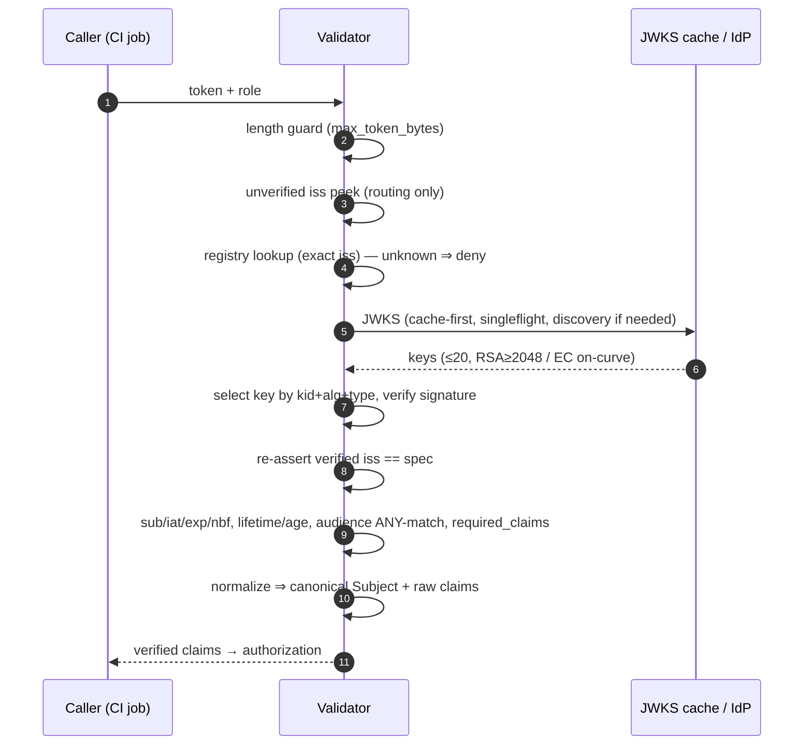

# Token Validation

How AWS OIDC Warden turns an incoming OIDC token into a set of verified,
canonical claims that authorization can trust. This is the security core of the
service: every credential issuance depends on the guarantees described here.

- **Package:** `internal/validator/`
- **Entry point:** `TokenValidatorInterface.Validate()` (self mode) or a
  `ClaimsExtractorInterface` implementation (delegated modes)
- **Output:** a `*types.Claims` with a **canonical `Subject`** plus the full
  verified raw-claims map, or an error (fail-closed — no partial result)

For where validation sits in the wider request pipeline see
[ARCHITECTURE.md](ARCHITECTURE.md); for the config keys referenced here see
[CONFIGURATION.md](CONFIGURATION.md); for adding a new issuer/provider see
[MULTI_ISSUER.md](MULTI_ISSUER.md).


---

## 1. Trust model

Validation answers one question: **can these claims be trusted to describe the
caller?** Two rules govern everything below.

1. **Issuer authenticity comes before identity.** The token's `iss` is read
   _unverified_ only to route to a configured issuer's spec. No identity or
   authorization decision uses any claim until the signature is verified and
   the issuer is re-asserted against that spec.
2. **A token can never self-assert its canonical identity.** The
   authorization key (`Subject`) is derived by the service from a configured
   mapping (`claim_mappings.subject`, or the GitHub `repository` claim by
   default) — never read directly from an attacker-influenced field.

Any failure — unknown issuer, bad signature, expired token, missing claim,
type mismatch — **denies**. There is no partial-credential path.

---

## 2. Validation modes

`jwt_validation.mode` selects how claims enter the pipeline. All three converge
on the **same claim-check-and-normalize path** (`checkAndNormalizeClaims`), so a
delegated mode can never be a weaker validator than self mode.

| Mode             | Who verifies the signature             | Multi-issuer?         | Adapter          | Use when                                                         |
| ---------------- | -------------------------------------- | --------------------- | ---------------- | ---------------------------------------------------------------- |
| `self` (default) | This service                           | **Yes**               | `SelfExtractor`  | Direct token submission (API Gateway REST, Lambda URL, ALB body) |
| `apigw`          | API Gateway HTTP API v2 JWT Authorizer | No (exactly 1 issuer) | `APIGWExtractor` | You front the service with an API Gateway JWT Authorizer         |
| `alb`            | Application Load Balancer OIDC         | No (exactly 1 issuer) | `ALBExtractor`   | You front the service with ALB OIDC (`x-amzn-oidc-data`)         |

**Delegated modes trust an upstream for _signature verification only_.** They
still independently re-validate issuer, audience, expiry, `nbf`, `iat`,
lifetime/age caps, and `required_claims`, and still derive the canonical subject
themselves. They require **exactly one** configured issuer and fail closed
otherwise (a delegated verifier cannot tell the service _which_ issuer it
checked). Multi-issuer is a `self`-mode capability.

> **Bypass guard:** in a delegated mode, if the upstream injects no claims, the
> extractor returns an error wrapping `ErrTokenValidationFailed` rather than
> treating "no claims" as "anonymous allow".

---

## 3. The self-mode pipeline

`Validate(tokenString)` runs these steps in order. Each is fail-closed.

```
0. Length guard        reject tokens larger than max_token_bytes (default 8 KB) before ANY parsing
1. Unverified iss peek  parse without verifying, read iss — for ROUTING ONLY
2. Registry lookup      exact-match iss against the issuer registry; unknown issuer denies (no JWKS fetch)
3. Scoped parser        build a parser pinned to this issuer: alg allow-list, exp required, iat, leeway
4. Signature verify     fetch this issuer's JWKS (cache-first), select the key by kid+alg+type, verify
4b. Re-assert issuer    the verified iss must still equal the spec used (guards a mid-call hot reload)
6–10. Claim checks       sub, iat, exp, nbf, lifetime/age caps, audience ANY-match, required_claims
10. Normalize           derive canonical Subject + raw-claims map via the provider adapter
```

(Steps are numbered to match the code comments; 5/7 are the crypto/time
hardening woven into 3–4 and 6.)

### Step 0 — Length guard

The raw token string is rejected if it exceeds `max_token_bytes` (default 8192)
**before any parsing**, so an oversized token can never reach the JSON/JWT
decoders. Returns `ErrTokenTooLarge`.

### Step 1 — Unverified issuer peek (routing only)

The token is parsed with `ParseUnverified` purely to read `iss`. This value is
**never** used for identity or authorization — only to pick which issuer spec to
verify against. A missing/empty `iss` denies (`ErrUnknownIssuer`).

### Step 2 — Registry lookup

The unverified `iss` is looked up by **exact string match** (no normalization,
no trailing-slash fixups) in the issuer registry. An unknown issuer denies
**before any JWKS fetch is attempted** — an unrecognized issuer cannot make the
service emit an outbound request.

The registry is an immutable snapshot behind an `atomic.Pointer`, rebuilt
lock-free when the config hot-reloads (new/removed issuer, audience, or mapping)
— picked up on the next `Validate()` call, no restart.

### Step 3 — Issuer-scoped parser

A per-call `jwt.Parser` is built, pinned to the matched issuer:

- **Algorithm allow-list:** `RS256/384/512`, `ES256/384/512` only. `none`,
  `HS*` (HMAC), and every other algorithm are rejected — this is the primary
  defense against alg-confusion.
- `WithIssuer(spec.Issuer)` — the verified `iss` must equal the spec's issuer.
- `WithExpirationRequired()` — a token with no `exp` is rejected.
- `WithIssuedAt()` and `WithLeeway(leeway)` — `iat` parsed, clock-skew leeway
  applied (default 30s, hard max 120s).

`leeway`, `max_token_lifetime`, `max_token_age`, and `max_token_bytes` are read
**live from config on every call**, so a hot-reloaded change takes effect
without a restart.

### Step 4 — Signature verification

The issuer's JWKS is fetched (cache-first — see [§5](#5-jwks-retrieval)), and the
signing key is selected and the signature verified (see [§4](#4-key-selection--crypto-hardening)).
If the key ID is not present in the cached JWKS (`ErrKeyNotFound`), the service
performs **one** cache-bypassing refetch to recover from key rotation, subject
to a per-`(issuer, kid)` rate limiter, then retries once.

### Step 4b — Issuer re-assertion

After verification, the **verified** `iss` is compared again to the spec used
for this call. This closes the small window between the step-2 lookup and step-4
verification in which a concurrent hot reload could have swapped the registry.
Mismatch denies.

### Steps 6–10 — Claim checks and normalization

Handed off to `checkAndNormalizeClaims` — the **same** function the delegated
extractors call — so self and delegated modes cannot drift apart. See
[§6](#6-claim-checks) and [§7](#7-canonical-subject-normalization).

---

## 4. Key selection & crypto hardening

Signature verification is more than a `kid` lookup. For a JWKS key to be used it
must satisfy **all** of:

- **`kid` match** — the JWKS entry's key ID equals the token header `kid`
  (missing `kid` in the token denies).
- **`use` is `sig` or unset** — encryption-only keys are skipped.
- **`alg` match** — if the JWKS entry declares an `alg`, it must equal the
  token's `alg`.
- **key-type ↔ alg-family match** — RSA keys only for `RS*`, EC keys only for
  `ES*`.

If a `kid` matches but fails these checks, scanning **continues** (a duplicate
`kid` with one matching and one non-matching key still resolves to the correct
key). This blocks alg-confusion and duplicate-`kid`-different-type key
selection. The key memo is scoped by issuer, so the same `kid` string from two
different issuers is never conflated.

**Key material is validated defensively** (a compromised JWKS source must not
enable offline forgery):

- **RSA:** modulus **≥ 2048 bits** or the key is rejected.
- **EC:** the point must lie on its declared curve (`P-256`/`P-384`/`P-521`);
  off-curve or identity points are rejected. Unsupported curves are rejected.

---

## 5. JWKS retrieval

```
issuer ──► cache hit? ──► yes ─► use cached JWKS
              │
              no
              ▼
        singleflight (per issuer) ──► resolve jwks_uri ──► fetch ──► validate ──► cache
```

- **Discovery:** unless the issuer sets an explicit `jwks_uri`, the service
  fetches `<issuer>/.well-known/openid-configuration` and uses its `jwks_uri`.
  The discovery document's own `issuer` field **must equal** the configured
  issuer (RFC 8414) — a compromised/misconfigured discovery endpoint cannot
  redirect trust to a different issuer. Discovered URIs are memoized.
- **Caching:** JWKS are cached per issuer with `cache.ttl`, across the memory,
  DynamoDB, or S3 backend ([cache docs](../internal/cache/CLAUDE.md)).
- **Singleflight:** concurrent cold fetches for one issuer collapse into a
  single upstream call, so cold-start or rotation storms make exactly one
  request per issuer.
- **Rotation recovery:** a `kid` miss forces one cache-bypassing refetch
  (rate-limited per `(issuer, kid)` via `jwks_refetch_cooldown`, default 60s);
  a discovery-driven `jwks_uri` that 404s is re-discovered once.
- **Bounds:** discovery and JWKS responses are read with `io.LimitReader`
  (1 MB), and a JWKS is rejected if it has **zero** keys or **more than 20**.
  Rejected JWKS are never cached.

---

## 6. Claim checks

`checkAndNormalizeClaims` applies these to the trusted raw claims (all
fail-closed):

| Check                | Rule                                                                                                                           |
| -------------------- | ------------------------------------------------------------------------------------------------------------------------------ |
| `sub`                | present and non-empty                                                                                                          |
| `iat`                | present; not in the future beyond `leeway`                                                                                     |
| `exp`                | present; not expired beyond `leeway`                                                                                           |
| `nbf`                | if present, not in the future beyond `leeway`                                                                                  |
| `max_token_lifetime` | if set, `exp - iat` must not exceed it (0 = disabled)                                                                          |
| `max_token_age`      | if set, `now - iat` must not exceed it (0 = disabled)                                                                          |
| **audience**         | **ANY-match** — at least one token `aud` equals one of the issuer's configured `audiences`; an empty set on either side denies |
| `required_claims`    | every configured claim name is present and (if a string) non-empty, checked on the raw claims                                  |

Audiences are **per-issuer isolated**: a token's `aud` is only ever checked
against the audience set of _its own_ verified issuer — no cross-issuer leakage.

---

## 7. Canonical subject normalization

`normalizeClaims` converts verified raw claims into `types.Claims`:

1. Copy the standard registered claims (`iss`, `aud`, `exp`, `iat`, `nbf`,
   `jti`) for every provider.
2. Dispatch to the provider adapter for provider-specific population.
3. **Always** set `Subject` from `adapter.subject(...)` — never from raw JSON.

Two providers ship; the seam is open/closed (add a provider by implementing
`providerAdapter` and registering it — no core edits):

- **`github`** — native unmarshal of the full GitHub Actions claim set into the
  typed struct. Canonical `Subject` defaults to the `repository` claim,
  overridable via `claim_mappings.subject`.
- **`generic`** — no native struct. Canonical `Subject` **must** come from
  `claim_mappings.subject` (enforced at config load, re-checked here).

`types.Claims.Subject` is the canonical identity authorization reads.
`types.Claims.Raw` (JSON-excluded) carries every verified raw claim, used for
condition matching, session-tag mapping, and `required_claims` against
provider-native claim names.

---

## 8. SSRF hardening of outbound fetches

Discovery and JWKS fetches are the only outbound requests validation makes. They
go through a single hardened `http.Client`, built once at construction:

- **Dial-time IP blocking** — the resolved IP is checked _before_ connecting;
  private, loopback, link-local (covers the `169.254.169.254` cloud-metadata
  address), unspecified, and multicast addresses are refused. Applied on the
  original request **and every redirect hop**.
- **DNS-rebinding safe** — the validated IP is dialed directly, so a second DNS
  lookup inside the dialer cannot swap in a different, unvalidated address.
- **TLS 1.2+** enforced; **HTTPS required** (plain `http://` allowed only for
  loopback and only under `allow_insecure_issuers`, a dev/test escape hatch).
- **Redirects** capped at 5 hops, each re-validated (scheme + host).

---

## 9. Hardening knobs

All optional, top-level, hot-reloadable (except `allow_insecure_issuers`, which
configures the HTTP client built at construction). Full reference in
[CONFIGURATION.md](CONFIGURATION.md).

| Key                      | Default | Effect                                                        |
| ------------------------ | ------- | ------------------------------------------------------------- |
| `jwt_leeway`             | `30s`   | Clock-skew allowance for `exp`/`iat`/`nbf`; hard max `120s`   |
| `max_token_lifetime`     | `0`     | Reject if `exp - iat` exceeds it (0 = no cap)                 |
| `max_token_age`          | `0`     | Reject if `now - iat` exceeds it (0 = no cap)                 |
| `max_token_bytes`        | `8192`  | Pre-parse token length cap                                    |
| `jwks_refetch_cooldown`  | `60s`   | Min interval between forced JWKS refetches per `(issuer,kid)` |
| `allow_insecure_issuers` | `false` | Dev-only: permit `http://` loopback issuer/`jwks_uri`         |

---

## 10. Failure modes → HTTP status

Validation failures propagate as sentinel errors mapped to HTTP status by the
frontend adapters (`internal/handler/errors.go`):

| Condition                                                                | Sentinel                   | HTTP | `errorCode`          |
| ------------------------------------------------------------------------ | -------------------------- | ---- | -------------------- |
| Empty/oversized token, bad role, malformed JSON                          | `ErrTokenTooLarge`, …      | 400  | `invalid_request`    |
| Unknown issuer, bad signature, expired, missing claim, audience mismatch | `ErrTokenValidationFailed` | 401  | `token_invalid`      |
| Role not permitted / account not allowed                                 | `ErrRoleNotPermitted`      | 403  | `permission_denied`  |
| Session policy read error                                                | `ErrSessionPolicyAccess`   | 500  | `policy_error`       |
| AssumeRole failed                                                        | `ErrAssumeRoleFailed`      | 500  | `assume_role_failed` |
| Required audit write failed (`audit_required=true`)                      | `ErrAuditWriteFailed`      | 500  | `audit_write_failed` |

---

## 11. Sequence (self mode)



---

## 12. Security invariants (summary)

1. Unverified `iss` is used for **routing only**; identity/authz use verified,
   re-asserted claims.
2. Canonical `Subject` is always **derived**, never self-asserted.
3. Algorithm allow-list is **RS/ES 256–512** — never `none`/`HS*`.
4. Key selection pins `kid` + `alg` + `use` + key-type↔alg-family; RSA ≥ 2048;
   EC verified on-curve.
5. Audience is **per-issuer isolated**, ANY-match, empty ⇒ deny.
6. Delegated modes re-validate everything except signature and route through the
   **same** claim-check path as self mode.
7. Outbound JWKS/discovery fetches are **SSRF-hardened** and bounded.
8. **Fail-closed throughout** — any error denies; no partial credentials.

---

## 13. Source map

| Concern                                          | File                                     |
| ------------------------------------------------ | ---------------------------------------- |
| Self-mode pipeline, key selection, normalization | `internal/validator/validator.go`        |
| Shared claim-check-and-normalize path            | `internal/validator/delegated_claims.go` |
| JWKS fetch, discovery, caching, rotation         | `internal/validator/jwks_fetch.go`       |
| SSRF-hardened HTTP client                        | `internal/validator/ssrf.go`             |
| Forced-refetch rate limiter                      | `internal/validator/refetch_limiter.go`  |
| Issuer-scoped key memoization                    | `internal/validator/keymemo.go`          |
| Extractor interface + self/apigw/alb             | `internal/validator/*_extractor.go`      |
| Canonical claim struct                           | `internal/types/github.go`               |

See also: [ARCHITECTURE.md](ARCHITECTURE.md) · [CONFIGURATION.md](CONFIGURATION.md) ·
[MULTI_ISSUER.md](MULTI_ISSUER.md) · [LOGGING.md](LOGGING.md) ·
`internal/validator/CLAUDE.md` (contributor notes).
